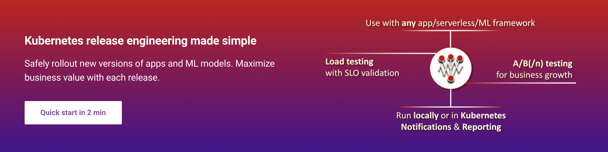

# Iter8



***

[](https://github.com/iter8-tools/iter8/releases)
[](https://pkg.go.dev/github.com/iter8-tools/iter8)
[](https://github.com/iter8-tools/iter8/actions?query=workflow%3Atests)
[](https://codecov.io/gh/iter8-tools/iter8)
[](https://join.slack.com/t/iter8-tools/shared_invite/zt-awl2se8i-L0pZCpuHntpPejxzLicbmw)
[](https://iter8.tools/0.7/getting-started/help/#iter8-community-meetings)

## Introduction

Iter8 is a Kubernetes release engineering toolkit built for DevOps, MLOps, SRE and data science teams. Use Iter8 to assess and compare multiple versions of Kubernetes apps and ML models based on performance and business metrics, safely rollout new versions, and/or maximize business value with each release.


## Highlights

## Install Iter8 CLI
Install the latest stable release of the Iter8 CLI using `brew` as follows.

```shell
brew tap iter8-tools/iter8
brew install iter8
```

You can also install Iter8 using:
* [pre-compiled binaries](https://iter8.tools/latest/getting-started/install/)
* [source](https://iter8.tools/latest/getting-started/install/)
* [`go 1.16+`](https://iter8.tools/latest/getting-started/install/)

## Usage Examples

### Load test HTTP services and validate SLOs

1.  [Load test an HTTP service and validate SLOs](https://iter8.tools/0.8/getting-started/your-first-experiment/).
2.  [Control the load characteristics during the HTTP load test experiment](https://iter8.tools/0.8/tutorials/load-test/requests/).
3.  [Load test an HTTP POST endpoint with request payload](https://iter8.tools/0.8/tutorials/load-test/payload/).
4.  [Learn more about built-in metrics and SLOs in an HTTP load test experiment](https://iter8.tools/0.8/tutorials/load-test/metricsandslos/).
5.  [Load test a Knative HTTP service](https://iter8.tools/0.8/tutorials/load-test/community/knative/loadtest/).


## Documentation
Iter8 documentation is available at https://iter8.tools.

## Contributing
See [here](https://iter8.tools/0.8/contributing/) for information about ways to contribute, Iter8 community meetings, finding an issue, asking for help, pull-request lifecycle, and more.
