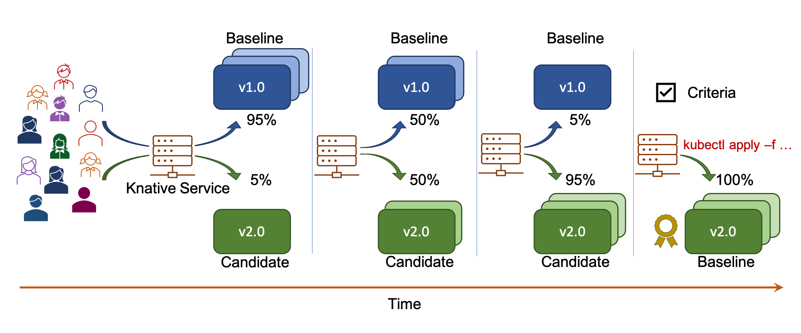

# Iter8
See https://iter8.tools for Iter8 documentation.

## What is Iter8?

You have developed multiple versions of a microservice app or an ML model. You want to identify the winning version and rollout the winner in a reliable manner.

> Enter Iter8.

Iter8 enables you to unlock business value in your k8s apps and ML models rapidly and robustly by combining the best of AI, release engineering, and observability.

Use Iter8's AI-driven experimentation capabilities to safely experiment with new versions of your apps and ML models on Kubernetes and OpenShift clusters, gain key insights into their behavior with real user requests in production or staging environments, progressively shift traffic, and rollout the winner in a statistically robust manner.

## What is an Iter8 experiment?

> Iter8 defines a Kubernetes resource kind called Experiment that automates metrics and AI-driven experiments, progressive delivery, and rollout of Kubernetes and OpenShift apps / ML models.

A basic Iter8 experiment that automates Canary testing and Progressive deployment (traffic shifting) is illustrated below.

## Features at a glance

- Experimentation on any Kubernetes and OpenShift stack; stacks that are currently supported with documented code-samples are **Knative**, **KFServing** and **Istio**.
- **Conformance**, **Canary**, **A/B**, **A/B/n** and **Pareto** testing patterns.
- **Progressive**, **FixedSplit**, **DarkLaunch**, and **BlueGreen** deployment patterns.
- Traffic shaping methods such as **mirroring**, **request routing**, and **sticky sessions**.
- Integration with app config tools such as **Helm**, **Kustomize**, and **kubectl**.
- **Metrics-based criteria** in experiments for evaluating app/model versions.
- Support for **Prometheus** metrics backend.
- Support for **custom metrics** based on any metric available in **Prometheus**.
- Statistically robust and principled assessment of app versions, traffic shifting, and version promotion using **Bayesian learning** and **multi-armed bandit algorithms**.
- The **iter8ctl** CLI for observing experiments in realtime.

## Contributing to Iter8
Please see [Iter8 documentation for contributors](https://iter8.tools/contributing/).