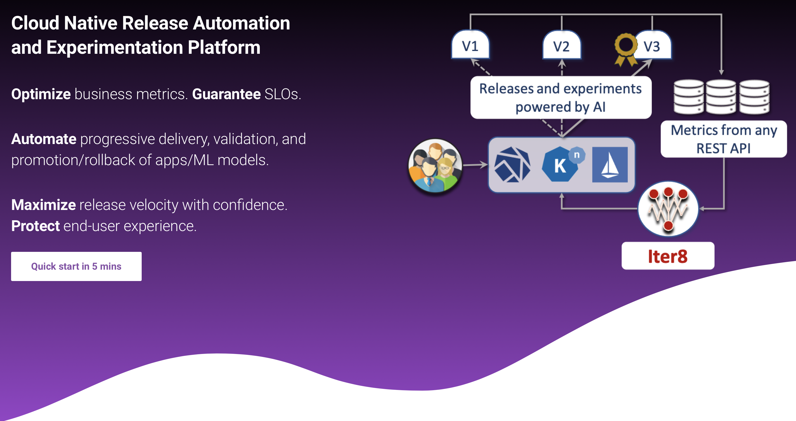

# Iter8

## Welcome
Welcome to the Iter8 GitHub repo! For Iter8 project documentation, please visit the following links.

## [Iter8 Documentation](https://iter8.tools)

## [Quick Start in 5 mins](https://iter8.tools/getting-started/quick-start/with-knative/)

## [Contributing to Iter8](https://iter8.tools/contributing/)