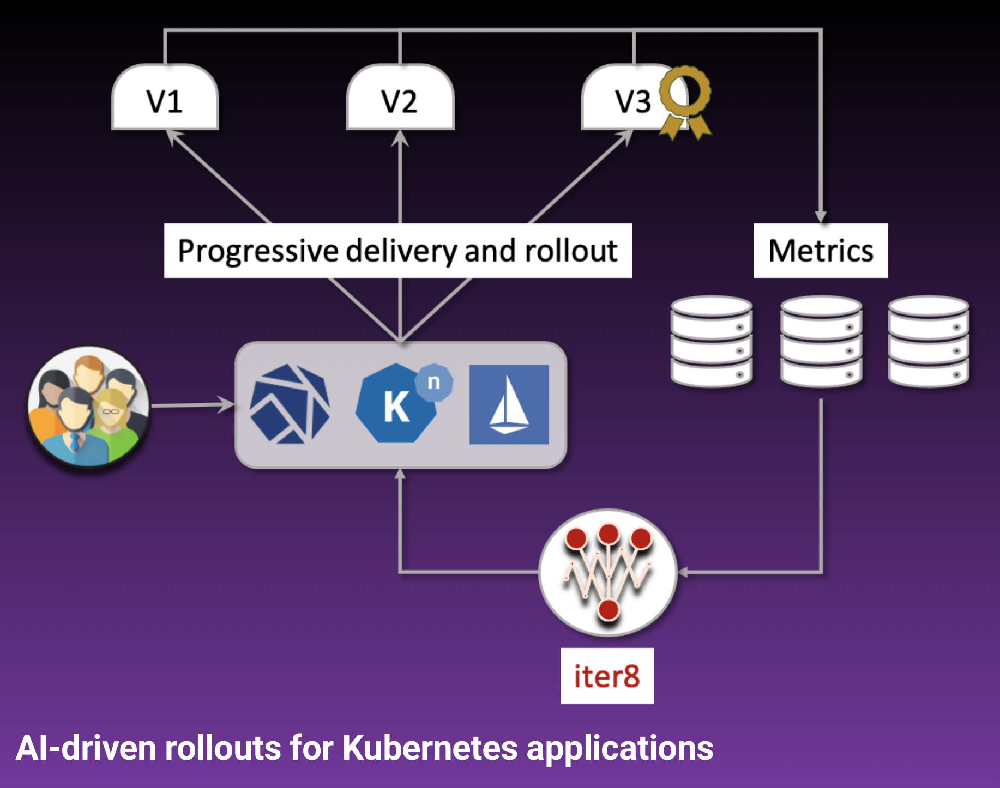

# Iter8
For complete documentation, please visit https://iter8.tools.

## What is Iter8?

Iter8 is an AI-powered cloud native release automation and experimentation platform. Iter8 makes it easy to achieve the following goals while releasing new versions of apps/ML models on Kubernetes.

- **Optimize** business metrics.
- **Guarantee** SLOs.
- **Automate** progressive delivery, validation, and promotion/rollback of apps/ML models.
- **Identify** top versions.
- **Maximize** release velocity with confidence.
- **Protect** end-user experience.

## [Quick Start in 5 mins](https://iter8.tools/getting-started/quick-start/with-knative/)

## Contributing to Iter8
Please visit [Iter8 documentation for contributors](https://iter8.tools/contributing/).