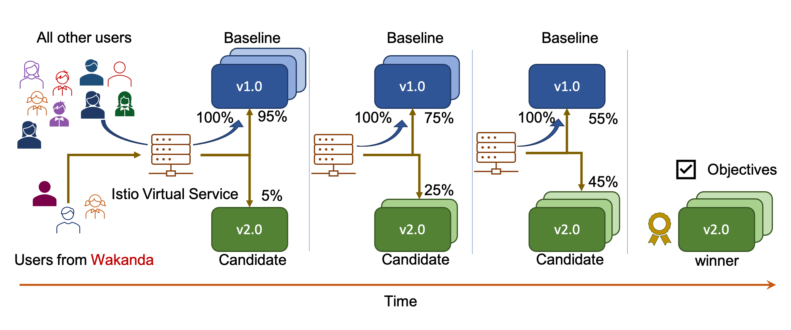

# Iter8
See https://iter8.tools for Iter8 documentation.

## What is Iter8?

Iter8 helps unlock business value in your k8s apps and ML models rapidly and robustly by combining the best of AI, release engineering, and observability.

Use Iter8's AI-driven experimentation capabilities to safely experiment with new versions of your apps and ML models on Kubernetes and OpenShift clusters, gain key insights into their behavior with real user requests in production or staging environments, progressively shift traffic, and rollout the winner in a statistically robust manner.

## What is an Iter8 experiment?

> Iter8 defines a Kubernetes resource kind called Experiment that automates metrics and AI-driven experiments, progressive delivery, and rollout of Kubernetes and OpenShift apps / ML models.

An Iter8 experiment is illustrated below. This experiment automates progressive delivery of a Knative application and uses Knative + Istio networking, and the request routing feature of Istio to perform the experiment for only a specific traffic segment.

## Contributing to Iter8
Please see [Iter8 documentation for contributors](https://iter8.tools/contributing/).