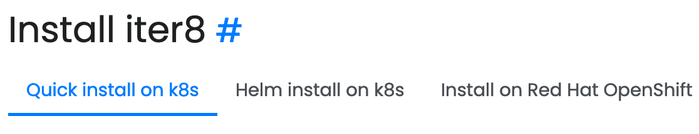
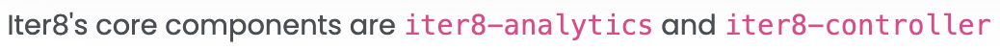
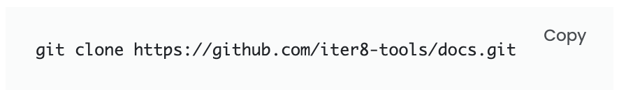
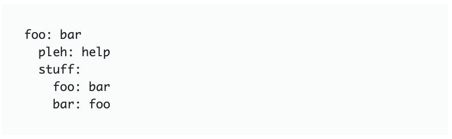
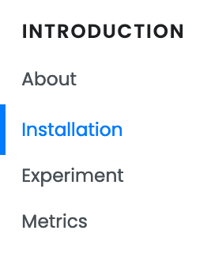
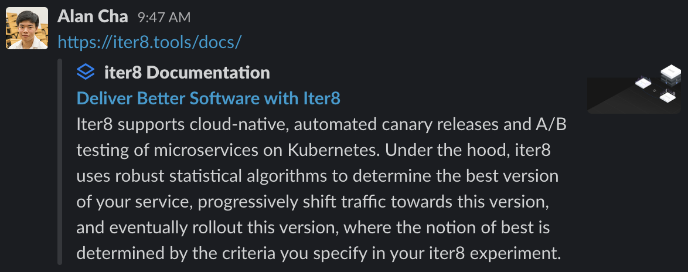

# Working with the new iter8 documentation

In this file, we describe a number of imporant things to consider when developing the [iter8 documentation page](https://github.com/iter8-tools/docs).

Table of contents:
* [Best practices](#best-practices)
  * [Headings should have an anchor link](#headings-should-have-an-anchor-link)
  * [Labeling sections in code](#labeling-sections-in-code)
* [Styled components](#styled-components)
  * [Highlighted words](#highlighted-words)
  * [Copyable code snippets](#copyable-code-snippets)
  * [Non-copyable code snippets](#non-copyable-code-snippets)
  * [Content separation line](#content-separation-line)
* [Miscellaneous](#miscellaneous)
  * [Duplicated about page](#duplicated-about-page)
  * [Sidebar selected page indicator](#sidebar-selected-page-indicator)
  * [Search bar](#search-bar)
  * [Open Graph and Twitter Cards](#open-graph-and-twitter-cards)
  * [Updating GitHub Pages](#updating-gitHub-pages) (WIP)
  * [Publishing a new release](#publishing-a-new-release) (WIP)


## Best practices

### Headings should have an anchor link

Headings should have the following pattern:

```html
<h2>[TOPIC NAME]
  <a class="js-anchor-link duik-anchorjs-link" href="[ANCHOR COMPONENT ID]" aria-label="Anchor" data-anchorjs-icon="#"></a>
</h2>
```

This will generate an `#` icon next to the heading that can be clicked for a smooth scrolling animation.

Currently, on the following sizes are being used:

* `<h2>` for titles
* `<h5>` for section titles
* `<h6>` for subsection tiles

It is recommended to use these sizes for consistency.

**Note**: smaller heading sizes currently do not display the pound sign. We will address this issue in the future but for the time being, add the anchor link for consistency.

***

For example:

```html
<h2>Install iter8
  <a class="js-anchor-link duik-anchorjs-link" href="install.html" aria-label="Anchor"data-anchorjs-icon="#"></a>
</h2>
```

...which produces:



### Labeling sections in code

To make code mantainence and navigation easier, wrap sections in a starting and ending comment, and a `<div>` with an `id` property.

```html
<!-- [TOPIC NAME] -->
<div id="[TOPIC ID]" class="mb-7">
  [TOPIC CONTENT]
</div>
<!-- End [TOPIC NAME] -->
```

**NOTE**: the `class="mb-7"` property in the `<div>` should also be used. 

## Styled components

### Highlighted words

For words that should be highlighted, use the following:

```html
<code>[TEXT HERE]</code>
```

This will format the contained text with a special font and pink font color. 

***

For example, highlighting important names in a paragraph:

```html
<p>
  Iter8's core components are <code>iter8-analytics</code> and <code>iter8-controller</code>
</p>
```

...which produces:



### Copyable code snippets

For code that is copyable, use the following:

```html
<pre>
  <code class="[LANGUAGE TYPE]">
    [CODE HERE]
  </code>
</pre>
```

The `LANGUAGE TYPE` refers to types refered to [here](https://prismjs.com/#supported-languages).

This will create a text box that has syntax highlighting and a button that says `copy`, which will copy the snippet into the user's clipboard. 

**Note**: Prism syntax highlighting currently doesn't work.

***

For example, a shell script:

```html
<pre>
  <code class="language-shell">
    git clone https://github.com/iter8-tools/docs.git
  </code>
</pre>
```

...which produces:



### Non-copyable code snippets

For code that should not be copyable, use the following:

```html
<pre class="[LANGUAGE TYPE]">
[CODE HERE]</pre>
```

See [copyable code snippets](#copyable-code-snippets) for more information about `[LANGUAGE TYPE]`  

This will create a text box that has the same style as the [copyable code snippets](#copyable-code-snippets) but without the clickable `copy` button.

**Note**: the spacing is intentional because the [`<pre>`](https://developer.mozilla.org/en-US/docs/Web/HTML/Element/pre) tag preserves spacing. The code snippet should be be tabulated and the ending `</pre>` should not be on its own line or else an extra space will show up in the rendered HTML.

***

A shell session can be formed by interlacing [copyable code snippets](#copyable-code-snippets) and [non-copyable code snippets](#non-copyable-code-snippets).

***

For example, a YAML code snippet:

```html
<pre class="language-yaml">
foo: bar
  pleh: help
  stuff:
    foo: bar
    bar: foo</pre>
```

...which produces:



### Content separation line

To add a line can be added to clearly divide content, use the following:

```html
<hr class="mt-7 mb-4">
```

**NOTE**: the `class="mt-7 mb-4"` property in the `<hr>` should also be used. 

## Miscellaneous

### Duplicated about page

Because GitHub pages does not provide any routing out-of-the-box, the [iter8.tools/docs/index.html](http://iter8.tools/docs/index.html) page is functionally (due to referenced file path changes) a duplicate of the [iter8.tools/docs/assets/documentation/introduction/about.html](http://iter8.tools/docs/assets/documentation/introduction/about.html) page. 

In other words, any change that is done on [index.html](https://github.com/iter8-tools/docs/blob/master/index.html) should be replicated in [assets/documentation/introduction/about.html](https://github.com/iter8-tools/docs/blob/master/assets/documentation/introduction/about.html) and vice versa. 

**Note**: a search and replace is **not** sufficient as the file paths of referenced components are different!

### Sidebar selected page indicator

There is a blue indicator on the sidebar that shows the user the currently selected page.



This is a static component that needs to be changed if new pages are added. 

***

At the beginning of every documentation page, there is a component with the property `id="sidebar-nav"`.

```html
<!-- Sidebar Nav -->
<div class="collapse navbar-collapse border-bottom border-md-0" id="sidebar-nav">
  <div class="js-scrollbar duik-sidebar-sticky">
    <h5 class="duik-sidebar__heading">Introduction</h5>
    <ul class="duik-sidebar__nav">
      <li class="duik-sidebar__item"><a class="duik-sidebar__link" href="assets/documentation/introduction/about.html">About</a></li>
      <li class="duik-sidebar__item"><a class="duik-sidebar__link active" href="assets/documentation/introduction/install.html">Installation</a></li>
      <li class="duik-sidebar__item"><a class="duik-sidebar__link" href="assets/documentation/introduction/experiment.html">Experiment</a></li>
      <li class="duik-sidebar__item"><a class="duik-sidebar__link" href="assets/documentation/introduction/metrics.html">Metrics</a></li>
    </ul>

    <h5 class="duik-sidebar__heading">Tutorials</h5>
    <ul class="duik-sidebar__nav">
      <li class="duik-sidebar__item"><a class="duik-sidebar__link" href="assets/documentation/tutorials/tutorial-deployments.html">Canary with deployments</a></li>
      <li class="duik-sidebar__item"><a class="duik-sidebar__link" href="assets/documentation/tutorials/tutorial-services.html">Canary with services</a></li>
    </ul>

    ...
    
  </div>
</div>
<!-- End Sidebar Nav -->
```

The `duik-sidebar__item`s contains a link which should have the class `duik-sidebar__link`. 

If the `active` class is selected as well, then that sidebar item will receive the blue indicator. 

Every documentation page should have one sidebar item whose link should have the `active` class. 

### Search bar

The searchable terms are hard-coded and contained in [assets/include/json/autocomplete-data-for-documentation-search.json](https://github.com/iter8-tools/docs/blob/master/assets/include/json/autocomplete-data-for-documentation-search.json).

This will need to be edited to allow for new terms to be used and new pages to be searchable.

### Open Graph and Twitter Cards

In the `<head>` of every page, there are [Open Graph](https://ogp.me/) and [Twitter Card](https://developer.twitter.com/en/docs/tweets/optimize-with-cards/overview/abouts-cards) `<meta>` tags. 

```html
<!-- Twitter Card -->
<meta name="twitter:card" content="product">
<meta name="twitter:title" content="Deliver Better Software with Iter8">
<meta name="twitter:description" content="Iter8 supports cloud-native, automated canary releases and A/B testing of microservices on Kubernetes. Under the hood, iter8 uses robust statistical algorithms to determine the best version of your service, progressively shift traffic towards this version, and eventually rollout this version, where the notion of best is determined by the criteria you specify in your iter8 experiment.">
<meta name="twitter:image" content="https://iter8.tools/docs/assets/img-temp/iter8-promo-resized-open-graph.png">

<!-- Open Graph -->
<meta property="og:title" content="Deliver Better Software with Iter8">
<meta property="og:type" content="article">
<meta property="og:url" content="https://iter8.tools/">
<meta property="og:image" content="https://iter8.tools/docs/assets/img-temp/iter8-promo-resized-open-graph.png">
<meta property="og:description"
  content="Iter8 supports cloud-native, automated canary releases and A/B testing of microservices on Kubernetes. Under the hood, iter8 uses robust statistical algorithms to determine the best version of your service, progressively shift traffic towards this version, and eventually rollout this version, where the notion of best is determined by the criteria you specify in your iter8 experiment.">
<meta property="og:site_name" content="iter8 Documentation">
```

These tags are most often used by social media websites to create previews of the page. 

For example, the following screenshot was taken from Slack:



_It may be in our interest to personalize these for each page._

### Updating GitHub Pages

WIP

### Publishing a new release

WIP