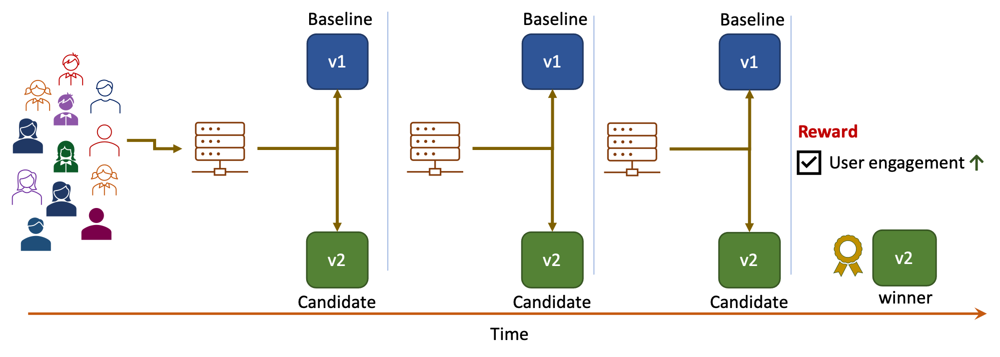
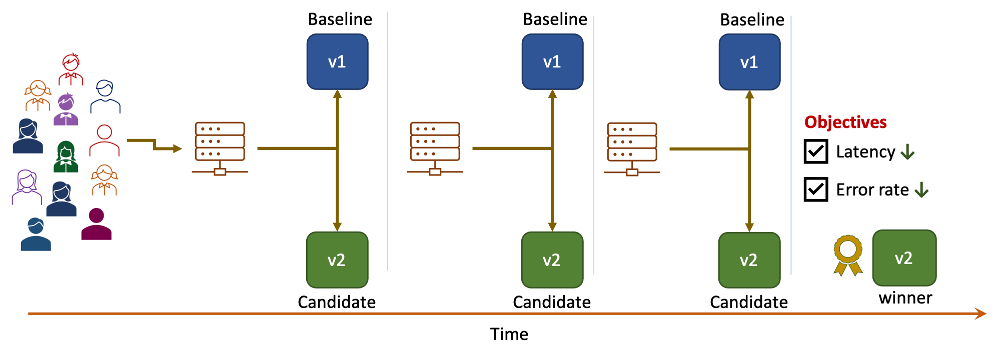
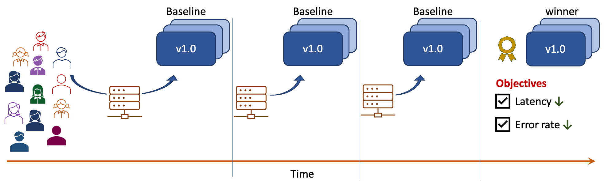
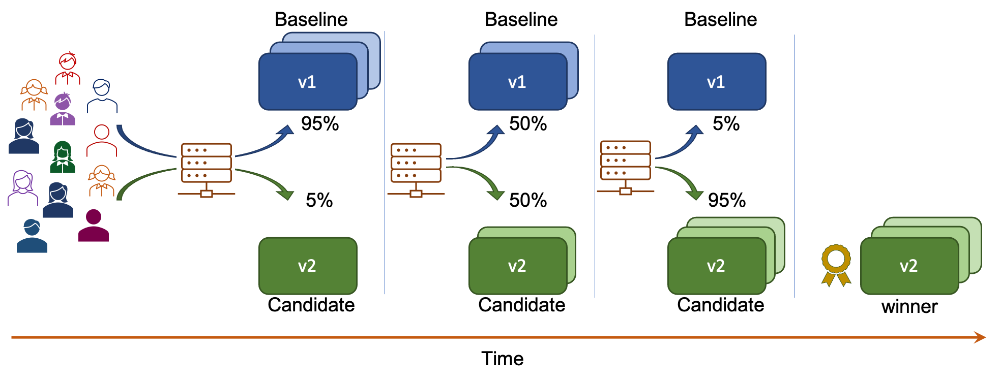
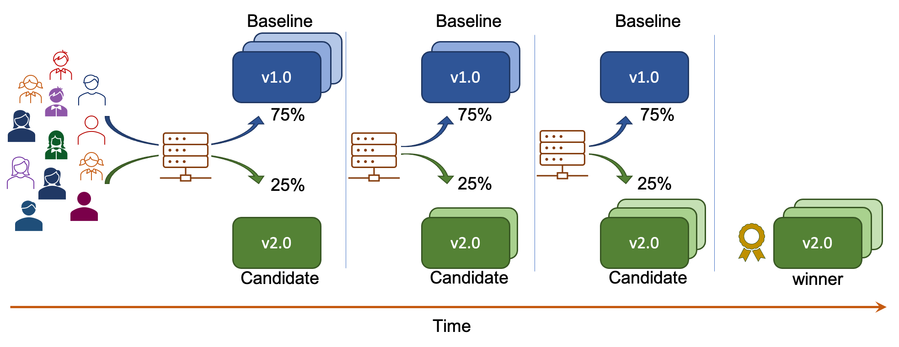
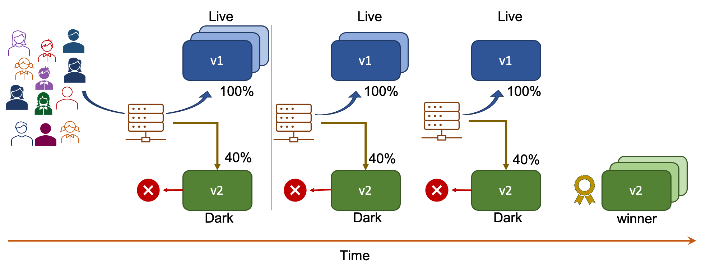
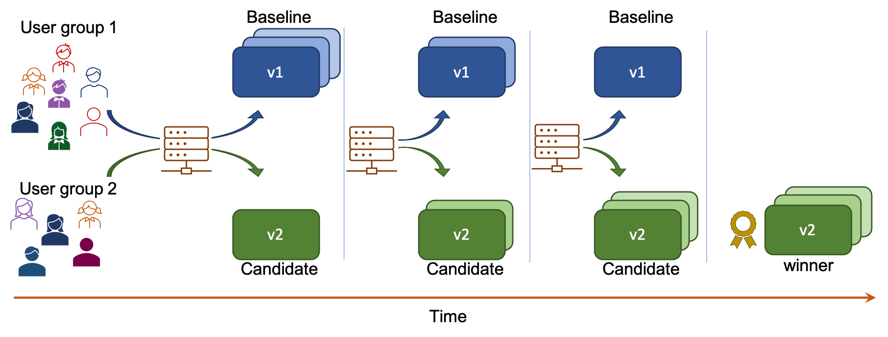
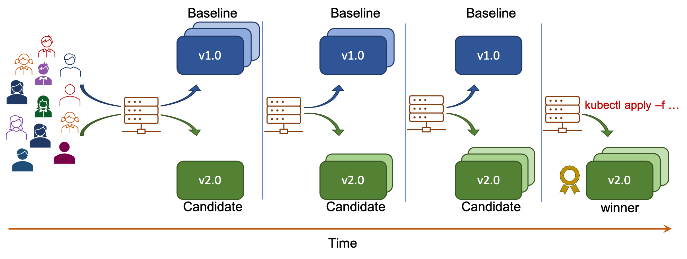
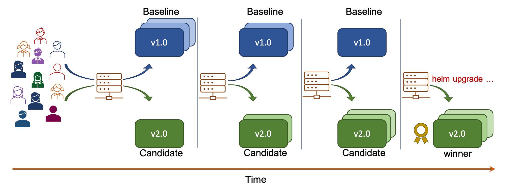
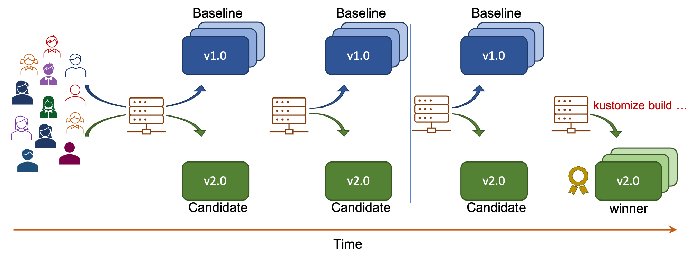

# Building Blocks

> Iter8 defines a Kubernetes resource called **Experiment** that automates A/B, A/B/n, Canary, and Conformance experiments. During an experiment, Iter8 can compare multiple versions, find,  and safely promote the **winning version (winner)** based on business metrics and SLOs.

We now introduce the building blocks of an Iter8 experiment.

***

## Objectives

**Objectives** correspond to service-level objectives or SLOs. In Iter8 experiments, objectives are specified as metrics along with acceptable limits on their values. Iter8 will report how versions are performing with respect to these metrics and whether or not they satisfy the objectives.

An example of an objective is as follows: the 99th-percentile tail latency of the version should be under 50 msec.

***

## Reward
**Reward** typically corresponds to a business metric which you wish to optimize during an experiment. In Iter8 experiments, reward is specified as a metrics along a preferred direction, which could be `high` or `low`. 

Examples of reward includes user-engagement, conversion rate, click-through rate, revenue, precision, recall, and accuracy (for ML models), all of which have a preferred direction `high`. The number of GPU cores consumed by an ML model version is an example of a reward with preferred direction `low`.

***

## Validation

A version of your app/ML model is considered **validated**, if it satisfies the objectives specified in the experiment.

***

## Testing pattern

**Testing pattern** defines the number of versions involved in the experiment (1, 2, or more), and determines how the winner is identified. Iter8 supports **A/B**, **A/B/n**, **canary** and **conformance** testing patterns.

=== "A/B"
    A/B testing involves a baseline version, a candidate version, a reward metric, and objectives (optional). If both versions are validated, the version which optimizes the reward is the winner. If only a single version is validated, this version is the winner. If no version is validated, then there is no winner.

    

=== "A/B/n"
    A/B/n testing involves a baseline version, two or more candidate versions, a reward metric,  and objectives (optional). The winner of the experiment is the version which optimizes the reward among the subset of versions that are validated. If no version is validated, then there is no winner.

    

=== "Canary"
    Canary testing involves a baseline version, a candidate version, and objectives. If the candidate is validated, then candidate is the winner; else, if baseline is validated, then baseline is the winner. If no version is validated, then there is no winner.

    

=== "Conformance"
    Conformance testing involves a single version, a baseline. If it is validated, then baseline is the winner; else, there is no winner.

    

***

## Deployment pattern

**Deployment pattern** determines how traffic is split between versions. Iter8 supports **progressive** and **fixed-split** deployment patterns.

=== "Progressive"
    Progressive deployment incrementally shifts traffic towards the winner over multiple iterations.

    

=== "Fixed-split"
    Fixed-split deployment does not shift traffic between versions.

    

***

## Traffic engineering

**Traffic engineering** refers to features such as **traffic mirroring/shadowing** and **user segmentation** that provide fine-grained controls over how traffic is routed to and from app versions.

Iter8 enables you to take total advantage of all the traffic engineering features available in the service mesh, ingress technology, or networking layer present in your Kubernetes cluster.

=== "Traffic mirroring/shadowing"
    **Traffic mirroring** or **shadowing** enables experimenting with a *dark* launched version with zero-impact on end-users. Mirrored traffic is a replica of the real user requests[^1] that is routed to the dark version. Metrics are collected and evaluated for the dark version, but responses from the dark version are ignored.

    

=== "User segmentation"
    **User segmentation** is the ability to carve out a specific segment of users for an experiment, leaving the rest of the users unaffected by the experiment. Service meshes and ingress controllers often provide the ability to route requests dynamically to different versions based on request attributes such as user identity, URI, IP address prefixes, or origin. Iter8 can leverage this functionality in experiments to control the segment of the users that will participate in the experiment. 
    
    For example, in the canary experiment depicted below, requests from the country `Wakanda` may be routed to baseline or candidate; requests that are not from `Wakanda` will not participate in the experiment and are routed only to the baseline.

    

=== "Session affinity"
    During A/B or canary testing experiments, it is often necessary to ensure that the version to which a particular user's request is routed remains consistent throughout the duration of the experiment. This traffic engineering feature is called **session affinity** or **session stickiness**. Service meshes and ingress controllers can enable this feature based on HTTP cookies or request attributes such as user identity, URI, IP address prefixes, or origin. Iter8 can leverage this functionality in experiments to control how user requests are routed to versions.

    For example, in the A/B testing experiment depicted below, requests from user group 1 are always routed to the baseline while requests from user group 2 are always routed to the candidate during the experiment.

    
***

## Version promotion

When two or more versions participate in an experiment, Iter8 **recommends a version for promotion**; if the experiment yielded a winner, then the version recommended for promotion is the winner; otherwise, the version recommended for promotion is the **baseline** version of your app/ML model.

Iter8 can optionally **promote the recommended version** at the end of an experiment.

## Resource config tools

Iter8 can be easily integrated with Helm and Kustomize. This integration is especially useful if you use these tools for configuring Kubernetes resources needed for releases of your app/ML model.

=== "Helm charts"
    An experiment that uses `helm` charts for version promotion is illustrated below.

    

=== "Kustomize resources"
    An experiment that uses `kustomize` resources for version promotion is illustrated below.

    

[^1]: It is possible to mirror only a certain percentage of the requests instead of all requests.