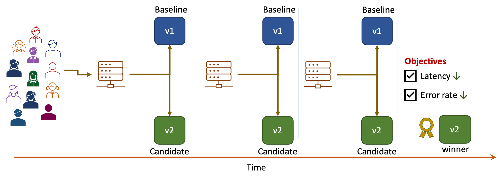
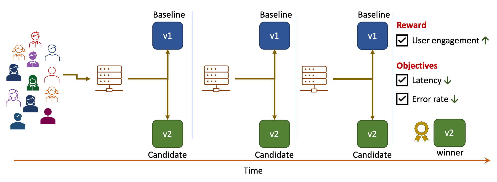
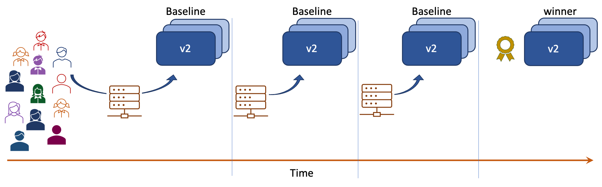
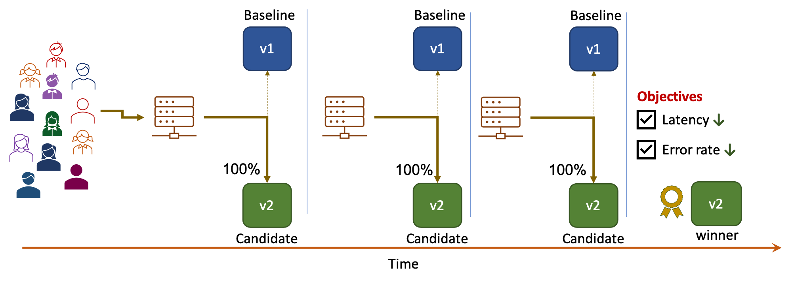
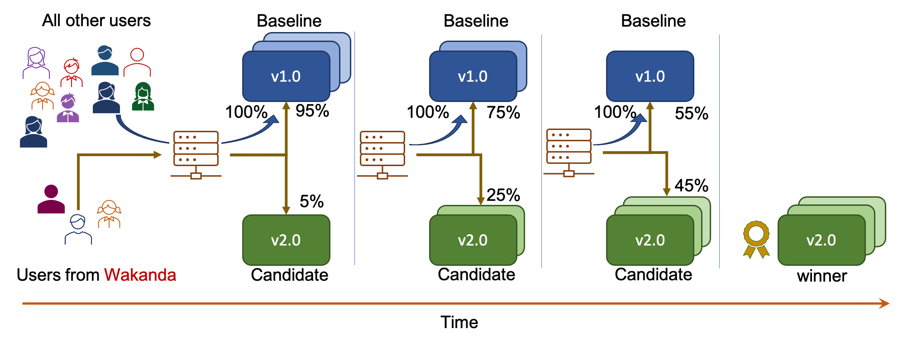

# Building Blocks

> Iter8 defines a Kubernetes resource called **Experiment** that automates a variety of release engineering and experimentation strategies for Kubernetes applications.

We introduce the building blocks of an Iter8 experiment below.

***

## Applications and Versions
Iter8 defines an application very broadly as anything that can be instantiated (run) on Kubernetes, which can be versioned, and for which metrics can be collected.

### Examples

* A Kubernetes service whose versions correspond to `deployments`.
* A Kubernetes service whose versions correspond to `statefulsets`.
* A Knative service whose versions correspond to `revisions`.
* A KFServing inference service, whose versions correspond to model `revisions`.
* A distributed application whose versions correspond to Helm `releases`.

## Objectives

**Objectives** correspond to service-level objectives or SLOs. In Iter8 experiments, objectives are specified as metrics along with acceptable limits on their values. Iter8 will report how versions are performing with respect to these metrics and whether or not they satisfy the objectives.

### Example

An example of an objective is as follows: the 99th-percentile tail latency of the version should be under 50 msec.

***

## Reward
**Reward** typically corresponds to a business metric which you wish to optimize during an A/B testing experiment. In Iter8 experiments, reward is specified as a metrics along with a preferred direction, which could be `high` or `low`. 

### Examples

Examples of reward includes user-engagement, conversion rate, click-through rate, revenue, precision, recall, and accuracy (for ML models), all of which have a preferred direction `high`. The number of GPU cores consumed by an ML model version is an example of a reward with preferred direction `low`.

***

## Baseline and candidate versions
Every Iter8 experiment involves a `baseline` version and may also involve zero, one or more `candidate` versions. Experiments frequently involve two versions, baseline and a candidate.

***

## Testing pattern

**Testing pattern** determines how the **winning version (winner)** in an experiment is identified.

=== "SLO Validation"
    SLO validation experiments may involve a single version or two versions.

    **SLO validation experiment with baseline version and no candidate:** If baseline satisfies the [objectives](#objectives), it is the winner. Otherwise, there is no winner.

    **SLO validation experiment with baseline and candidate versions:** If candidate satisfies the [objectives](#objectives), it is the winner. Else, if baseline satisfies the [objectives](#objectives), it is the winner. Else, there is no winner.

    

=== "A/B testing"
    **A/B testing experiments** involve a baseline version, a candidate version, and a reward metric. The version which performs best in terms of the reward metric is the winner.

    

=== "A/B/n testing"
    **A/B/n testing experiments** involve a baseline version, two or more candidate versions, and a reward metric. The version which performs best in terms of the reward metric is the winner.

    

=== "Hybrid (A/B + SLOs) testing"
    **Hybrid (A/B + SLOs) testing experiments** combine A/B or A/B/n testing on the one hand with SLO validation on the other. Among the versions that satisfy objectives, the version which performs best in terms of the reward metric is the winner. If no version satisfies objectives, then there is no winner.

    

***

## Deployment pattern
**Deployment pattern** defines how traffic is split between versions during the experiment. 

Iter8 makes it easy for you to take total advantage of all the traffic engineering features available in your K8s environment (i.e., supported by the ingress or service mesh technology available in your K8s cluster). 

A few common deployment strategies used in Iter8 experiments are described below. In the following description, `v1` and `v2` refer to the current and new versions of the application respectively.

=== "Simple rollout & rollback"
    This pattern is modeled after the [rolling update of a Kubernetes deployment](https://kubernetes.io/docs/tutorials/kubernetes-basics/update/update-intro/). 
    
    * After `v2` is deployed, it replaces `v1`.
    * If `v2` is the winner of the experiment, it is retained.
    * Else, `v2` is rolled back and `v1` is retained. 
    
    All traffic flows to `v2` during the experiment.

    

=== "Blue/Green"

    * After `v2` is deployed, both `v1` and `v2` are available. 
    * All traffic is routed to `v2`. 
    * If `v2` is the winner of the experiment, all traffic continues to flow to `v2`.
    * Else, all traffic is routed back to `v1`.

    

=== "Dark launch"

    * After `v2` is deployed, it is hidden from end-users.
    * `v2` is not used to serve end-user requests but can still be experimented with.

    === "Builtin load generation"
        During the experiment, Iter8 generates load for `v2`.

        

    === "Traffic mirroring (shadowing)"
        Mirrored traffic is a replica of the real user requests[^1] that is routed to `v2`, and used to collect metrics for `v2`.

        

=== "Canary"
    Canary deployment involves exposing `v2` to a small fraction of end-user requests during the experiment before exposing it to a larger fraction of requests or all the requests.

    === "%-based split"
        A fixed % of end-user requests is sent to `v2` and the rest is sent to `v1`.

        

    === "Progressive traffic shift"

        Traffic is incrementally shifted to the winner over multiple iterations.

        

    ???+ Tip "Canary with user segmentation and session affinity"
        === "Session affinity"            
            Session affinity, sometimes referred to as sticky sessions, routes all requests coming from an end-user to the same version consistently throughout the experiment.

            Session affinity is depicted in the picture below. User grouping and affinity can be configured based on a number of different attributes of the request including request headers, cookies, query parameters, geo location, user agent (browser version, screen size, operating system) and language.

            

        === "User segmentation"
            === "%-based split"
                * Only a specific segment of the users participate in the experiment.
                * A fixed % of requests from the participating segment is sent to `v2`. Rest is sent to `v1`.
                * All requests from end-users in the non-participating segment is sent to `v1`.

                

            === "Progressive traffic shift"
                * Only a specific segment of the users participate in the experiment.
                * Within this segment, traffic is incrementally shifted to the winner over multiple iterations.
                * All requests from end-users in the non-participating segment is sent to `v1`.

                

<!-- 
    progressive rollout incrementally shifts traffic towards the winner over multiple iterations.

    

=== "Fixed-split"
    Fixed-split deployment does not shift traffic between versions.

     -->

***

<!-- ## Traffic engineering

**Traffic engineering** refers to features such as **dark launch, traffic mirroring/shadowing, user segmentation** and **session affinity** that provide fine-grained controls over how traffic is routed to and from app versions.

Iter8 enables you to take total advantage of all the traffic engineering features available in the service mesh, ingress technology, or networking layer present in your Kubernetes cluster.

=== "Dark launch"
    **Dark launch** enables you to deploy and experiment with a new version of your application/ML model in such a way that it is hidden from all (or most) of your end-users.

    

=== "Traffic mirroring/shadowing"
    **Traffic mirroring** or **shadowing** enables experimenting with a *dark* launched version with zero-impact on end-users. Mirrored traffic is a replica of the real user requests[^1] that is routed to the dark version. Metrics are collected and evaluated for the dark version, but responses from the dark version are ignored.

    

=== "User segmentation"
    **User segmentation** is the ability to carve out a specific segment of users for an experiment, leaving the rest of the users unaffected by the experiment. Service meshes and ingress controllers often provide the ability to route requests dynamically to different versions based on request attributes such as user identity, URI, IP address prefixes, or origin. Iter8 can leverage this functionality in experiments to control the segment of the users that will participate in the experiment. 
    
    For example, in the canary experiment depicted below, requests from the country `Wakanda` may be routed to baseline or candidate; requests that are not from `Wakanda` will not participate in the experiment and are routed only to the baseline.

    

=== "Session affinity"
    During A/B or canary testing experiments, it is often necessary to ensure that the version to which a particular user's request is routed remains consistent throughout the duration of the experiment. This traffic engineering feature is called **session affinity** or **session stickiness**. Service meshes and ingress controllers can enable this feature based on HTTP cookies or request attributes such as user identity, URI, IP address prefixes, or origin. Iter8 can leverage this functionality in experiments to control how user requests are routed to versions.

    For example, in the A/B testing experiment depicted below, requests from user group 1 are always routed to the baseline while requests from user group 2 are always routed to the candidate during the experiment.

    
*** -->

## Version promotion
Iter8 can **promote the winning version** at the end of an experiment.

[^1]: It is possible to mirror only a certain percentage of the requests instead of all requests.