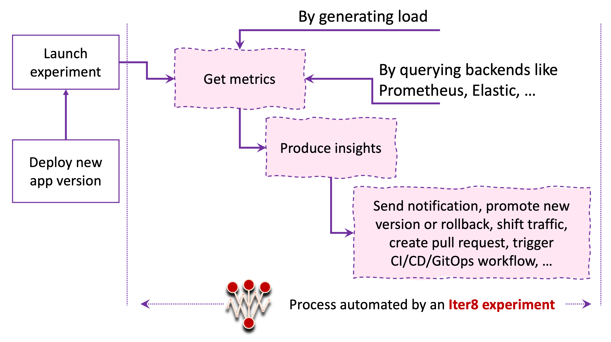

# What is Iter8?

**Iter8** is the release engineering platform for Kubernetes applications and ML models.

Iter8 makes it easy to **unlock business value and guarantee service-level objectives (SLOs)** by identifying the best performing version of your app/ML model and promoting it safely.

Iter8 is designed for **DevOps and MLOps teams** interested in maximizing release velocity and business value with their apps/ML models while protecting end-user experience. Use Iter8 for SLO validation, A/B testing and progressive rollouts of K8s apps/ML models.

## What is an Iter8 experiment?
Iter8 defines a Kubernetes resource called **Experiment** that automates SLO validation, A/B(/n) testing and progressive rollouts as shown below.

## How does Iter8 work?

Iter8 consists of a [Go-based Kubernetes controller](https://github.com/iter8-tools/etc3) that orchestrates (reconciles) experiments in conjunction with a [Python-based analytics service](https://github.com/iter8-tools/iter8-analytics), and a [Go-based task runner](https://github.com/iter8-tools/handler).
