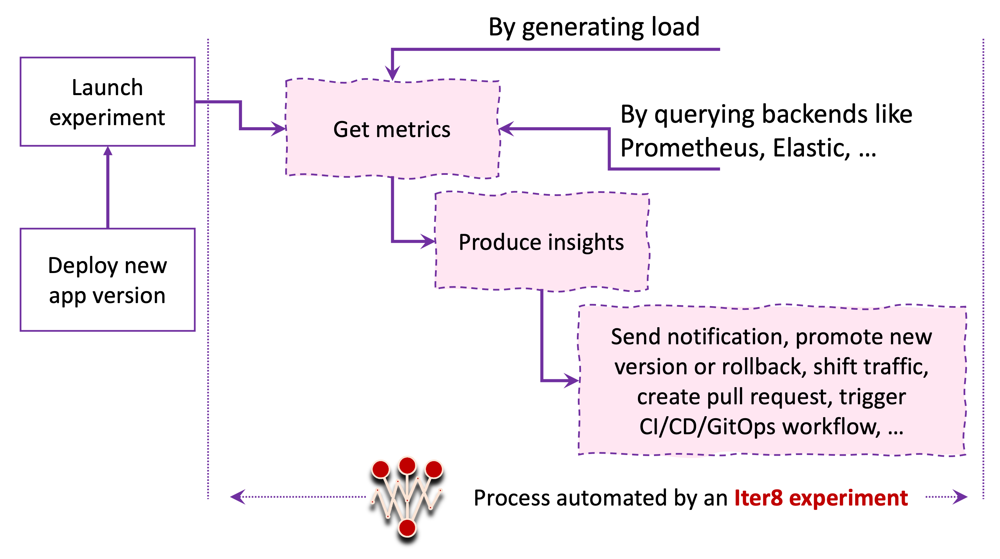

# What is Iter8?
Iter8 makes it simple and easy to safely rollout new versions of apps and ML models, and maximize business value with each release. Iter8 is open-source and Kubernetes-friendly. Built for DevOps/SRE/MLOps/data science teams.

## Use cases

1.  Load testing with SLOs
2.  A/B(/n) testing with business reward metrics
3.  SLOs with metrics from any backend
4.  Traffic mirroring
5.  User segmentation
6.  Session affinity
7.  Gradual rollout

The traffic engineering use-cases (4 - 7 above) are achieved by using Iter8 along with a Kubernetes service mesh or ingress.

## What is an Iter8 experiment?
An Iter8 experiment is a sequence of tasks that produce metrics-driven insights for your app/ML model versions, validates them, and optionally performs a rollout. Iter8 provides a set of pre-defined and customizable tasks for the following purposes.

1.  Generating load and getting built-in metrics for one or more versions of the app.
2.  Getting metrics by querying backends like Prometheus, New Relic, SysDig, or Elastic.
3.  Assessing app versions with SLOs and business reward metrics.
4.  Triggering events based on experiments insights. Events include:
      * sending a Slack or webhook notification
      * triggering a CI/CD/GitHub actions workflow
      * creating a GitHub pull request, and 
      * changing application state (including traffic splits) inside a Kubernetes cluster
      * sending a cloudevent notification



Experiments are specified using an `experiment.yaml` file as shown below.
```yaml
# the following experiment performs a load test for https://example.com
# and validates error-rate and 95th percentile service level objectives (SLOs)
# 
# task 1: generate requests for the app and collect built-in metrics
- task: gen-load-and-collect-metrics
  with:
    versionInfo:
    - url: https://example.com
# task 2: assess if app satisfies SLOs
# this experiment involves only one version of the app
- task: assess-app-versions
  with:
    SLOs:
    - metric: built-in/error-rate
      upperLimit: 0
    - metric: built-in/p95
      upperLimit: 100
```

### Experiment Chart
In order to enable reuse, Iter8 experiments are templated and packaged in the form of [Helm charts](https://helm.sh/docs/topics/charts/). Iter8 experiment charts can be combined with values to generate `experiments.yaml` files, much like how Helm charts can be combined with values to produce Kubernetes manifests.

## Where can I run experiments?

* On your local machine
* In a container
* Inside Kubernetes
* As a step in your CI/CD/GitOps pipeline

## Iter8 can be used with ...

  * any app/serverless/ML framework
  * any metrics backend
  * any service mesh/ingress/networking technology, and 
  * any CI/CD/GitOps process

## Implementation

Iter8 is implemented as a `go` module and comes with a command line interface (CLI) that enables rapid experimentation.
