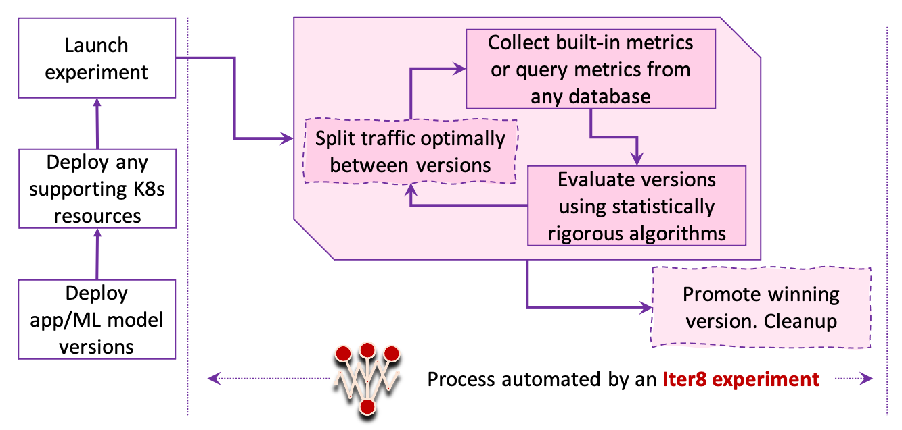

# What is Iter8?

Iter8 enables **DevOps/SRE/MLOps/data science teams** to maximize release velocity and business value of apps and ML models while protecting end-user experience.

Use **Iter8 experiments** for load testing, SLO validation, A/B(/n) testing different versions of apps and identifying a winner based on business metrics, dark launches and canary releases, chaos testing, and hybrids of the above. Combine Iter8 with your service mesh/ingress/networking technology to achieve advanced traffic engineering functions like mirroring, user segmentation, session affinity, and gradual rollouts.

***

## What is an Iter8 experiment?
Iter8 defines the concept of an experiment that automates various aspects of the application release process as shown below.[^1]



***

## How is an Iter8 experiment specified?
Iter8 experiment is specified in a simple `experiment.yaml` file as shown in the following example. An experiment is simply a collection of tasks that are executed by Iter8. The set of tasks supported by Iter8 are [here](../reference/tasks/overview.md).

```yaml
# the following experiment performs a load test for https://example.com
# and assesses if it satisfies 
# error-rate and 95th percentile service level objectives (SLOs)
# 
# generate requests for the app and collect built-in metrics
- task: collect-fortio-metrics
  with:
    versionInfo:
    - url: https://example.com
# assess how the app is performing relative to criteria
- task: assess-versions
  with:
    criteria:
      requestCount: iter8-fortio/request-count
      objectives:
      - metric: iter8-fortio/error-rate
        upperLimit: 0
      - metric: iter8-fortio/p95
        upperLimit: 100
```

Iter8 tasks can perform a variety of functions such as collecting built-in metrics, querying metrics from databases or app endpoints, assessing how the versions are performing relative to the experiment criteria, computing and applying optional traffic splits between versions, promoting the winning version, notifying event receivers, creating pull requests, and triggering webhooks or GitHub Action workflows to name a few.

## How are experiments run?
Iter8 provides a command line utility for running experiments on your local machine.

```shell
# this will run experiment.yaml
iter8 run
```

Iter8 experiments can also be run inside a container, in a Kubernetes cluster in the form of a job, as a step within a GitHub actions workflow, in any environment that can run a container image (such as a Tekton task), or in any environment that can run the Iter8 executable.

***

## Can Iter8 be used within [... my unique environment]?
Iter8 can be used with:

  * any app/serverless/ML framework
  * any metrics provider
  * any service mesh/ingress technology for managing traffic, and 
  * any CI/CD/GitOps process.

## How is Iter8 implemented?

Iter8 is implemented as `go` module.

[^1]: Tasks with squiggly and dashed boundaries are optional.