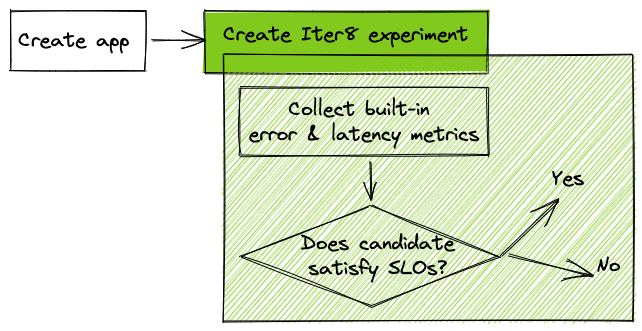

# Your First Experiment

!!! tip "Scenario: Validate service-level objectives (SLOs) for a Kubernetes app"
    **Problem**: You have a Kubernetes app. You want to verify that it satisfies latency and error rate SLOs.

    **Solution**: In this tutorial, you will launch a Kubernetes app along with an Iter8 experiment. Iter8 will [validate that the app satisfies latency and error-based objectives (SLOs)](../concepts/buildingblocks.md#slo-validation) using [built-in metrics](../metrics/builtin.md). During this validation, Iter8 will generate HTTP GET requests for the app.

    
    
??? warning "Setup Kubernetes cluster and local environment"
    1. Setup [Kubernetes cluster](setup-for-tutorials.md#local-kubernetes-cluster)
    2. [Install Iter8 in Kubernetes cluster](install.md)
    3. Get [Helm 3.4+](https://helm.sh/docs/intro/install/).
    4. Get [`iter8ctl`](install.md#get-iter8ctl)
    5. Fork the [Iter8 GitHub repo](https://github.com/iter8-tools/iter8). Clone your fork, and set the ITER8 environment variable as follows.
    ```shell
    export USERNAME=<your GitHub username>
    ```
    ```shell
    git clone git@github.com:$USERNAME/iter8.git
    cd iter8
    export ITER8=$(pwd)
    ```

## 1. Create app
The `hello world` app consists of a Kubernetes deployment and service. Deploy the app as follows.

```shell
kubectl apply -n default -f $ITER8/samples/deployments/app/deploy.yaml
kubectl apply -n default -f $ITER8/samples/deployments/app/service.yaml
```

### 1.a) Verify app is running

??? note "Verify that the app is running using these instructions"
    ```shell
    # do this in a separate terminal
    kubectl port-forward -n default svc/hello 8080:8080
    ```

    ```shell
    curl localhost:8080
    ```

    ```
    # output will be similar to the following (notice 1.0.0 version tag)
    # hostname will be different in your environment
    Hello, world!
    Version: 1.0.0
    Hostname: hello-bc95d9b56-xp9kv
    ```

## 2. Create Iter8 experiment
Deploy an Iter8 experiment for SLO validation of the app as follows.
```shell
helm upgrade -n default my-exp $ITER8/samples/first-exp \
  --set URL='http://hello.default.svc.cluster.local:8080' \
  --set limitMeanLatency=50.0 \
  --set limitErrorRate=0.0 \
  --set limit95thPercentileLatency=100.0 \
  --install  
```

The above command creates [an Iter8 experiment](../concepts/whatisiter8.md#what-is-an-iter8-experiment) that generates requests, collects latency and error rate metrics for the app, and verifies that the app satisfies mean latency (50 msec), error rate (0.0), 95th percentile tail latency SLO (100 msec) SLOs.

### 2.a) View manifest
??? note "View Iter8 experiment manifest using these instructions"
    View the Iter8 experiment as follows.
    ```shell
    helm get manifest -n default my-exp
    ```

    Your experiment will be similar to the following.
    ```yaml linenums="1" hl_lines="14 15 16 17 18 19 20 25 26 27 28 29 30 31"
    # Source: slo/templates/experiment.yaml
    apiVersion: iter8.tools/v2alpha2
    kind: Experiment
    metadata:
      name: slo-validation-mz8py
    spec:
      # target identifies application for which SLO validation experiment is performed
      target: app
      strategy:
        # this experiment will perform a conformance test
        testingPattern: Conformance
        actions:
          start:
          - task: metrics/collect
            with:
              time: "5s"
              versions:
              - name: my-app
                url: "http://hello.default.svc.cluster.local:8080"
                qps: 8
      criteria:
        requestCount: iter8-system/request-count
        indicators:
        - iter8-system/error-count
        objectives:
        - metric: iter8-system/mean-latency
          upperLimit: "50.0"
        - metric: iter8-system/error-rate
          upperLimit: "0.0"
        - metric: iter8-system/latency-95th-percentile
          upperLimit: "100.0"
      duration:
        intervalSeconds: 1
        iterationsPerLoop: 1
      versionInfo:
        # information about app versions used in this experiment
        baseline:
          name: my-app
    ```    

    The [`metrics/collect` task](../reference/tasks/metrics-collect.md) highlighted above is responsible for generating and sending HTTP requests to the app's API end-point, receiving responses, and creating latency and error-related metrics. The [`objectives`](../../concepts/buildingblocks/#objectives-slos) stanza describes the SLOs that the app needs to satisfy in order to be declared a winner.

## 3. Observe experiment
The `iter8ctl` CLI makes it easy to observe experiment progress and outcomes.

### 3.a) Assert outcomes
Assert that the experiment completed and found a winning version. Wait 20 seconds before trying the following command. If the assertions are not satisfied, try again after a few seconds.

```shell
# assert that the experiment completed and found a winner
iter8ctl assert -c completed -c winnerFound
```

### 3.b) Describe results
Describe the results of the Iter8 experiment.

```shell
# describe results of the experiment
iter8ctl describe
```

??? info "Sample experiment results"
    ```shell
    ****** Overview ******
    Experiment name: my-experiment
    Experiment namespace: default
    Target: my-app
    Testing pattern: Conformance
    Deployment pattern: Progressive

    ****** Progress Summary ******
    Experiment stage: Completed
    Number of completed iterations: 1

    ****** Winner Assessment ******
    > If the version being validated; i.e., the baseline version, satisfies the experiment objectives, it is the winner.
    > Otherwise, there is no winner.
    Winning version: my-app

    ****** Objective Assessment ******
    > Identifies whether or not the experiment objectives are satisfied by the most recently observed metrics values for each version.
    +--------------------------------------+--------+
    |              OBJECTIVE               | MY-APP |
    +--------------------------------------+--------+
    | iter8-system/mean-latency <=         | true   |
    |                               50.000 |        |
    +--------------------------------------+--------+
    | iter8-system/error-rate <=           | true   |
    |                                0.000 |        |
    +--------------------------------------+--------+
    | iter8-system/latency-95th-percentile | true   |
    | <= 100.000                           |        |
    +--------------------------------------+--------+

    ****** Metrics Assessment ******
    > Most recently read values of experiment metrics for each version.
    +--------------------------------------+--------+
    |                METRIC                | MY-APP |
    +--------------------------------------+--------+
    | iter8-system/mean-latency            |  1.233 |
    +--------------------------------------+--------+
    | iter8-system/error-rate              |  0.000 |
    +--------------------------------------+--------+
    | iter8-system/latency-95th-percentile |  2.311 |
    +--------------------------------------+--------+
    | iter8-system/request-count           | 40.000 |
    +--------------------------------------+--------+
    | iter8-system/error-count             |  0.000 |
    +--------------------------------------+--------+
    ```

### 3.c) Debug
The `iter8ctl` debug command is especially useful in situations where the experiment failed to complete successfully, or produces an unexpected outcome (such as failure to find a winning version).

```shell
# print Iter8logs at priority levels 1 (error), 2 (warning), and 3 (info)
iter8ctl debug --priority 3
```

??? info "Sample debugging output"
    ```yaml
    hello: world
    ```

## 4. Cleanup
```shell
# remove experiment
helm uninstall -n default my-exp
# remove app
kubectl delete -n default -f $ITER8/samples/deployments/app/service.yaml
kubectl delete -n default -f $ITER8/samples/deployments/app/deploy.yaml
```
***

**Next Steps**

!!! tip "Use in your environment"
    1. Run the above experiment with your app by setting the `URL` value in the Helm command to the URL of your app. You can run this experiment in any Kubernetes environment such as a dev, test, staging, or production cluster.
    
    2. You can also customize the mean latency, error rate, and tail latency limits in the SLOs.

    3. [Try an SLO validation experiment where Iter8 generates payload for a POST API implemented by your app.](../tutorials/deployments/slo-validation-payload.md)

    4. [Try an SLO validation experiment with chaos injection.](../tutorials/deployments/slo-validation-chaos.md)

    5. [Try an SLO validation experiment with promotion of a candidate version using GitOps.](../tutorials/deployments/slo-validation-gitops.md)
