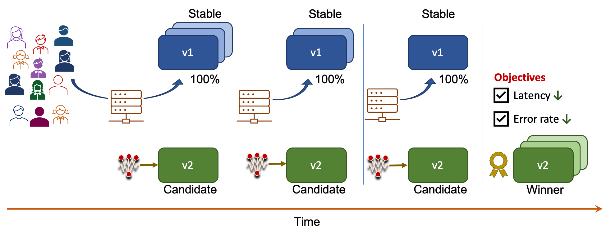

# Your First Experiment

!!! tip "Scenario: Safely rollout a Kubernetes deployment with SLO validation"
    In this tutorial, you will [dark launch](../concepts/buildingblocks.md#dark-launch) a candidate version of your application (a Kubernetes deployment). You will use an Iter8 experiment to [validate that the candidate satisfies latency and error-based objectives (SLOs)](../concepts/buildingblocks.md#slo-validation), and promote it as the latest stable version. The metrics needed for validation will be collected automatically using Iter8's [builtin metrics](../metrics/builtin.md) feature.
    
    

???+ warning "Platform setup"
    1. [Helm 3+](https://helm.sh/docs/intro/install/). While Helm is not a pre-requisite for using Iter8, this tutorial uses Helm.
    2. A Kubernetes cluster.

        ??? note "Create a local Kubernetes cluster"
            You can create a local K8s cluster as follows. You may skip this step if you already have a K8s cluster to work with.

            === "Kind"

                ```shell
                kind create cluster --wait 5m
                kubectl cluster-info --context kind-kind
                ```

            === "Minikube"

                ```shell
                minikube start
                ```
    3. [Iter8 installed in your K8s cluster](install.md#install-iter8).
    4. [`iter8ctl`](install.md#install-iter8ctl).

## 1. Create stable version
Deploy the stable version of the `hello world` application using Helm.

```shell
helm repo add iter8 https://iter8-tools.github.io/iter8/
```

```shell
helm install \
  --set stable=gcr.io/google-samples/hello-app:1.0 \
  my-app iter8/deploy
```

??? note "Verify that stable version is up"
    ```shell
    # do this in a separate terminal
    kubectl port-forward svc/hello 8080:8080
    ```

    ```shell
    curl localhost:8080
    ```

    ```
    # output will be similar to the following (notice 1.0.0 version tag)
    # hostname will be different in your environment
    Hello, world!
    Version: 1.0.0
    Hostname: hello-bc95d9b56-xp9kv
    ```

<!-- 
```shell
kubectl create deploy hello --image=gcr.io/google-samples/hello-app:1.0
kubectl create svc clusterip hello --tcp=8080
``` 
-->

## 2. Create candidate version
Deploy the candidate version of the `hello world` application using Helm.
```shell
helm upgrade --install \
  --set candidate=gcr.io/google-samples/hello-app:2.0 \
  --set LimitMeanLatency=50.0 \
  --set LimitErrorRate=0.0 \
  --set Limit95thPercentileLatency=100.0 \
  my-app iter8/deploy
```

??? note "Verify that candidate version is up"
    ```shell
    # do this in a separate terminal
    kubectl port-forward svc/hello-candidate 8081:8080
    ```

    ```shell
    curl localhost:8081
    ```

    ```
    # output will be similar to the following (notice 2.0.0 version tag)
    # hostname will be different in your environment
    Hello, world!
    Version: 2.0.0
    Hostname: hello-bc95d9b56-xp9kv
    ```

The above command creates [an Iter8 experiment](../concepts/whatisiter8.md#what-is-an-iter8-experiment) alongside the candidate deployment of the `hello world` application. The experiment will collect latency and error rate metrics for the candidate, and verify that it satisfies the mean latency SLO (50 msec), error rate SLO (no errors), 95th percentile tail latency SLO (100 msec) specified in the Helm command.

<!-- 
```shell
kubectl create deploy hello-candidate --image=gcr.io/google-samples/hello-app:2.0
kubectl create svc clusterip hello-candidate --tcp=8080
``` 
-->

## 3. Observe experiment
Periodically describe the experiment results.
```shell
watch -x iter8ctl describe last
```

??? info "Experiment results will look similar to this ... "
    ```shell
    ****** Overview ******
    Experiment name: my-experiment
    Experiment namespace: default
    Target: my-app
    Testing pattern: Conformance
    Deployment pattern: Progressive

    ****** Progress Summary ******
    Experiment stage: Completed
    Number of completed iterations: 1

    ****** Winner Assessment ******
    > If the version being validated; i.e., the baseline version, satisfies the experiment objectives, it is the winner.
    > Otherwise, there is no winner.
    Winning version: my-app

    ****** Objective Assessment ******
    > Identifies whether or not the experiment objectives are satisfied by the most recently observed metrics values for each version.
    +--------------------------------------+--------+
    |              OBJECTIVE               | MY-APP |
    +--------------------------------------+--------+
    | iter8-system/mean-latency <=         | true   |
    |                               50.000 |        |
    +--------------------------------------+--------+
    | iter8-system/error-rate <=           | true   |
    |                                0.000 |        |
    +--------------------------------------+--------+
    | iter8-system/latency-95th-percentile | true   |
    | <= 100.000                           |        |
    +--------------------------------------+--------+

    ****** Metrics Assessment ******
    > Most recently read values of experiment metrics for each version.
    +--------------------------------------+--------+
    |                METRIC                | MY-APP |
    +--------------------------------------+--------+
    | iter8-system/mean-latency            |  1.233 |
    +--------------------------------------+--------+
    | iter8-system/error-rate              |  0.000 |
    +--------------------------------------+--------+
    | iter8-system/latency-95th-percentile |  2.311 |
    +--------------------------------------+--------+
    | iter8-system/request-count           | 40.000 |
    +--------------------------------------+--------+
    | iter8-system/error-count             |  0.000 |
    +--------------------------------------+--------+
    ``` 

## 4. Promote winner
Assert that the winner of the experiment is the candidate version.
```shell
iter8ctl assert last --condition=Completed --condition=CandidateWon
```

Promote the winner as follows.

```shell
helm install \
  --set stable=gcr.io/google-samples/hello-app:2.0 \
  my-app iter8/deploy
```

??? note "Verify that candidate is the latest stable version ..."
    ```shell
    curl localhost:8080
    ```

    ```
    # output will be similar to the following (notice 2.0.0 version tag)
    # hostname will be different in your environment
    Hello, world!
    Version: 2.0.0
    Hostname: hello-bc95d9b56-xp9kv
    ```

## 5. Cleanup
```shell
helm uninstall my-app
```

***

**Next Steps**

!!! tip "Use in production"
    The source for the Helm chart used in this tutorial can be found in the following location.
    ```shell
    $ITER8/helm/deploy
    ```
    Adapt the `deployment.yaml` and `hpa.yaml` templates as needed by your application in order use this chart in production.

!!! tip "Try other Iter8 tutorials"
    Iter8 can work in any K8s environment. Try Iter8 in the following environments.

    [KFServing](../tutorials/kfserving/quick-start.md){ .md-button .md-button--primary }
    [Seldon](../tutorials/seldon/quick-start.md){ .md-button .md-button--primary }
    [Knative](../tutorials/knative/quick-start.md){ .md-button .md-button--primary }
    [Istio](../tutorials/istio/quick-start.md){ .md-button .md-button--primary }