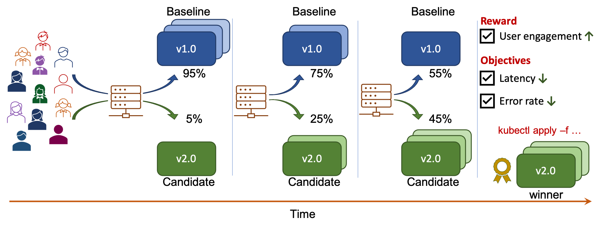
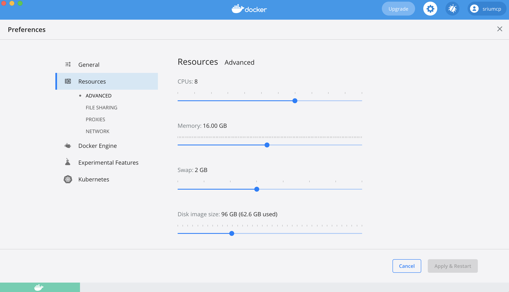
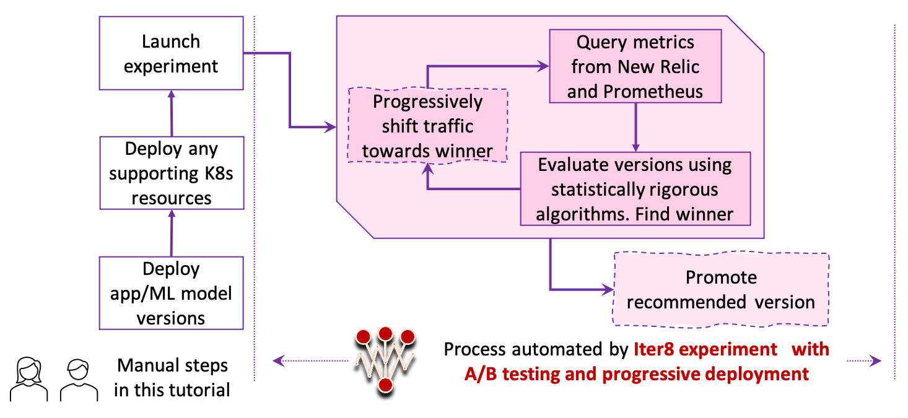

# Quick Start

!!! tip "Scenario: A/B testing"
    [A/B testing](../../concepts/buildingblocks/#testing-pattern) enables you to compare two versions of an app/ML model, and select a winner based on a (business) reward metric and objectives (SLOs). In this tutorial, you will:

    1. Perform A/B testing.
    2. Specify *user-engagement* as the reward metric, and *latency* and *error-rate* based objectives. Iter8 will find a winner by comparing the two versions in terms of the reward, and by validating versions in terms of the objectives.
    3. Use New Relic as the provider for user-engagement metric, and Prometheus as the provider for latency and error-rate metrics.
    4. Combine A/B testing with [progressive deployment](../../concepts/buildingblocks/#deployment-pattern).
    
    Iter8 will progressively shift the traffic towards the winner and promote it at the end as depicted below.

    

???+ warning "Before you begin, you will need... "
    1. The [kubectl CLI](https://kubernetes.io/docs/tasks/tools/install-kubectl/).
    2. [Go 1.13+](https://golang.org/doc/install).
    
    This tutorial is available for the following K8s stacks.

    [Istio](#before-you-begin){ .md-button }
    [KFServing](#before-you-begin){ .md-button }
    [Knative](#before-you-begin){ .md-button }

    Please choose the same K8s stack consistently throughout this tutorial. If you wish to switch K8s stacks between tutorials, start from a clean K8s cluster, so that your cluster is correctly setup.

## 1. Create Kubernetes cluster

Create a local cluster using Kind or Minikube as follows, or use a managed Kubernetes cluster. Ensure that the cluster has sufficient resources, for example, 8 CPUs and 12GB of memory.

=== "Kind"

    ```shell
    kind create cluster
    kubectl cluster-info --context kind-kind
    ```

    ??? info "Ensuring your Kind cluster has sufficient resources"
        Your Kind cluster inherits the CPU and memory resources of its host. If you are using Docker Desktop, you can set its resources as shown below.

        

=== "Minikube"

    ```shell
    minikube start --cpus 8 --memory 12288
    ```

## 2. Clone Iter8 repo
```shell
git clone https://github.com/iter8-tools/iter8.git
cd iter8
export ITER8=$(pwd)
```

## 3. Install K8s stack and Iter8
Choose the K8s stack over which you are performing the A/B testing experiment.

=== "Istio"
    Setup Istio, Iter8, a mock New Relic service, and Prometheus add-on within your cluster.

    ```shell
    $ITER8/samples/istio/quickstart/platformsetup.sh
    ```
    
=== "KFServing"
    Setup KFServing, Iter8, a mock New Relic service, and Prometheus add-on within your cluster.

    ```shell
    $ITER8/samples/kfserving/quickstart/platformsetup.sh
    ```

=== "Knative"
    Setup Knative, Iter8, a mock New Relic service, and Prometheus add-on within your cluster. Knative can work with multiple networking layers. So can Iter8's Knative extension. 
    
    Choose the networking layer for Knative.
    === "Contour"

        ```shell
        $ITER8/samples/knative/quickstart/platformsetup.sh contour
        ```

    === "Kourier"

        ```shell
        $ITER8/samples/knative/quickstart/platformsetup.sh kourier
        ```

    === "Gloo"
        This step requires Python. This will install `glooctl` binary under `$HOME/.gloo` folder.
        ```shell
        $ITER8/samples/knative/quickstart/platformsetup.sh gloo
        ```

    === "Istio"

        ```shell
        $ITER8/samples/knative/quickstart/platformsetup.sh istio
        ```

## 4. Create app/ML model versions
=== "Istio"
    Deploy the [`bookinfo` microservice application](https://istio.io/latest/docs/examples/bookinfo/) including two versions of the `productpage` microservice.

    ```shell
    kubectl apply -n bookinfo-iter8 -f $ITER8/samples/istio/quickstart/bookinfo-app.yaml
    kubectl apply -n bookinfo-iter8 -f $ITER8/samples/istio/quickstart/productpage-v2.yaml
    kubectl wait -n bookinfo-iter8 --for=condition=Ready pods --all
    ```

    ??? info "Look inside productpage-v2.yaml (v1 is similar)"
        ```yaml linenums="1"
        apiVersion: apps/v1
        kind: Deployment
        metadata:
          name: productpage-v2
          labels:
            app: productpage
            version: v2
        spec:
          replicas: 1
          selector:
            matchLabels:
              app: productpage
              version: v2
          template:
            metadata:
              annotations:
                sidecar.istio.io/inject: "true"
              labels:
                app: productpage
                version: v2
            spec:
              serviceAccountName: bookinfo-productpage
              containers:
              - name: productpage
                image: iter8/productpage:demo
                imagePullPolicy: IfNotPresent
                ports:
                - containerPort: 9080
                env:
                  - name: deployment
                    value: "productpage-v2"
                  - name: namespace
                    valueFrom:
                      fieldRef:
                        fieldPath: metadata.namespace
                  - name: color
                    value: "green"
                  - name: reward_min
                    value: "10"
                  - name: reward_max
                    value: "20"
                  - name: port
                    value: "9080"
        ```

=== "KFServing"
    Deploy two KFServing inference services corresponding to two versions of a TensorFlow classification model, along with an Istio virtual service to split traffic between them.

    ```shell
    kubectl apply -f $ITER8/samples/kfserving/quickstart/baseline.yaml
    kubectl apply -f $ITER8/samples/kfserving/quickstart/candidate.yaml
    kubectl apply -f $ITER8/samples/kfserving/quickstart/routing-rule.yaml
    kubectl wait --for=condition=Ready isvc/flowers -n ns-baseline
    kubectl wait --for=condition=Ready isvc/flowers -n ns-candidate
    ```

    ??? info "Look inside baseline.yaml"
        ```yaml linenums="1"
        apiVersion: v1
        kind: Namespace
        metadata:
          name: ns-baseline
        ---
        apiVersion: serving.kubeflow.org/v1beta1
        kind: InferenceService
        metadata:
          name: flowers
          namespace: ns-baseline
        spec:
          predictor:
            tensorflow:
              storageUri: "gs://kfserving-samples/models/tensorflow/flowers"
        ```

    ??? info "Look inside candidate.yaml"
        ```yaml linenums="1"
        apiVersion: v1
        kind: Namespace
        metadata:
          name: ns-candidate
        ---
        apiVersion: serving.kubeflow.org/v1beta1
        kind: InferenceService
        metadata:
          name: flowers
          namespace: ns-candidate
        spec:
          predictor:
            tensorflow:
              storageUri: "gs://kfserving-samples/models/tensorflow/flowers-2"
        ```

    ??? info "Look inside routing-rule.yaml"
        ```yaml linenums="1"
        apiVersion: networking.istio.io/v1alpha3
        kind: VirtualService
        metadata:
          name: routing-rule
          namespace: default
        spec:
          gateways:
          - knative-serving/knative-ingress-gateway
          hosts:
          - example.com
          http:
          - route:
            - destination:
                host: flowers-predictor-default.ns-baseline.svc.cluster.local
              headers:
                request:
                  set:
                    Host: flowers-predictor-default.ns-baseline
                response:
                  set:
                    version: flowers-v1
              weight: 100
            - destination:
                host: flowers-predictor-default.ns-candidate.svc.cluster.local
              headers:
                request:
                  set:
                    Host: flowers-predictor-default.ns-candidate
                response:
                  set:
                    version: flowers-v2
              weight: 0
        ```

=== "Knative"
    Deploy two versions of a Knative app.

    ```shell
    kubectl apply -f $ITER8/samples/knative/quickstart/baseline.yaml
    kubectl apply -f $ITER8/samples/knative/quickstart/experimentalservice.yaml
    kubectl wait --for=condition=Ready ksvc/sample-app
    ```

    ??? info "Look inside baseline.yaml"
        ```yaml linenums="1"
        apiVersion: serving.knative.dev/v1
        kind: Service
        metadata:
          name: sample-app
          namespace: default
        spec:
          template:
            metadata:
              name: sample-app-v1
            spec:
              containers:
              - image: gcr.io/knative-samples/knative-route-demo:blue 
                env:
                - name: T_VERSION
                  value: "blue"
        ```

    ??? info "Look inside experimentalservice.yaml"
        ```yaml linenums="1"
        apiVersion: serving.knative.dev/v1
        kind: Service
        metadata:
          name: sample-app
          namespace: default
        spec:
          template:
            metadata:
              name: sample-app-v2
            spec:
              containers:
              - image: gcr.io/knative-samples/knative-route-demo:green 
                env:
                - name: T_VERSION
                  value: "green"
          traffic:
          - tag: current
            revisionName: sample-app-v1
            percent: 100
          - tag: candidate
            latestRevision: true
            percent: 0
        ```

## 5. Generate requests
=== "Istio"
    Generate requests to your app using [Fortio](https://github.com/fortio/fortio) as follows.

    ```shell
    # URL_VALUE is the URL of the `bookinfo` application
    URL_VALUE="http://$(kubectl -n istio-system get svc istio-ingressgateway -o jsonpath='{.spec.clusterIP}'):80/productpage"
    sed "s+URL_VALUE+${URL_VALUE}+g" $ITER8/samples/istio/quickstart/fortio.yaml | kubectl apply -f -
    ```

    ??? info "Look inside fortio.yaml"
        ```yaml linenums="1"
        apiVersion: batch/v1
        kind: Job
        metadata:
          name: fortio
        spec:
          template:
            spec:
              volumes:
              - name: shared
                emptyDir: {}
              containers:
              - name: fortio
                image: fortio/fortio
                command: [ 'fortio', 'load', '-t', '6000s', '-qps', "16", '-json', '/shared/fortiooutput.json', '-H', 'Host: bookinfo.example.com', "$(URL)" ]
                env:
                - name: URL
                  value: URL_VALUE
                volumeMounts:
                - name: shared
                  mountPath: /shared
              - name: busybox
                image: busybox:1.28
                command: ['sh', '-c', 'echo busybox is running! && sleep 6000']
                volumeMounts:
                - name: shared
                  mountPath: /shared
              restartPolicy: Never
        ```    

=== "KFServing"
    Generate requests to your model as follows.
 
    === "Port forward Istio ingress in terminal one"
        ```shell
        INGRESS_GATEWAY_SERVICE=$(kubectl get svc -n istio-system --selector="app=istio-ingressgateway" --output jsonpath='{.items[0].metadata.name}')
        kubectl port-forward -n istio-system svc/${INGRESS_GATEWAY_SERVICE} 8080:80
        ```

    === "Send requests in terminal two"
        ```shell
        curl -o /tmp/input.json https://raw.githubusercontent.com/kubeflow/kfserving/master/docs/samples/v1beta1/rollout/input.json
        while true; do
        curl -v -H "Host: example.com" localhost:8080/v1/models/flowers:predict -d @/tmp/input.json
        sleep 0.2
        done
        ```

=== "Knative"
    Generate requests using [Fortio](https://github.com/fortio/fortio) as follows.

    ```shell
    # URL_VALUE is the URL where your Knative application serves requests
    URL_VALUE=$(kubectl get ksvc sample-app -o json | jq .status.address.url)
    sed "s+URL_VALUE+${URL_VALUE}+g" $ITER8/samples/knative/quickstart/fortio.yaml | kubectl apply -f -
    ```

    ??? info "Look inside fortio.yaml"
        ```yaml linenums="1"
        apiVersion: batch/v1
        kind: Job
        metadata:
        name: fortio
        spec:
        template:
            spec:
            volumes:
            - name: shared
                emptyDir: {}
            containers:
            - name: fortio
                image: fortio/fortio
                command: ["fortio", "load", "-t", "6000s", "-qps", "16", "-json", "/shared/fortiooutput.json", $(URL)]
                env:
                - name: URL
                value: URL_VALUE
                volumeMounts:
                - name: shared
                mountPath: /shared         
            - name: busybox
                image: busybox:1.28
                command: ['sh', '-c', 'echo busybox is running! && sleep 600']
                volumeMounts:
                - name: shared
                mountPath: /shared       
            restartPolicy: Never
        ```

## 6. Define metrics
Iter8 introduces a Kubernetes CRD called Metric that makes it easy to use metrics from RESTful metric providers like Prometheus, New Relic, Sysdig and Elastic during experiments. Define the Iter8 metrics used in this experiment as follows.

=== "Istio"
    ```shell
    kubectl apply -f $ITER8/samples/istio/quickstart/metrics.yaml
    ```

    ??? info "Look inside metrics.yaml"
        ```yaml linenums="1"
        apiVersion: v1
        kind: Namespace
        metadata:
          labels:
            creator: iter8
            stack: istio
          name: iter8-istio
        ---
        apiVersion: iter8.tools/v2alpha2
        kind: Metric
        metadata:
          name: user-engagement
          namespace: iter8-istio
        spec:
          params:
          - name: nrql
            value: |
              SELECT average(duration) FROM Sessions WHERE version='$name' SINCE $elapsedTime sec ago
          description: Average duration of a session
          type: Gauge
          provider: newrelic
          jqExpression: ".results[0] | .[] | tonumber"
          urlTemplate: http://metrics-mock.iter8-system.svc.cluster.local:8080/newrelic
        ---
        apiVersion: iter8.tools/v2alpha2
        kind: Metric
        metadata:
          labels:
            creator: iter8
          name: error-count
          namespace: iter8-istio
        spec:
          description: Number of error responses
          jqExpression: .data.result[0].value[1] | tonumber
          params:
          - name: query
            value: |
              sum(increase(istio_requests_total{response_code=~'5..',reporter='source',destination_workload='$name',destination_workload_namespace='$namespace'}[${elapsedTime}s])) or on() vector(0)
          provider: prometheus
          type: Counter
          urlTemplate: http://prometheus-operated.iter8-system:9090/api/v1/query
        ---
        apiVersion: iter8.tools/v2alpha2
        kind: Metric
        metadata:
          labels:
            creator: iter8
          name: error-rate
          namespace: iter8-istio
        spec:
          description: Fraction of requests with error responses
          jqExpression: .data.result[0].value[1] | tonumber
          params:
          - name: query
            value: |
              (sum(increase(istio_requests_total{response_code=~'5..',reporter='source',destination_workload='$name',destination_workload_namespace='$namespace'}[${elapsedTime}s])) or on() vector(0)) / (sum(increase(istio_requests_total{reporter='source',destination_workload='$name',destination_workload_namespace='$namespace'}[${elapsedTime}s])) or on() vector(0))
          provider: prometheus
          sampleSize: request-count
          type: Gauge
          urlTemplate: http://prometheus-operated.iter8-system:9090/api/v1/query
        ---
        apiVersion: iter8.tools/v2alpha2
        kind: Metric
        metadata:
          labels:
            creator: iter8
          name: le500ms-latency-percentile
          namespace: iter8-istio
        spec:
          description: Less than 500 ms latency
          jqExpression: .data.result[0].value[1] | tonumber
          params:
          - name: query
            value: |
              (sum(increase(istio_request_duration_milliseconds_bucket{le='500',reporter='source',destination_workload='$name',destination_workload_namespace='$namespace'}[${elapsedTime}s])) or on() vector(0)) / (sum(increase(istio_request_duration_milliseconds_bucket{le='+Inf',reporter='source',destination_workload='$name',destination_workload_namespace='$namespace'}[${elapsedTime}s])) or on() vector(0))
          provider: prometheus
          sampleSize: iter8-istio/request-count
          type: Gauge
          urlTemplate: http://prometheus-operated.iter8-system:9090/api/v1/query
        ---
        apiVersion: iter8.tools/v2alpha2
        kind: Metric
        metadata:
          labels:
            creator: iter8
          name: mean-latency
          namespace: iter8-istio
        spec:
          description: Mean latency
          jqExpression: .data.result[0].value[1] | tonumber
          params:
          - name: query
            value: |
              (sum(increase(istio_request_duration_milliseconds_sum{reporter='source',destination_workload='$name',destination_workload_namespace='$namespace'}[${elapsedTime}s])) or on() vector(0)) / (sum(increase(istio_requests_total{reporter='source',destination_workload='$name',destination_workload_namespace='$namespace'}[${elapsedTime}s])) or on() vector(0))
          provider: prometheus
          sampleSize: request-count
          type: Gauge
          units: milliseconds
          urlTemplate: http://prometheus-operated.iter8-system:9090/api/v1/query
        ---
        apiVersion: iter8.tools/v2alpha2
        kind: Metric
        metadata:
          labels:
            creator: iter8
          name: request-count
          namespace: iter8-istio
        spec:
          description: Number of requests
          jqExpression: .data.result[0].value[1] | tonumber
          params:
          - name: query
            value: |
              sum(increase(istio_requests_total{reporter='source',destination_workload='$name',destination_workload_namespace='$namespace'}[${elapsedTime}s]))
          provider: prometheus
          type: Counter
          urlTemplate: http://prometheus-operated.iter8-system:9090/api/v1/query
        ```

=== "KFServing"
    ```shell
    kubectl apply -f $ITER8/samples/kfserving/quickstart/metrics.yaml
    ```

    ??? info "Look inside metrics.yaml"
        ```yaml linenums="1"
        apiVersion: v1
        kind: Namespace
        metadata:
          name: iter8-kfserving
        ---
        apiVersion: iter8.tools/v2alpha2
        kind: Metric
        metadata:
          name: user-engagement
          namespace: iter8-kfserving
        spec:
          params:
          - name: nrql
            value: |
              SELECT average(duration) FROM Sessions WHERE version='$version' SINCE $elapsedTime sec ago
          description: Average duration of a session
          type: Gauge
          provider: newrelic
          jqExpression: ".results[0] | .[] | tonumber"
          urlTemplate: http://metrics-mock.iter8-system.svc.cluster.local:8080/newrelic
        ---
        apiVersion: iter8.tools/v2alpha2
        kind: Metric
        metadata:
          name: 95th-percentile-tail-latency
          namespace: iter8-kfserving
        spec:
          description: 95th percentile tail latency
          jqExpression: .data.result[0].value[1] | tonumber
          params:
          - name: query
            value: |
              histogram_quantile(0.95, sum(rate(revision_app_request_latencies_bucket{namespace_name='$ns'}[${elapsedTime}s])) by (le))
          provider: prometheus
          sampleSize: iter8-kfserving/request-count
          type: Gauge
          units: milliseconds
          urlTemplate: http://prometheus-operated.iter8-system:9090/api/v1/query
        ---
        apiVersion: iter8.tools/v2alpha2
        kind: Metric
        metadata:
          name: error-count
          namespace: iter8-kfserving
        spec:
          description: Number of error responses
          jqExpression: .data.result[0].value[1] | tonumber
          params:
          - name: query
            value: |
              sum(increase(revision_app_request_latencies_count{response_code_class!='2xx',namespace_name='$ns'}[${elapsedTime}s])) or on() vector(0)
          provider: prometheus
          type: Counter
          urlTemplate: http://prometheus-operated.iter8-system:9090/api/v1/query
        ---
        apiVersion: iter8.tools/v2alpha2
        kind: Metric
        metadata:
          name: error-rate
          namespace: iter8-kfserving
        spec:
          description: Fraction of requests with error responses
          jqExpression: .data.result[0].value[1] | tonumber
          params:
          - name: query
            value: |
              (sum(increase(revision_app_request_latencies_count{response_code_class!='2xx',namespace_name='$ns'}[${elapsedTime}s])) or on() vector(0)) / (sum(increase(revision_app_request_latencies_count{namespace_name='$ns'}[${elapsedTime}s])) or on() vector(0))
          provider: prometheus
          sampleSize: iter8-kfserving/request-count
          type: Gauge
          urlTemplate: http://prometheus-operated.iter8-system:9090/api/v1/query
        ---
        apiVersion: iter8.tools/v2alpha2
        kind: Metric
        metadata:
          name: mean-latency
          namespace: iter8-kfserving
        spec:
          description: Mean latency
          jqExpression: .data.result[0].value[1] | tonumber
          params:
          - name: query
            value: |
              (sum(increase(revision_app_request_latencies_sum{namespace_name='$ns'}[${elapsedTime}s])) or on() vector(0)) / (sum(increase(revision_app_request_latencies_count{namespace_name='$ns'}[${elapsedTime}s])) or on() vector(0))
          provider: prometheus
          sampleSize: iter8-kfserving/request-count
          type: Gauge
          units: milliseconds
          urlTemplate: http://prometheus-operated.iter8-system:9090/api/v1/query
        ---
        apiVersion: iter8.tools/v2alpha2
        kind: Metric
        metadata:
          name: request-count
          namespace: iter8-kfserving
        spec:
          description: Number of requests
          jqExpression: .data.result[0].value[1] | tonumber
          params:
          - name: query
            value: |
              sum(increase(revision_app_request_latencies_count{namespace_name='$ns'}[${elapsedTime}s])) or on() vector(0)
          provider: prometheus
          type: Counter
          urlTemplate: http://prometheus-operated.iter8-system:9090/api/v1/query
        ```

=== "Knative"

    ```shell
    kubectl apply -f $ITER8/samples/knative/quickstart/metrics.yaml
    ```

    ??? info "Look inside metrics.yaml"
        ```yaml linenums="1"
        apiVersion: v1
        kind: Namespace
        metadata:
          name: iter8-knative
        ---
        apiVersion: iter8.tools/v2alpha2
        kind: Metric
        metadata:
          name: user-engagement
          namespace: iter8-knative
        spec:
          params:
          - name: nrql
            value: |
              SELECT average(duration) FROM Sessions WHERE version='$name' SINCE $elapsedTime sec ago
          description: Average duration of a session
          type: Gauge
          headerTemplates:
          - name: X-Query-Key
            value: t0p-secret-api-key  
          provider: newrelic
          jqExpression: ".results[0] | .[] | tonumber"
          urlTemplate: http://metrics-mock.iter8-system.svc.cluster.local:8080/newrelic
        ---
        apiVersion: iter8.tools/v2alpha2
        kind: Metric
        metadata:
          name: 95th-percentile-tail-latency
          namespace: iter8-knative
        spec:
          description: 95th percentile tail latency
          jqExpression: .data.result[0].value[1] | tonumber
          params:
          - name: query
            value: |
              histogram_quantile(0.95, sum(rate(revision_app_request_latencies_bucket{revision_name='$name'}[${elapsedTime}s])) by (le))
          provider: prometheus
          sampleSize: iter8-knative/request-count
          type: Gauge
          units: milliseconds
          urlTemplate: http://prometheus-operated.iter8-system:9090/api/v1/query
        ---
        apiVersion: iter8.tools/v2alpha2
        kind: Metric
        metadata:
          name: error-count
          namespace: iter8-knative
        spec:
          description: Number of error responses
          jqExpression: .data.result[0].value[1] | tonumber
          params:
          - name: query
            value: |
              sum(increase(revision_app_request_latencies_count{response_code_class!='2xx',revision_name='$name'}[${elapsedTime}s])) or on() vector(0)
          provider: prometheus
          type: Counter
          urlTemplate: http://prometheus-operated.iter8-system:9090/api/v1/query
        ---
        apiVersion: iter8.tools/v2alpha2
        kind: Metric
        metadata:
          name: error-rate
          namespace: iter8-knative
        spec:
          description: Fraction of requests with error responses
          jqExpression: .data.result[0].value[1] | tonumber
          params:
          - name: query
            value: |
              (sum(increase(revision_app_request_latencies_count{response_code_class!='2xx',revision_name='$name'}[${elapsedTime}s])) or on() vector(0)) / (sum(increase(revision_app_request_latencies_count{revision_name='$name'}[${elapsedTime}s])) or on() vector(0))
          provider: prometheus
          sampleSize: iter8-knative/request-count
          type: Gauge
          urlTemplate: http://prometheus-operated.iter8-system:9090/api/v1/query
        ---
        apiVersion: iter8.tools/v2alpha2
        kind: Metric
        metadata:
          name: mean-latency
          namespace: iter8-knative
        spec:
          description: Mean latency
          jqExpression: .data.result[0].value[1] | tonumber
          params:
          - name: query
            value: |
              (sum(increase(revision_app_request_latencies_sum{revision_name='$name'}[${elapsedTime}s])) or on() vector(0)) / (sum(increase(revision_app_request_latencies_count{revision_name='$name'}[${elapsedTime}s])) or on() vector(0))
          provider: prometheus
          sampleSize: iter8-knative/request-count
          type: Gauge
          units: milliseconds
          urlTemplate: http://prometheus-operated.iter8-system:9090/api/v1/query
        ---
        apiVersion: iter8.tools/v2alpha2
        kind: Metric
        metadata:
          name: request-count
          namespace: iter8-knative
        spec:
          description: Number of requests
          jqExpression: .data.result[0].value[1] | tonumber
          params:
          - name: query
            value: |
              sum(increase(revision_app_request_latencies_count{revision_name='$name'}[${elapsedTime}s])) or on() vector(0)
          provider: prometheus
          type: Counter
          urlTemplate: http://prometheus-operated.iter8-system:9090/api/v1/query
        ```

??? Note "Metrics in your environment"
    You can use metrics from any RESTful provider in Iter8 experiments. 
        
    In this tutorial, the metrics related to latency and error-rate objectives are collected by the Prometheus instance created in Step 3. The `urlTemplate` field in these metrics point to this Prometheus instance. If you wish to use these latency and error-rate metrics with your own application, change the `urlTemplate` values to match the URL of your Prometheus instance.

    In this tutorial, the user-engagement metric is synthetically generated by a mock New Relic service. For your application, replace this metric with any business metric you wish to optimize.


## 7. Launch experiment
Iter8 defines a Kubernetes resource called Experiment that automates A/B, A/B/n, Canary, and Conformance experiments. During an experiment, Iter8 can compare multiple versions, find, and safely promote the winning version (winner) based on business metrics and SLOs. 

Launch the Iter8 experiment that orchestrates A/B testing for the app/ML model in this tutorial.

=== "Istio"

    ```shell
    kubectl apply -f $ITER8/samples/istio/quickstart/experiment.yaml
    ```

    ??? info "Look inside experiment.yaml"
        ```yaml linenums="1"
        apiVersion: iter8.tools/v2alpha2
        kind: Experiment
        metadata:
          name: quickstart-exp
        spec:
          # target identifies the service under experimentation using its fully qualified name
          target: bookinfo-iter8/productpage
          strategy:
            # this experiment will perform an A/B test
            testingPattern: A/B
            # this experiment will progressively shift traffic to the winning version
            deploymentPattern: Progressive
            actions:
              # when the experiment completes, promote the winning version using kubectl apply
              finish:
              - task: common/exec
                with:
                  cmd: /bin/bash
                  args: [ "-c", "kubectl -n bookinfo-iter8 apply -f {{ .promote }}" ]
          criteria:
            rewards:
            # (business) reward metric to optimize in this experiment
            - metric: iter8-istio/user-engagement 
              preferredDirection: High
            objectives: # used for validating versions
            - metric: iter8-istio/mean-latency
              upperLimit: 100
            - metric: iter8-istio/error-rate
              upperLimit: "0.01"
            requestCount: iter8-istio/request-count
          duration: # product of fields determines length of the experiment
            intervalSeconds: 10
            iterationsPerLoop: 10
          versionInfo:
            # information about the app versions used in this experiment
            baseline:
              name: productpage-v1
              variables:
              - name: namespace # used by final action if this version is the winner
                value: bookinfo-iter8
              - name: promote # used by final action if this version is the winner
                value: https://raw.githubusercontent.com/iter8-tools/iter8/master/samples/istio/quickstart/vs-for-v1.yaml
              weightObjRef:
                apiVersion: networking.istio.io/v1beta1
                kind: VirtualService
                namespace: bookinfo-iter8
                name: bookinfo
                fieldPath: .spec.http[0].route[0].weight
            candidates:
            - name: productpage-v2
              variables:
              - name: namespace # used by final action if this version is the winner
                value: bookinfo-iter8
              - name: promote # used by final action if this version is the winner
                value: https://raw.githubusercontent.com/iter8-tools/iter8/master/samples/istio/quickstart/vs-for-v2.yaml
              weightObjRef:
                apiVersion: networking.istio.io/v1beta1
                kind: VirtualService
                namespace: bookinfo-iter8
                name: bookinfo
                fieldPath: .spec.http[0].route[1].weight
        ```

=== "KFServing"

    ```shell
    kubectl apply -f $ITER8/samples/kfserving/quickstart/experiment.yaml
    ```

    ??? info "Look inside experiment.yaml"
        ```yaml linenums="1"
        apiVersion: iter8.tools/v2alpha2
        kind: Experiment
        metadata:
          name: quickstart-exp
        spec:
          target: flowers
          strategy:
            testingPattern: A/B
            deploymentPattern: Progressive
            actions:
              # when the experiment completes, promote the winning version using kubectl apply
              finish:
              - task: common/exec
                with:
                  cmd: /bin/bash
                  args: [ "-c", "kubectl apply -f {{ .promote }}" ]
          criteria:
            requestCount: iter8-kfserving/request-count
            rewards: # Business rewards
            - metric: iter8-kfserving/user-engagement
              preferredDirection: High # maximize user engagement
            objectives:
            - metric: iter8-kfserving/mean-latency
              upperLimit: 2000
            - metric: iter8-kfserving/95th-percentile-tail-latency
              upperLimit: 5000
            - metric: iter8-kfserving/error-rate
              upperLimit: "0.01"
          duration:
            intervalSeconds: 10
            iterationsPerLoop: 25
          versionInfo:
            # information about model versions used in this experiment
            baseline:
              name: flowers-v1
              weightObjRef:
                apiVersion: networking.istio.io/v1alpha3
                kind: VirtualService
                name: routing-rule
                namespace: default
                fieldPath: .spec.http[0].route[0].weight      
              variables:
              - name: ns
                value: ns-baseline
              - name: promote
                value: https://raw.githubusercontent.com/iter8-tools/iter8/master/samples/kfserving/quickstart/promote-v1.yaml
            candidates:
            - name: flowers-v2
              weightObjRef:
                apiVersion: networking.istio.io/v1alpha3
                kind: VirtualService
                name: routing-rule
                namespace: default
                fieldPath: .spec.http[0].route[1].weight      
              variables:
              - name: ns
                value: ns-candidate
              - name: promote
                value: https://raw.githubusercontent.com/iter8-tools/iter8/master/samples/kfserving/quickstart/promote-v2.yaml
        ```

=== "Knative"

    ```shell
    kubectl apply -f $ITER8/samples/knative/quickstart/experiment.yaml
    ```

    ??? info "Look inside experiment.yaml"
        ```yaml linenums="1"
        apiVersion: iter8.tools/v2alpha2
        kind: Experiment
        metadata:
          name: quickstart-exp
        spec:
          # target identifies the knative service under experimentation using its fully qualified name
          target: default/sample-app
          strategy:
            testingPattern: A/B
            deploymentPattern: Progressive
            actions:
              finish: # run the following sequence of tasks at the end of the experiment
              - task: common/exec # promote the winning version      
                with:
                  cmd: /bin/sh
                  args:
                  - "-c"
                  - |
                    kubectl apply -f https://raw.githubusercontent.com/iter8-tools/iter8/master/samples/knative/quickstart/{{ .promote }}.yaml
          criteria:
            requestCount: iter8-knative/request-count
            rewards: # Business rewards
            - metric: iter8-knative/user-engagement
              preferredDirection: High # maximize user engagement
            objectives: 
            - metric: iter8-knative/mean-latency
              upperLimit: 50
            - metric: iter8-knative/95th-percentile-tail-latency
              upperLimit: 100
            - metric: iter8-knative/error-rate
              upperLimit: "0.01"
          duration:
            intervalSeconds: 10
            iterationsPerLoop: 10
          versionInfo:
            # information about app versions used in this experiment
            baseline:
              name: sample-app-v1
              weightObjRef:
                apiVersion: serving.knative.dev/v1
                kind: Service
                name: sample-app
                namespace: default
                fieldPath: .spec.traffic[0].percent
              variables:
              - name: promote
                value: baseline
            candidates:
            - name: sample-app-v2
              weightObjRef:
                apiVersion: serving.knative.dev/v1
                kind: Service
                name: sample-app
                namespace: default
                fieldPath: .spec.traffic[1].percent
              variables:
              - name: promote
                value: candidate
        ```

The process automated by Iter8 during this experiment is depicted below.



## 8. Observe experiment
Observe the experiment in realtime.

### a) Observe metrics

Install `iter8ctl`. You can change the directory where `iter8ctl` binary is installed by changing `GOBIN` below.
```shell
GO111MODULE=on GOBIN=/usr/local/bin go get github.com/iter8-tools/iter8ctl@v0.1.3
```

Periodically describe the experiment.
```shell
while clear; do
kubectl get experiment quickstart-exp -o yaml | iter8ctl describe -f -
sleep 8
done
```

??? info "Look inside metrics summary"
    The `iter8ctl` output will be similar to the following.
    ```shell
    ****** Overview ******
    Experiment name: quickstart-exp
    Experiment namespace: default
    Target: default/sample-app
    Testing pattern: A/B
    Deployment pattern: Progressive

    ****** Progress Summary ******
    Experiment stage: Running
    Number of completed iterations: 8

    ****** Winner Assessment ******
    App versions in this experiment: [sample-app-v1 sample-app-v2]
    Winning version: sample-app-v2
    Version recommended for promotion: sample-app-v2

    ****** Objective Assessment ******
    > Identifies whether or not the experiment objectives are satisfied by the most recently observed metrics values for each version.
    +--------------------------------------------+---------------+---------------+
    |                 OBJECTIVE                  | SAMPLE-APP-V1 | SAMPLE-APP-V2 |
    +--------------------------------------------+---------------+---------------+
    | iter8-knative/mean-latency <=              | true          | true          |
    |                                     50.000 |               |               |
    +--------------------------------------------+---------------+---------------+
    | iter8-knative/95th-percentile-tail-latency | true          | true          |
    | <= 100.000                                 |               |               |
    +--------------------------------------------+---------------+---------------+
    | iter8-knative/error-rate <=                | true          | true          |
    |                                      0.010 |               |               |
    +--------------------------------------------+---------------+---------------+

    ****** Metrics Assessment ******
    > Most recently read values of experiment metrics for each version.
    +--------------------------------------------+---------------+---------------+
    |                   METRIC                   | SAMPLE-APP-V1 | SAMPLE-APP-V2 |
    +--------------------------------------------+---------------+---------------+
    | iter8-knative/request-count                |      1213.625 |       361.962 |
    +--------------------------------------------+---------------+---------------+
    | iter8-knative/user-engagement              |        10.023 |        14.737 |
    +--------------------------------------------+---------------+---------------+
    | iter8-knative/mean-latency                 |         1.133 |         1.175 |
    | (milliseconds)                             |               |               |
    +--------------------------------------------+---------------+---------------+
    | iter8-knative/95th-percentile-tail-latency |         4.768 |         4.824 |
    | (milliseconds)                             |               |               |
    +--------------------------------------------+---------------+---------------+
    | iter8-knative/error-rate                   |         0.000 |         0.000 |
    +--------------------------------------------+---------------+---------------+
    ``` 

As the experiment progresses, you should eventually see that all of the objectives reported as being satisfied by both versions and the candidate improves over the baseline version in terms of the reward metric. The candidate is identified as the winner and is recommended for promotion.

### b) Observe traffic
=== "Istio"

    ```shell
    kubectl -n bookinfo-iter8 get vs bookinfo -o json --watch | jq .spec.http[0].route
    ```

    ??? info "Look inside traffic summary"
        The `kubectl` output will be similar to the following.
        ```shell
        [
          {
            "destination": {
              "host": "productpage",
              "port": {
                "number": 9080
              },
              "subset": "productpage-v1"
            },
            "weight": 35
          },
          {
            "destination": {
              "host": "productpage",
              "port": {
                "number": 9080
              },
              "subset": "productpage-v2"
            },
            "weight": 65
          }
        ]
        ```

=== "KFServing"

    ```shell
    kubectl get vs routing-rule -o json --watch | jq .spec.http[0].route
    ```

    ??? info "Look inside traffic summary"
        ```json
        [
          {
            "destination": {
              "host": "flowers-predictor-default.ns-baseline.svc.cluster.local"
            },
            "headers": {
              "request": {
                "set": {
                  "Host": "flowers-predictor-default.ns-baseline"
                }
              },
              "response": {
                "set": {
                  "version": "flowers-v1"
                }
              }
            },
            "weight": 5
          },
          {
            "destination": {
              "host": "flowers-predictor-default.ns-candidate.svc.cluster.local"
            },
            "headers": {
              "request": {
                "set": {
                  "Host": "flowers-predictor-default.ns-candidate"
                }
              },
              "response": {
                "set": {
                  "version": "flowers-v2"
                }
              }
            },
            "weight": 95
          }
        ]
        ```    

=== "Knative"

    ```shell
    kubectl get ksvc sample-app -o json --watch | jq .status.traffic
    ```

    ??? info "Look inside traffic summary"
        The `kubectl` output will be similar to the following.
        ```shell
        [
        {
            "latestRevision": false,
            "percent": 45,
            "revisionName": "sample-app-v1",
            "tag": "current",
            "url": "http://current-sample-app.default.example.com"
        },
        {
            "latestRevision": true,
            "percent": 55,
            "revisionName": "sample-app-v2",
            "tag": "candidate",
            "url": "http://candidate-sample-app.default.example.com"
        }
        ]
        ```

As the experiment progresses, you should see traffic progressively shift from the baseline version to the candidate version.

### c) Observe progress
```shell
kubectl get experiment quickstart-exp --watch
```

??? info "Look inside progress summary"
    The `kubectl` output will be similar to the following.
    ```shell
    NAME             TYPE     TARGET               STAGE     COMPLETED ITERATIONS   MESSAGE
    quickstart-exp   Canary   default/sample-app   Running   1                      IterationUpdate: Completed Iteration 1
    quickstart-exp   Canary   default/sample-app   Running   2                      IterationUpdate: Completed Iteration 2
    quickstart-exp   Canary   default/sample-app   Running   3                      IterationUpdate: Completed Iteration 3
    quickstart-exp   Canary   default/sample-app   Running   4                      IterationUpdate: Completed Iteration 4
    quickstart-exp   Canary   default/sample-app   Running   5                      IterationUpdate: Completed Iteration 5
    quickstart-exp   Canary   default/sample-app   Running   6                      IterationUpdate: Completed Iteration 6
    quickstart-exp   Canary   default/sample-app   Running   7                      IterationUpdate: Completed Iteration 7
    quickstart-exp   Canary   default/sample-app   Running   8                      IterationUpdate: Completed Iteration 8
    quickstart-exp   Canary   default/sample-app   Running   9                      IterationUpdate: Completed Iteration 9
    ```

When the experiment completes, you will see the experiment stage change from `Running` to `Completed`.

???+ info "Understanding what happened"
    1. You created two versions of your app/ML model.
    2. You generated requests for your app/ML model versions. At the start of the experiment, 100% of the requests are sent to the baseline and 0% to the candidate.
    3. You created an Iter8 experiment with A/B testing pattern and progressive deployment pattern. In each iteration, Iter8 observed the latency and error-rate metrics collected by Prometheus, and the user-engagement metric from New Relic; Iter8 verified that the candidate satisfied all objectives, verified that the candidate improved over the baseline in terms of user-engagement, identified candidate as the winner, progressively shifted traffic from the baseline to the candidate, and promoted the candidate.

## 9. Cleanup
=== "Istio"
    ```shell
    kubectl delete -f $ITER8/samples/istio/quickstart/fortio.yaml
    kubectl delete -f $ITER8/samples/istio/quickstart/experiment.yaml
    kubectl delete namespace bookinfo-iter8
    ```

=== "KFServing"
    ```shell
    kubectl delete -f $ITER8/samples/kfserving/quickstart/experiment.yaml
    kubectl delete -f $ITER8/samples/kfserving/quickstart/baseline.yaml
    kubectl delete -f $ITER8/samples/kfserving/quickstart/candidate.yaml
    ```

=== "Knative"
    ```shell
    kubectl delete -f $ITER8/samples/knative/quickstart/fortio.yaml
    kubectl delete -f $ITER8/samples/knative/quickstart/experiment.yaml
    kubectl delete -f $ITER8/samples/knative/quickstart/experimentalservice.yaml
    ```
