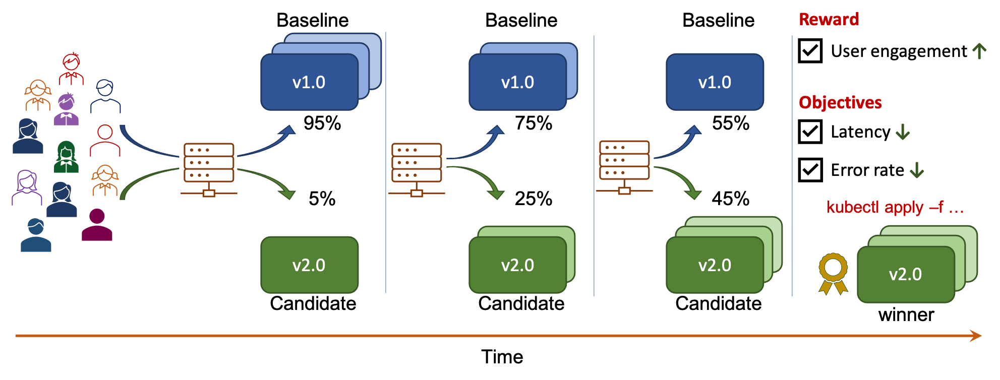

# Hybrid (A/B + SLOs) testing

!!! tip "Scenario: Hybrid (A/B + SLOs) testing and progressive traffic shift"
    [Hybrid (A/B + SLOs) testing](../../../concepts/buildingblocks.md#hybrid-ab-slos-testing) enables you to combine A/B or A/B/n testing with a reward metric on the one hand with SLO validation using objectives on the other. Among the versions that satisfy objectives, the version which performs best in terms of the reward metric is the winner. In this tutorial, you will:

    1. Perform hybrid (A/B + SLOs) testing.
    2. Specify *user-engagement* as the reward metric. This metric will be mocked by Iter8 in this tutorial.
    3. Specify *latency* and *error-rate* based objectives; data for these metrics will be provided by Prometheus.
    4. Combine hybrid (A/B + SLOs) testing with [progressive traffic shift](../../../concepts/buildingblocks.md#progressive-traffic-shift). Iter8 will progressively shift traffic towards the winner and promote it at the end as depicted below.
    
    

???+ warning "Before you begin, you will need... "
    1. The [kubectl CLI](https://kubernetes.io/docs/tasks/tools/install-kubectl/).
    2. [Kustomize 3+](https://kubectl.docs.kubernetes.io/installation/kustomize/).
    3. [Go 1.13+](https://golang.org/doc/install).

## 1. Setup
* Setup your K8s cluster with Istio and Iter8 as described [here](../platform-setup/). 
* Ensure that the `ITER8` environment variable is set to the root of your local Iter8 repo.

## 2. Create application versions
Deploy the [`bookinfo` microservice application](https://istio.io/latest/docs/examples/bookinfo/) including two versions of the `productpage` microservice.

```shell
kubectl apply -n bookinfo-iter8 -f $ITER8/samples/istio/quickstart/bookinfo-app.yaml
kubectl apply -n bookinfo-iter8 -f $ITER8/samples/istio/quickstart/productpage-v2.yaml
kubectl wait -n bookinfo-iter8 --for=condition=Ready pods --all
```

??? info "Look inside productpage-v2.yaml (v1 is similar)"
    ```yaml linenums="1"
    apiVersion: apps/v1
    kind: Deployment
    metadata:
        name: productpage-v2
        labels:
        app: productpage
        version: v2
    spec:
        replicas: 1
        selector:
        matchLabels:
            app: productpage
            version: v2
        template:
        metadata:
            annotations:
            sidecar.istio.io/inject: "true"
            labels:
            app: productpage
            version: v2
        spec:
            serviceAccountName: bookinfo-productpage
            containers:
            - name: productpage
            image: iter8/productpage:demo
            imagePullPolicy: IfNotPresent
            ports:
            - containerPort: 9080
            env:
                - name: deployment
                value: "productpage-v2"
                - name: namespace
                valueFrom:
                    fieldRef:
                    fieldPath: metadata.namespace
                - name: color
                value: "green"
                - name: reward_min
                value: "10"
                - name: reward_max
                value: "20"
                - name: port
                value: "9080"
    ```

## 3. Generate requests
Generate requests to your app using [Fortio](https://github.com/fortio/fortio) as follows.

```shell
# URL_VALUE is the URL of the `bookinfo` application
URL_VALUE="http://$(kubectl -n istio-system get svc istio-ingressgateway -o jsonpath='{.spec.clusterIP}'):80/productpage"
sed "s+URL_VALUE+${URL_VALUE}+g" $ITER8/samples/istio/quickstart/fortio.yaml | kubectl apply -f -
```

??? info "Look inside fortio.yaml"
    ```yaml linenums="1"
    apiVersion: batch/v1
    kind: Job
    metadata:
        name: fortio
    spec:
        template:
        spec:
            volumes:
            - name: shared
            emptyDir: {}
            containers:
            - name: fortio
            image: fortio/fortio
            command: [ 'fortio', 'load', '-t', '6000s', '-qps', "16", '-json', '/shared/fortiooutput.json', '-H', 'Host: bookinfo.example.com', "$(URL)" ]
            env:
            - name: URL
                value: URL_VALUE
            volumeMounts:
            - name: shared
                mountPath: /shared
            - name: busybox
            image: busybox:1.28
            command: ['sh', '-c', 'echo busybox is running! && sleep 6000']
            volumeMounts:
            - name: shared
                mountPath: /shared
            restartPolicy: Never
    ```

## 4. Define metrics
Iter8 introduces a Kubernetes CRD called Metric that makes it easy to use metrics from RESTful metric providers like Prometheus, New Relic, Sysdig and Elastic during experiments. 

Define the Iter8 metrics used in this experiment as follows. For the purpose of this tutorial, you will [mock](../../../../metrics/mock/) the user-engagement metric. The latency and error metrics will be provided by Prometheus.

```shell
kubectl apply -f $ITER8/samples/istio/quickstart/metrics.yaml
```

??? info "Look inside metrics.yaml"
    ```yaml linenums="1"
    apiVersion: v1
    kind: Namespace
    metadata:
        labels:
        creator: iter8
        stack: istio
        name: iter8-istio
    ---
    apiVersion: iter8.tools/v2alpha2
    kind: Metric
    metadata:
        name: user-engagement
        namespace: iter8-istio
    spec:
      mock:
      - name: productpage-v1
        level: 15.0
      - name: productpage-v2
        level: 20.0
    ---
    apiVersion: iter8.tools/v2alpha2
    kind: Metric
    metadata:
        labels:
        creator: iter8
        name: error-count
        namespace: iter8-istio
    spec:
        description: Number of error responses
        jqExpression: .data.result[0].value[1] | tonumber
        params:
        - name: query
          value: |
              sum(increase(istio_requests_total{response_code=~'5..',reporter='source',destination_workload='$name',destination_workload_namespace='$namespace'}[${elapsedTime}s])) or on() vector(0)
        provider: prometheus
        type: Counter
        urlTemplate: http://prometheus-operated.iter8-system:9090/api/v1/query
    ---
    apiVersion: iter8.tools/v2alpha2
    kind: Metric
    metadata:
        labels:
        creator: iter8
        name: error-rate
        namespace: iter8-istio
    spec:
        description: Fraction of requests with error responses
        jqExpression: .data.result[0].value[1] | tonumber
        params:
        - name: query
          value: |
              (sum(increase(istio_requests_total{response_code=~'5..',reporter='source',destination_workload='$name',destination_workload_namespace='$namespace'}[${elapsedTime}s])) or on() vector(0)) / (sum(increase(istio_requests_total{reporter='source',destination_workload='$name',destination_workload_namespace='$namespace'}[${elapsedTime}s])) or on() vector(0))
        provider: prometheus
        sampleSize: request-count
        type: Gauge
        urlTemplate: http://prometheus-operated.iter8-system:9090/api/v1/query
    ---
    apiVersion: iter8.tools/v2alpha2
    kind: Metric
    metadata:
        labels:
        creator: iter8
        name: le500ms-latency-percentile
        namespace: iter8-istio
    spec:
        description: Less than 500 ms latency
        jqExpression: .data.result[0].value[1] | tonumber
        params:
        - name: query
          value: |
              (sum(increase(istio_request_duration_milliseconds_bucket{le='500',reporter='source',destination_workload='$name',destination_workload_namespace='$namespace'}[${elapsedTime}s])) or on() vector(0)) / (sum(increase(istio_request_duration_milliseconds_bucket{le='+Inf',reporter='source',destination_workload='$name',destination_workload_namespace='$namespace'}[${elapsedTime}s])) or on() vector(0))
        provider: prometheus
        sampleSize: iter8-istio/request-count
        type: Gauge
        urlTemplate: http://prometheus-operated.iter8-system:9090/api/v1/query
    ---
    apiVersion: iter8.tools/v2alpha2
    kind: Metric
    metadata:
        labels:
        creator: iter8
        name: mean-latency
        namespace: iter8-istio
    spec:
        description: Mean latency
        jqExpression: .data.result[0].value[1] | tonumber
        params:
        - name: query
          value: |
              (sum(increase(istio_request_duration_milliseconds_sum{reporter='source',destination_workload='$name',destination_workload_namespace='$namespace'}[${elapsedTime}s])) or on() vector(0)) / (sum(increase(istio_requests_total{reporter='source',destination_workload='$name',destination_workload_namespace='$namespace'}[${elapsedTime}s])) or on() vector(0))
        provider: prometheus
        sampleSize: request-count
        type: Gauge
        units: milliseconds
        urlTemplate: http://prometheus-operated.iter8-system:9090/api/v1/query
    ---
    apiVersion: iter8.tools/v2alpha2
    kind: Metric
    metadata:
        labels:
        creator: iter8
        name: request-count
        namespace: iter8-istio
    spec:
        description: Number of requests
        jqExpression: .data.result[0].value[1] | tonumber
        params:
        - name: query
          value: |
              sum(increase(istio_requests_total{reporter='source',destination_workload='$name',destination_workload_namespace='$namespace'}[${elapsedTime}s]))
        provider: prometheus
        type: Counter
        urlTemplate: http://prometheus-operated.iter8-system:9090/api/v1/query
    ```


??? Note "Metrics in your environment"
    You can define and use custom metrics from any database in Iter8 experiments. 
       
    For your application, replace the mocked metric used in this tutorial with any custom metric you wish to optimize. Documentation on defining custom metrics is [here](../../../../metrics/custom/).


## 5. Launch experiment
Iter8 defines a custom K8s resource called *Experiment* that automates a variety of release engineering and experimentation strategies for K8s applications and ML models. Launch the Hybrid (A/B + SLOs) testing & progressive traffic shift experiment as follows.

```shell
kubectl apply -f $ITER8/samples/istio/quickstart/experiment.yaml
```

??? info "Look inside experiment.yaml"
    ```yaml linenums="1"
    apiVersion: iter8.tools/v2alpha2
    kind: Experiment
    metadata:
      name: quickstart-exp
    spec:
      # target identifies the service under experimentation using its fully qualified name
      target: bookinfo-iter8/productpage
      strategy:
        # this experiment will perform an A/B test
        testingPattern: A/B
        # this experiment will progressively shift traffic to the winning version
        deploymentPattern: Progressive
        actions:
          # when the experiment completes, promote the winning version using kubectl apply
          finish:
          - task: common/exec
            with:
              cmd: /bin/bash
              args: [ "-c", "kubectl -n bookinfo-iter8 apply -f {{ .promote }}" ]
      criteria:
        rewards:
        # (business) reward metric to optimize in this experiment
        - metric: iter8-istio/user-engagement 
          preferredDirection: High
        objectives: # used for validating versions
        - metric: iter8-istio/mean-latency
          upperLimit: 100
        - metric: iter8-istio/error-rate
          upperLimit: "0.01"
        requestCount: iter8-istio/request-count
      duration: # product of fields determines length of the experiment
        intervalSeconds: 10
        iterationsPerLoop: 10
      versionInfo:
        # information about the app versions used in this experiment
        baseline:
          name: productpage-v1
          variables:
          - name: namespace # used by final action if this version is the winner
            value: bookinfo-iter8
          - name: promote # used by final action if this version is the winner
            value: https://raw.githubusercontent.com/iter8-tools/iter8/master/samples/istio/quickstart/vs-for-v1.yaml
          weightObjRef:
            apiVersion: networking.istio.io/v1beta1
            kind: VirtualService
            namespace: bookinfo-iter8
            name: bookinfo
            fieldPath: .spec.http[0].route[0].weight
        candidates:
        - name: productpage-v2
          variables:
          - name: namespace # used by final action if this version is the winner
            value: bookinfo-iter8
          - name: promote # used by final action if this version is the winner
            value: https://raw.githubusercontent.com/iter8-tools/iter8/master/samples/istio/quickstart/vs-for-v2.yaml
          weightObjRef:
            apiVersion: networking.istio.io/v1beta1
            kind: VirtualService
            namespace: bookinfo-iter8
            name: bookinfo
            fieldPath: .spec.http[0].route[1].weight
    ```

## 6. Understand the experiment
The process automated by Iter8 in this experiment is as follows.
    


Observe the results of the experiment in real-time as follows.
### a) Observe results

Install `iter8ctl`. You can change the directory where `iter8ctl` binary is installed by changing `GOBIN` below.
```shell
GO111MODULE=on GOBIN=/usr/local/bin go get github.com/iter8-tools/iter8ctl@v0.1.4
```

Periodically describe the experiment results.
```shell
watch -x iter8ctl describe -f - <(kubectl get experiment quickstart-exp -o yaml)
```

??? info "Experiment results will look similar to this"
    The `iter8ctl` output will be similar to the following.
    ```shell
    ****** Overview ******
    Experiment name: quickstart-exp
    Experiment namespace: default
    Target: default/sample-app
    Testing strategy: A/B
    Rollout strategy: Progressive

    ****** Progress Summary ******
    Experiment stage: Running
    Number of completed iterations: 8

    ****** Winner Assessment ******
    App versions in this experiment: [sample-app-v1 sample-app-v2]
    Winning version: sample-app-v2
    Version recommended for promotion: sample-app-v2

    ****** Objective Assessment ******
    > Identifies whether or not the experiment objectives are satisfied by the most recently observed metrics values for each version.
    +--------------------------------------------+---------------+---------------+
    |                 OBJECTIVE                  | SAMPLE-APP-V1 | SAMPLE-APP-V2 |
    +--------------------------------------------+---------------+---------------+
    | iter8-knative/mean-latency <=              | true          | true          |
    |                                     50.000 |               |               |
    +--------------------------------------------+---------------+---------------+
    | iter8-knative/95th-percentile-tail-latency | true          | true          |
    | <= 100.000                                 |               |               |
    +--------------------------------------------+---------------+---------------+
    | iter8-knative/error-rate <=                | true          | true          |
    |                                      0.010 |               |               |
    +--------------------------------------------+---------------+---------------+

    ****** Metrics Assessment ******
    > Most recently read values of experiment metrics for each version.
    +--------------------------------------------+---------------+---------------+
    |                   METRIC                   | SAMPLE-APP-V1 | SAMPLE-APP-V2 |
    +--------------------------------------------+---------------+---------------+
    | iter8-knative/request-count                |      1213.625 |       361.962 |
    +--------------------------------------------+---------------+---------------+
    | iter8-knative/user-engagement              |        10.023 |        14.737 |
    +--------------------------------------------+---------------+---------------+
    | iter8-knative/mean-latency                 |         1.133 |         1.175 |
    | (milliseconds)                             |               |               |
    +--------------------------------------------+---------------+---------------+
    | iter8-knative/95th-percentile-tail-latency |         4.768 |         4.824 |
    | (milliseconds)                             |               |               |
    +--------------------------------------------+---------------+---------------+
    | iter8-knative/error-rate                   |         0.000 |         0.000 |
    +--------------------------------------------+---------------+---------------+
    ``` 

Observe how traffic is split between versions in real-time as follows.
### b) Observe traffic
```shell
kubectl -n bookinfo-iter8 get vs bookinfo -o json --watch | jq ".spec.http[0].route"
```

??? info "Look inside traffic summary"
    The `kubectl` output will be similar to the following.
    ```shell
    [
      {
        "destination": {
          "host": "productpage",
          "port": {
            "number": 9080
          },
          "subset": "productpage-v1"
        },
        "weight": 35
      },
      {
        "destination": {
          "host": "productpage",
          "port": {
            "number": 9080
          },
          "subset": "productpage-v2"
        },
        "weight": 65
      }
    ]
    ```

### c) Observe progress
```shell
kubectl get experiment quickstart-exp --watch
```

??? info "Look inside progress summary"
    The `kubectl` output will be similar to the following.
    ```shell
    NAME             TYPE     TARGET               STAGE     COMPLETED ITERATIONS   MESSAGE
    quickstart-exp   Canary   default/sample-app   Running   1                      IterationUpdate: Completed Iteration 1
    quickstart-exp   Canary   default/sample-app   Running   2                      IterationUpdate: Completed Iteration 2
    quickstart-exp   Canary   default/sample-app   Running   3                      IterationUpdate: Completed Iteration 3
    quickstart-exp   Canary   default/sample-app   Running   4                      IterationUpdate: Completed Iteration 4
    quickstart-exp   Canary   default/sample-app   Running   5                      IterationUpdate: Completed Iteration 5
    quickstart-exp   Canary   default/sample-app   Running   6                      IterationUpdate: Completed Iteration 6
    quickstart-exp   Canary   default/sample-app   Running   7                      IterationUpdate: Completed Iteration 7
    quickstart-exp   Canary   default/sample-app   Running   8                      IterationUpdate: Completed Iteration 8
    quickstart-exp   Canary   default/sample-app   Running   9                      IterationUpdate: Completed Iteration 9
    ```

## 7. Cleanup
```shell
kubectl delete -f $ITER8/samples/istio/quickstart/fortio.yaml
kubectl delete -f $ITER8/samples/istio/quickstart/experiment.yaml
kubectl delete namespace bookinfo-iter8
```
