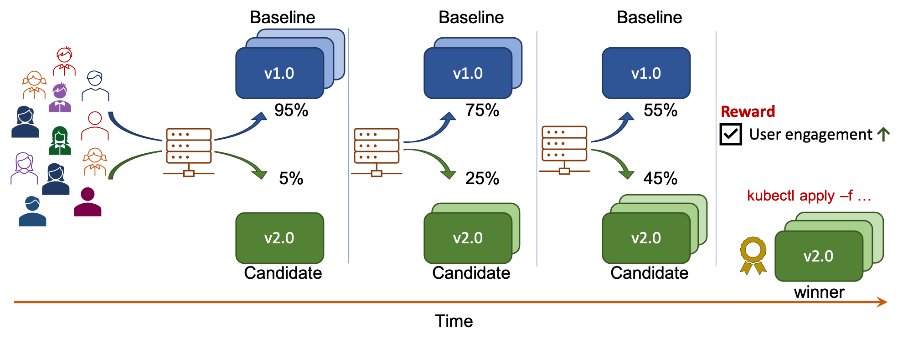

# A/B Testing

!!! tip "Scenario: A/B testing and progressive deployment of KFServing models"
    [A/B testing](../../../../../concepts/buildingblocks/#testing-pattern) enables you to compare two versions of an ML model, and select a winner based on a (business) reward metric. In this tutorial, you will:

    1. Perform A/B testing.
    2. Specify *user-engagement* as the reward metric. This metric will be mocked by Iter8 in this tutorial.
    3. Combine A/B testing with [progressive deployment](../../../../../concepts/buildingblocks/#deployment-pattern). Iter8 will progressively shift traffic towards the winner and promote it at the end as depicted below.

    

???+ warning "Before you begin, you will need... "
    1. The [kubectl CLI](https://kubernetes.io/docs/tasks/tools/install-kubectl/).
    2. [Kustomize 3+](https://kubectl.docs.kubernetes.io/installation/kustomize/).
    3. [Go 1.13+](https://golang.org/doc/install).

## 1. Setup
* Setup your K8s cluster with KFServing and Iter8 as described [here](../platform-setup/). 
* Ensure that the `ITER8` environment variable is set to the root of your local Iter8 repo.

## 2. Create ML model versions
Deploy two KFServing inference services corresponding to two versions of a TensorFlow classification model, along with an Istio virtual service to split traffic between them.

```shell
kubectl apply -f $ITER8/samples/kfserving/quickstart/baseline.yaml
kubectl apply -f $ITER8/samples/kfserving/quickstart/candidate.yaml
kubectl apply -f $ITER8/samples/kfserving/quickstart/routing-rule.yaml
kubectl wait --for=condition=Ready isvc/flowers -n ns-baseline
kubectl wait --for=condition=Ready isvc/flowers -n ns-candidate
```

??? info "Look inside baseline.yaml"
    ```yaml linenums="1"
    apiVersion: v1
    kind: Namespace
    metadata:
      name: ns-baseline
    ---
    apiVersion: serving.kubeflow.org/v1beta1
    kind: InferenceService
    metadata:
      name: flowers
      namespace: ns-baseline
    spec:
      predictor:
        tensorflow:
          storageUri: "gs://kfserving-samples/models/tensorflow/flowers"
    ```

??? info "Look inside candidate.yaml"
    ```yaml linenums="1"
    apiVersion: v1
    kind: Namespace
    metadata:
      name: ns-candidate
    ---
    apiVersion: serving.kubeflow.org/v1beta1
    kind: InferenceService
    metadata:
      name: flowers
      namespace: ns-candidate
    spec:
      predictor:
        tensorflow:
          storageUri: "gs://kfserving-samples/models/tensorflow/flowers-2"
    ```

??? info "Look inside routing-rule.yaml"
    ```yaml linenums="1"
    apiVersion: networking.istio.io/v1alpha3
    kind: VirtualService
    metadata:
      name: routing-rule
      namespace: default
    spec:
      gateways:
      - knative-serving/knative-ingress-gateway
      hosts:
      - example.com
      http:
      - route:
        - destination:
            host: flowers-predictor-default.ns-baseline.svc.cluster.local
          headers:
            request:
              set:
                Host: flowers-predictor-default.ns-baseline
            response:
              set:
                version: flowers-v1
          weight: 100
        - destination:
            host: flowers-predictor-default.ns-candidate.svc.cluster.local
          headers:
            request:
              set:
                Host: flowers-predictor-default.ns-candidate
            response:
              set:
                version: flowers-v2
          weight: 0
    ```

## 3. Generate requests
Generate requests for your model as follows.

=== "Port forward Istio ingress in terminal one"
    ```shell
    INGRESS_GATEWAY_SERVICE=$(kubectl get svc -n istio-system --selector="app=istio-ingressgateway" --output jsonpath='{.items[0].metadata.name}')
    kubectl port-forward -n istio-system svc/${INGRESS_GATEWAY_SERVICE} 8080:80
    ```

=== "Send requests in terminal two"
    ```shell
    curl -o /tmp/input.json https://raw.githubusercontent.com/kubeflow/kfserving/master/docs/samples/v1beta1/rollout/input.json
    watch --interval 0.2 -x curl -v -H "Host: example.com" localhost:8080/v1/models/flowers:predict -d @/tmp/input.json
    ```

## 4. Define metrics
Iter8 defines a custom K8s resource called *Metric* that makes it easy to use metrics from RESTful metric providers like Prometheus, New Relic, Sysdig and Elastic during experiments. 

For the purpose of this tutorial, you will [mock](../../../../metrics/mock/) the user-engagement metric as follows.

```shell
kubectl apply -f $ITER8/samples/kfserving/quickstart/metrics.yaml
```

??? info "Look inside metrics.yaml"
    ```yaml linenums="1"
    apiVersion: v1
    kind: Namespace
    metadata:
      name: iter8-kfserving
    ---
    apiVersion: iter8.tools/v2alpha2
    kind: Metric
    metadata:
      name: user-engagement
      namespace: iter8-kfserving
    spec:
      mock:
      - name: flowers-v1
        level: "15.0"
      - name: flowers-v2
        level: "20.0"
    ```

??? Note "Metrics in your environment"
    You can define and use custom metrics from any database in Iter8 experiments. 
       
    For your application, replace the mocked metric used in this tutorial with any custom metric you wish to optimize in the A/B test. Documentation on defining custom metrics is [here](../../../../metrics/custom/).

## 5. Launch experiment
Iter8 defines a custom K8s resource called *Experiment* that automates a variety of release engineering and experimentation strategies for K8s applications and ML models. Launch the A/B testing & progressive deployment experiment as follows.

```shell
kubectl apply -f $ITER8/samples/kfserving/quickstart/experiment.yaml
```

??? info "Look inside experiment.yaml"
    ```yaml linenums="1"
    apiVersion: iter8.tools/v2alpha2
    kind: Experiment
    metadata:
      name: quickstart-exp
    spec:
      target: flowers
      strategy:
        testingPattern: A/B
        deploymentPattern: Progressive
        actions:
          # when the experiment completes, promote the winning version using kubectl apply
          finish:
          - task: common/exec
            with:
              cmd: /bin/bash
              args: [ "-c", "kubectl apply -f {{ .promote }}" ]
      criteria:
        rewards: # Business rewards
        - metric: iter8-kfserving/user-engagement
          preferredDirection: High # maximize user engagement
      duration:
        intervalSeconds: 5
        iterationsPerLoop: 20
      versionInfo:
        # information about model versions used in this experiment
        baseline:
          name: flowers-v1
          weightObjRef:
            apiVersion: networking.istio.io/v1alpha3
            kind: VirtualService
            name: routing-rule
            namespace: default
            fieldPath: .spec.http[0].route[0].weight      
          variables:
          - name: ns
            value: ns-baseline
          - name: promote
            value: https://raw.githubusercontent.com/iter8-tools/iter8/master/samples/kfserving/quickstart/promote-v1.yaml
        candidates:
        - name: flowers-v2
          weightObjRef:
            apiVersion: networking.istio.io/v1alpha3
            kind: VirtualService
            name: routing-rule
            namespace: default
            fieldPath: .spec.http[0].route[1].weight      
          variables:
          - name: ns
            value: ns-candidate
          - name: promote
            value: https://raw.githubusercontent.com/iter8-tools/iter8/master/samples/kfserving/quickstart/promote-v2.yaml
    ```

## 6. Understand the experiment
The process automated by Iter8 in this experiment is as follows.
    


Observe the results of the experiment in real-time as follows.
### a) Observe results

Install `iter8ctl`. You can change the directory where `iter8ctl` binary is installed by changing `GOBIN` below.
```shell
GO111MODULE=on GOBIN=/usr/local/bin go get github.com/iter8-tools/iter8ctl@v0.1.4
```

Periodically describe the experiment results.
```shell
watch -x iter8ctl describe -f - <(kubectl get experiment quickstart-exp -o yaml)
```

??? info "Experiment results will look similar to this"
    ```shell
    ****** Overview ******
    Experiment name: quickstart-exp
    Experiment namespace: default
    Target: default/sample-app
    Testing pattern: A/B
    Deployment pattern: Progressive

    ****** Progress Summary ******
    Experiment stage: Running
    Number of completed iterations: 8

    ****** Winner Assessment ******
    App versions in this experiment: [sample-app-v1 sample-app-v2]
    Winning version: sample-app-v2
    Version recommended for promotion: sample-app-v2

    ****** Objective Assessment ******
    > Identifies whether or not the experiment objectives are satisfied by the most recently observed metrics values for each version.
    +--------------------------------------------+---------------+---------------+
    |                 OBJECTIVE                  | SAMPLE-APP-V1 | SAMPLE-APP-V2 |
    +--------------------------------------------+---------------+---------------+
    | iter8-knative/mean-latency <=              | true          | true          |
    |                                     50.000 |               |               |
    +--------------------------------------------+---------------+---------------+
    | iter8-knative/95th-percentile-tail-latency | true          | true          |
    | <= 100.000                                 |               |               |
    +--------------------------------------------+---------------+---------------+
    | iter8-knative/error-rate <=                | true          | true          |
    |                                      0.010 |               |               |
    +--------------------------------------------+---------------+---------------+

    ****** Metrics Assessment ******
    > Most recently read values of experiment metrics for each version.
    +--------------------------------------------+---------------+---------------+
    |                   METRIC                   | SAMPLE-APP-V1 | SAMPLE-APP-V2 |
    +--------------------------------------------+---------------+---------------+
    | iter8-knative/request-count                |      1213.625 |       361.962 |
    +--------------------------------------------+---------------+---------------+
    | iter8-knative/user-engagement              |        10.023 |        14.737 |
    +--------------------------------------------+---------------+---------------+
    | iter8-knative/mean-latency                 |         1.133 |         1.175 |
    | (milliseconds)                             |               |               |
    +--------------------------------------------+---------------+---------------+
    | iter8-knative/95th-percentile-tail-latency |         4.768 |         4.824 |
    | (milliseconds)                             |               |               |
    +--------------------------------------------+---------------+---------------+
    | iter8-knative/error-rate                   |         0.000 |         0.000 |
    +--------------------------------------------+---------------+---------------+
    ``` 

Observe how traffic is split between versions in real-time as follows.
### b) Observe traffic

```shell
kubectl get vs routing-rule -o json --watch | jq ".spec.http[0].route"
```

??? info "Traffic summary will look similar to this"
    ```json
    [
      {
        "destination": {
          "host": "flowers-predictor-default.ns-baseline.svc.cluster.local"
        },
        "headers": {
          "request": {
            "set": {
              "Host": "flowers-predictor-default.ns-baseline"
            }
          },
          "response": {
            "set": {
              "version": "flowers-v1"
            }
          }
        },
        "weight": 5
      },
      {
        "destination": {
          "host": "flowers-predictor-default.ns-candidate.svc.cluster.local"
        },
        "headers": {
          "request": {
            "set": {
              "Host": "flowers-predictor-default.ns-candidate"
            }
          },
          "response": {
            "set": {
              "version": "flowers-v2"
            }
          }
        },
        "weight": 95
      }
    ]
    ```

### c) Observe progress
```shell
kubectl get experiment quickstart-exp --watch
```

??? info "Look inside progress summary"
    The `kubectl` output will be similar to the following.
    ```shell
    NAME             TYPE     TARGET               STAGE     COMPLETED ITERATIONS   MESSAGE
    quickstart-exp   Canary   default/sample-app   Running   1                      IterationUpdate: Completed Iteration 1
    quickstart-exp   Canary   default/sample-app   Running   2                      IterationUpdate: Completed Iteration 2
    quickstart-exp   Canary   default/sample-app   Running   3                      IterationUpdate: Completed Iteration 3
    quickstart-exp   Canary   default/sample-app   Running   4                      IterationUpdate: Completed Iteration 4
    quickstart-exp   Canary   default/sample-app   Running   5                      IterationUpdate: Completed Iteration 5
    quickstart-exp   Canary   default/sample-app   Running   6                      IterationUpdate: Completed Iteration 6
    quickstart-exp   Canary   default/sample-app   Running   7                      IterationUpdate: Completed Iteration 7
    quickstart-exp   Canary   default/sample-app   Running   8                      IterationUpdate: Completed Iteration 8
    quickstart-exp   Canary   default/sample-app   Running   9                      IterationUpdate: Completed Iteration 9
    ```

## 7. Cleanup
```shell
kubectl delete -f $ITER8/samples/kfserving/quickstart/experiment.yaml
kubectl delete -f $ITER8/samples/kfserving/quickstart/baseline.yaml
kubectl delete -f $ITER8/samples/kfserving/quickstart/candidate.yaml
```
