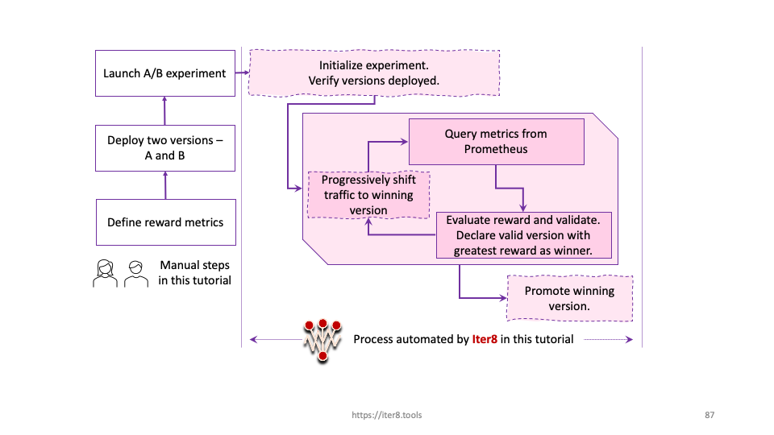

# Quick Start with Istio

!!! info "Older version of Iter8 for Istio"
    An older version of Iter8 was tightly coupled with the Istio domain. If this is what you are looking for, it is available [here](https://github.com/iter8-tools/iter8-istio).

!!! tip "Scenario: A/B testing and progressive deployment"
    [A/B testing](../../../concepts/buildingblocks/#testing-pattern) enables you to evaluate two versions to determine which produces the greatest benefit. In addition, Iter8 enables you to [validate](../../../concepts/buildingblocks/#validation) your versions using a set of service-level objectives, or SLOs, ensuring that the winning version is also valid.
    In this tutorial, you will:

    1. Perform A/B testing.
    2. Specify a reward to evaluate the relative benefit of your versions.
    3. Specify service-level objectives or SLOs used by Iter8 to validate your versions.
    4. Use metrics from Prometheus.
    5. Combine A/B testing with [progressive deployment](../../../concepts/buildingblocks/#deployment-pattern) in an Iter8 experiment.
    
    Assuming the new version is valid and produces a greater reward, Iter8 will progressively increase the traffic percentage for the winning version and promote it at the end as depicted below.

    

???+ warning "Before you begin, you will need... "
    1. **Kubernetes cluster.** You can also use, for example, [Minikube](https://minikube.sigs.k8s.io/docs/) or [Kind](https://kind.sigs.k8s.io/).
    2. The `kubectl` CLI. Install `kubectl` [here](https://kubernetes.io/docs/tasks/tools/install-kubectl/).
    3. **Go 1.13+** (recommended; required for using `iter8ctl` in [Step 7](/getting-started/quick-start/with-istio/#7-observe-experiment)). Install Go [here](https://golang.org/doc/install).

## 1. Create Kubernetes cluster

Create a local cluster using Minikube or Kind as follows, or use a managed Kubernetes service. Ensure that the cluster has sufficient resources, for example, 6 CPUs and 12GB of memory.

=== "Minikube"

    ```shell
    minikube start --cpus 6 --memory 12288
    ```

=== "Kind"

    ```shell
    kind create cluster
    kubectl cluster-info --context kind-kind
    ```

    ??? info "Ensuring your Kind cluster has sufficient resources"
        Your Kind cluster inherits the CPU and memory resources of its host. If you are using Docker Desktop, you can set its resources as shown below.

        


    

## 2. Clone Iter8 repo
```shell
git clone https://github.com/iter8-tools/iter8.git
cd iter8
export ITER8=$(pwd)
```

## 3. Install Istio and Iter8

For demonstration purposes, this quick install also installs the Prometheus add-on and the (Prometheus-based) sample metrics for Istio.

```shell
$ITER8/samples/istio/quickstart/platformsetup.sh
```

## 4. Add Business Metric

We will use the [`bookinfo` application](https://istio.io/latest/docs/examples/bookinfo/) provided by Istio. The frontend [`productpage`](https://github.com/iter8-tools/bookinfoapp-productpage/tree/productpage-reward) microservice has been modified to produce a business metric, `number_of_books_purchased_total`.
To use this metric, we must create a [`Metric`](http://localhost:8000/reference/apispec/#metric) resource, `books-purchased` telling Iter8 how to extract the value of this metric from Prometheus.

```shell
kubectl apply -f $ITER8/samples/istio/quickstart/books-purchased.yaml
```

??? info "Look inside `books-purchased.yaml`"
    ```yaml linenums="1"
    apiVersion: iter8.tools/v2alpha2
    kind: Metric
    metadata:
    name: books-purchased
    spec:
    description: Total number of books purchased
    params:
    - name: query
        value: |
        (sum(increase(number_of_books_purchased_total{destination_workload='$revision',destination_workload_namespace='$namespace'}[${elapsedTime}s])) or on() vector(0)) / (sum(increase(istio_requests_total{reporter='source',destination_workload='$revision',destination_workload_namespace='$namespace'}[${elapsedTime}s])) or on() vector(0))
    type: Gauge
    provider: prometheus
    jqExpression: ".data.result[0].value[1] | tonumber"
    urlTemplate: http://prometheus-operated.iter8-system:9090/api/v1/query
    ```

## 4. Create app versions

Deploy the [`bookinfo` application](https://istio.io/latest/docs/examples/bookinfo/) including two versions of the `productpage` microservice. The two versions have different color text, red and green. You will use an A/B test to determine which version yields a greater number of books purchased.

```shell
kubectl apply -f $ITER8/samples/istio/quickstart/namespace.yaml
kubectl apply -n bookinfo-iter8 -f $ITER8/samples/istio/quickstart/bookinfo-app.yaml
kubectl apply -n bookinfo-iter8 -f $ITER8/samples/istio/quickstart/productpage-v2.yaml
kubectl apply -n bookinfo-iter8 -f $ITER8/samples/istio/quickstart/bookinfo-gateway.yaml
kubectl --namespace bookinfo-iter8 wait --for=condition=Ready pods --all
```

??? info "Look inside `productpage-v1` configuration"
    Environment variables are used to configure the service. They define the text color and the expected reward.
    ```yaml linenums="1"
    env:
    - name: color
      value: "red"
    - name: reward_min
      value: "0"
    - name: reward_max
      value: "5"
    ```

??? info "Look inside `productpage-v2` configuration"
    Environment variables are used to configure the service. They define the text color and the expected reward.
    ```yaml linenums="1"
    env:
    - name: color
      value: "green"
    - name: reward_min
      value: "10"
    - name: reward_max
      value: "20"
    ```

## 5. Generate requests
In a production environment, your application would receive requests from end-users. For the purposes of this tutorial, simulate user requests using [Fortio](https://github.com/fortio/fortio) as follows.

```shell
# URL_VALUE is the URL of the `bookinfo` application
URL_VALUE="http://$(kubectl -n istio-system get svc istio-ingressgateway -o jsonpath='{.spec.clusterIP}'):80/productpage"
sed "s+URL_VALUE+${URL_VALUE}+g" $ITER8/samples/istio/quickstart/fortio.yaml | kubectl apply -f -
```

??? info "Look inside fortio.yaml"
    ```yaml linenums="1"
    apiVersion: batch/v1
    kind: Job
    metadata:
      name: fortio
    spec:
      template:
        spec:
          volumes:
          - name: shared
            emptyDir: {}
          containers:
          - name: fortio
            image: fortio/fortio
            command: [ 'fortio', 'load', '-t', '6000s', '-qps', "16", '-json', '/shared/fortiooutput.json', '-H', 'Host: bookinfo.example.com', "$(URL)" ]
            env:
            - name: URL
              value: URL_VALUE
            volumeMounts:
            - name: shared
              mountPath: /shared
          - name: busybox
            image: busybox:1.28
            command: ['sh', '-c', 'echo busybox is running! && sleep 6000']
            volumeMounts:
            - name: shared
              mountPath: /shared
          restartPolicy: Never
    ```

## 6. Launch Iter8 experiment
Launch the Iter8 experiment. Iter8 will orchestrate the A/B test between two versions of `productpage` with SLO validation and progressive deployment as specified in the experiment.

```shell
kubectl apply -f $ITER8/samples/istio/quickstart/experiment.yaml
```

??? info "Look inside experiment.yaml"
    ```yaml linenums="1"
    apiVersion: iter8.tools/v2alpha2
    kind: Experiment
    metadata:
      name: istio-quickstart
    spec:
      # target identifies the service under experimentation using its fully qualified name
      target: bookinfo-iter8/productpage
      strategy:
        # this experiment will perform an A/B test
        testingPattern: A/B
        # this experiment will progressively shift traffic to the winning version
        deploymentPattern: Progressive
        actions:
          # when the experiment completes, promote the winning version using kubectl apply
          finish:
          - task: common/exec
            with:
              cmd: /bin/bash
              args:
              - "-c"
              - kubectl -n {{ .namespace }} apply -f {{ .promote }}

      criteria:
        rewards: # metrics to be used to determine the "value" or "benefit" of a version
        - metric: books-purchased
          preferredDirection: High
        objectives: # metrics to be used to determine validity of a version
        - metric: iter8-istio/mean-latency
          upperLimit: 100
        - metric: iter8-istio/error-rate
          upperLimit: "0.01"
      duration: # product of fields determines length of the experiment
        intervalSeconds: 10
        iterationsPerLoop: 10
      versionInfo:
        # information about the app versions used in this experiment
        baseline:
          name: A
          variables:
          - name: revision # used in Prometheus queries
            value: productpage-v1
          - name: namespace # used by final action if this version is the winner
            value: bookinfo-iter8
          - name: promote # used by final action if this version is the winner
            value: https://raw.githubusercontent.com/kalantar/iter8/istio-quickstart/samples/istio/quickstart/A.yaml
          weightObjRef:
            apiVersion: networking.istio.io/v1beta1
            kind: VirtualService
            namespace: bookinfo-iter8
            name: bookinfo
            fieldPath: .spec.http[0].route[0].weight
        candidates:
        - name: B
          variables:
          - name: revision # used in Prometheus queries
            value: productpage-v2
          - name: namespace # used by final action if this version is the winner
            value: bookinfo-iter8
          - name: promote # used by final action if this version is the winner
            value: https://raw.githubusercontent.com/kalantar/iter8/istio-quickstart/samples/istio/quickstart/B.yaml
          weightObjRef:
            apiVersion: networking.istio.io/v1beta1
            kind: VirtualService
            namespace: bookinfo-iter8
            name: bookinfo
            fieldPath: .spec.http[0].route[1].weight
    ```

The process automated by Iter8 during this experiment is depicted below.


## 7. Observe experiment
Observe the experiment in realtime. Paste commands from the tabs below in separate terminals.

=== "iter8ctl"
    Install `iter8ctl`. You can change the directory where `iter8ctl` binary is installed by changing `GOBIN` below.
    ```shell
    GO111MODULE=on GOBIN=/usr/local/bin go get github.com/iter8-tools/iter8ctl
    ```

    Periodically describe the experiment.
    ```shell
    while clear; do
    kubectl get experiment istio-quickstart -o yaml | iter8ctl describe -f -
    sleep 4
    done
    ```
    ??? info "iter8ctl output"
        The `iter8ctl` output will be similar to the following.
        ```shell
        ****** Overview ******
        Experiment name: istio-quickstart
        Experiment namespace: default
        Target: bookinfo-iter8/productpage
        Testing pattern: A/B
        Deployment pattern: Progressive

        ****** Progress Summary ******
        Experiment stage: Running
        Number of completed iterations: 3

        ****** Winner Assessment ******
        App versions in this experiment: [A B]
        Winning version: B
        Version recommended for promotion: B

        ****** Objective Assessment ******
        > Identifies whether or not the experiment objectives are satisfied by the most recently observed metrics values for each version.
        +--------------------------------+-------+------+
        |           OBJECTIVE            |   A   |  B   |
        +--------------------------------+-------+------+
        | iter8-istio/mean-latency <=    | false | true |
        |                        100.000 |       |      |
        +--------------------------------+-------+------+
        | iter8-istio/error-rate <=      | true  | true |
        |                          0.010 |       |      |
        +--------------------------------+-------+------+

        ****** Metrics Assessment ******
        > Most recently read values of experiment metrics for each version.
        +--------------------------------+---------+--------+
        |             METRIC             |    A    |   B    |
        +--------------------------------+---------+--------+
        | books-purchased                |   0.000 |  0.000 |
        +--------------------------------+---------+--------+
        | iter8-istio/request-count      | 464.031 | 21.288 |
        +--------------------------------+---------+--------+
        | iter8-istio/mean-latency       | 190.375 | 38.084 |
        | (milliseconds)                 |         |        |
        +--------------------------------+---------+--------+
        | request-count                  | 464.031 | 21.459 |
        +--------------------------------+---------+--------+
        | iter8-istio/error-rate         |   0.000 |  0.000 |
        +--------------------------------+---------+--------+
        ``` 

    As the experiment progresses, you should eventually see that all of the objectives reported as being satisfied by both versions. The B version is identified as the winner and is recommended for promotion because it has the higher value for the reward metric `books-purchased`. When the experiment completes (in ~2 mins), you will see the experiment stage change from `Running` to `Completed`.

=== "kubectl get experiment"

    ```shell
    kubectl get experiment istio-quickstart --watch
    ```

    ??? info "kubectl get experiment output"
        The `kubectl` output will be similar to the following.
        ```shell
        NAME               TYPE   TARGET                       STAGE     COMPLETED ITERATIONS   MESSAGE
        istio-quickstart   A/B    bookinfo-iter8/productpage   Running   1                      IterationUpdate: Completed Iteration 1
        istio-quickstart   A/B    bookinfo-iter8/productpage   Running   2                      IterationUpdate: Completed Iteration 2
        istio-quickstart   A/B    bookinfo-iter8/productpage   Running   3                      IterationUpdate: Completed Iteration 3
        istio-quickstart   A/B    bookinfo-iter8/productpage   Running   4                      IterationUpdate: Completed Iteration 4
        istio-quickstart   A/B    bookinfo-iter8/productpage   Running   5                      IterationUpdate: Completed Iteration 5
        istio-quickstart   A/B    bookinfo-iter8/productpage   Running   6                      IterationUpdate: Completed Iteration 6
        istio-quickstart   A/B    bookinfo-iter8/productpage   Running   7                      IterationUpdate: Completed Iteration 7
        ```

    When the experiment completes (in ~ 2 mins), you will see the experiment stage change from `Running` to `Completed`.    

=== "kubectl get virtualservice"

    ```shell
    kubectl --namespace bookinfo-iter8 get virtualservice bookinfo -o json --watch \
      | jq .spec.http[0].route
    ```

    ??? info "kubectl get virtualservice output"
        The `kubectl` output will be similar to the following.
        ```shell
        [
          {
            "destination": {
              "host": "productpage",
              "port": {
                "number": 9080
              },
              "subset": "productpage-v1"
            },
            "weight": 35
          },
          {
            "destination": {
              "host": "productpage",
              "port": {
                "number": 9080
              },
              "subset": "productpage-v2"
            },
            "weight": 65
          }
        ]
        ```
    As the experiment progresses, you should see traffic progressively shift from `productpage-v1` to `productpage-v2`. When the experiment completes, all of the traffic will be sent to the winner, `productpage-v2`.

## 8. Cleanup

```shell
kubectl delete -f $ITER8/samples/istio/quickstart/fortio.yaml
kubectl delete -f $ITER8/samples/istio/quickstart/experiment.yaml
kubectl delete -f $ITER8/samples/istio/quickstart/books-purchased.yaml
kubectl delete namespace bookinfo-iter8
```

???+ info "Understanding what happened"
    1. You defined a reward metric based on a business metric generated by the `productpage` microservice of the `bookinfo` application.
    2. You deployed the bookinfo application including two versions of the `productpage` microservice, `productpage-v1` (version A) and `productpage-v2` (version B).
    3. You generated requests to `bookinfo` using a Fortio job. At the start of the experiment, 100% of the requests are sent to version A and 0% to version B.
    4. You created an Iter8 experiment with A/B testing and progressive deployment patterns. In each iteration, Iter8 observed the reward metric, books purchased, and the mean latency and error-rate metrics collected by Prometheus. It verified that the versions satisfied all objectives, identified B as the winner because it also had the highest reward, progressively shifted traffic from version A to version B, and eventually promoted B using the `kubectl apply` command embedded within its finish action.
    5. Had version B failed to satisfy objectives or had a lower reward, then version A would have been promoted.
