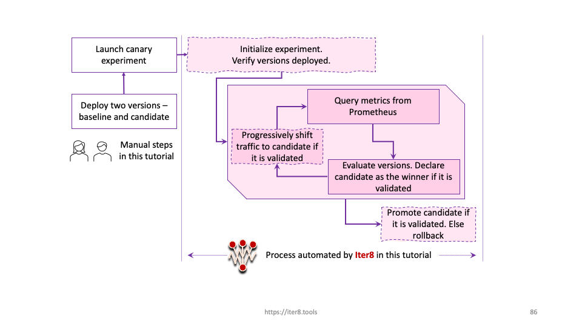

# Quick Start with Istio

!!! info "Older version of Iter8 for Istio"
    An older version of Iter8 was tightly coupled with the Istio domain. If this is what you are looking for, it is available [here](https://github.com/iter8-tools/iter8-istio).

!!! tip "Scenario: Canary testing and progressive deployment"
    [Canary testing](../../../concepts/buildingblocks/#testing-pattern) enables you to reduce risk during a [release](../../../concepts/buildingblocks/#release) by [validating](../../../concepts/buildingblocks/#validation) your new version with a small fraction of users before exposing it to all users. In this tutorial, you will:

    1. Perform canary testing.
    2. Specify service-level objectives or SLOs used by Iter8 to automatically validate your versions.
    3. Use metrics from Prometheus.
    4. Combine canary testing with [progressive deployment](../../../concepts/buildingblocks/#deployment-pattern) in an Iter8 experiment.
    
    Assuming the new version is validated, Iter8 will progressively increase the traffic percentage for the new version and promote it at the end as depicted below.

    

???+ warning "Before you begin, you will need... "
    1. **Kubernetes cluster.** You can also use [Minikube](https://minikube.sigs.k8s.io/docs/) or [Kind](https://kind.sigs.k8s.io/).
    2. The `kubectl` CLI. Install `kubectl` [here](https://kubernetes.io/docs/tasks/tools/install-kubectl/).
    3. **Go 1.13+** (recommended; required for using `iter8ctl` in [Step 7](/getting-started/quick-start/with-knative/#7-observe-experiment)). Install Go [here](https://golang.org/doc/install).

## 1. Create Kubernetes cluster

Create a local cluster using Minikube or Kind as follows, or use a managed Kubernetes service. Ensure that the cluster has sufficient resources, for example, 6 CPUs and 12GB of memory.

=== "Minikube"

    ```shell
    minikube start --cpus 6 --memory 12288
    ```

=== "Kind"

    ```shell
    kind create cluster
    kubectl cluster-info --context kind-kind
    ```

    ??? info "Ensuring your Kind cluster has sufficient resources"
        Your Kind cluster inherits the CPU and memory resources of its host. If you are using Docker Desktop, you can set its resources as shown below.

        


    

## 2. Clone Iter8 repo
```shell
git clone https://github.com/iter8-tools/iter8.git
cd iter8
export ITER8=$(pwd)
```

## 3. Install Istio and Iter8

For demonstration purposes, this quick install also installs the
Prometheus add-on and the (Prometheus-based) sample metrics for Istio.

```shell
$ITER8/samples/istio/quickstart/platformsetup.sh
```

## 4. Create app versions

Deploy the [`bookinfo` application](https://istio.io/latest/docs/examples/bookinfo/) and deploy additional copies of the `productpage` microservice.
The candidate version is also referred to as the *new* or *canary* version.
```shell
kubectl apply -f $ITER8/samples/istio/quickstart/namespace.yaml
kubectl apply -n bookinfo-iter8 -f $ITER8/samples/istio/quickstart/bookinfo-app.yaml
kubectl apply -n bookinfo-iter8 -f $ITER8/samples/istio/quickstart/productpage-v3.yaml
kubectl apply -n bookinfo-iter8 -f $ITER8/samples/istio/quickstart/bookinfo-gateway.yaml
```

??? info "Look inside `productpage-v1` configuration"
    The environment variables used to configure the service define the text color.
    ```yaml linenums="1"
    env:
    - name: color
      value: "red"
    - name: reward_min
      value: "0"
    - name: reward_max
      value: "5"
    ```

??? info "Look inside `productpage-v3` configuration"
    ```yaml linenums="1"
    The environment variables used to configure the service define the text color.
    ```yaml linenums="1"
    env:
    - name: color
      value: "green"
    - name: reward_min
      value: "10"
    - name: reward_max
      value: "20"
    ```

## 5. Generate requests
In a production environment, your application would receive requests from end-users. For the purposes of this tutorial, simulate user requests using [Fortio](https://github.com/fortio/fortio) as follows.

```shell
kubectl --namespace bookinfo-iter8 wait --for=condition=Ready pods --all
# URL_VALUE is the URL where your Knative application serves requests
URL_VALUE="http://$(kubectl -n istio-system get svc istio-ingressgateway -o jsonpath='{.spec.clusterIP}'):80/productpage"
sed "s+URL_VALUE+${URL_VALUE}+g" $ITER8/samples/istio/quickstart/fortio.yaml | kubectl apply -f -
```

??? info "Look inside fortio.yaml"
    ```yaml linenums="1"
    apiVersion: batch/v1
    kind: Job
    metadata:
      name: fortio
    spec:
      template:
        spec:
          volumes:
          - name: shared
            emptyDir: {}
          containers:
          - name: fortio
            image: fortio/fortio
            command:
              - fortio
              - load
              - -t
              - 6000s
              - -qps
              - "16"
              - -json
              - /shared/fortiooutput.json
              - -H
              - "Host: bookinfo.example.com"
              - $(URL)
            env:
            - name: URL
              value: URL_VALUE
            volumeMounts:
            - name: shared
              mountPath: /shared
          - name: busybox
            image: busybox:1.28
            command: ['sh', '-c', 'echo busybox is running! && sleep 6000']
            volumeMounts:
            - name: shared
              mountPath: /shared
          restartPolicy: Never
    ```

## 6. Launch Iter8 experiment
Launch the Iter8 experiment. Iter8 will orchestrate the canary release of the new version with SLO validation and progressive deployment as specified in the experiment.

```shell
kubectl apply -f $ITER8/samples/istio/quickstart/experiment.yaml
```

??? info "Look inside experiment.yaml"
    ```yaml linenums="1"
    apiVersion: iter8.tools/v2alpha2
    kind: Experiment
    metadata:
      name: istio-quickstart
    spec:
      # target identifies the knative service under experimentation using its fully qualified name
      target: bookinfo-iter8/productpage
      strategy:
        # this experiment will perform a canary test
        testingPattern: Canary
        deploymentPattern: Progressive
        actions:
          finish: # run the following sequence of tasks at the end of the experiment
          - task: common/exec
            with:
              cmd: /bin/bash
              args:
              - "-c"
              - kubectl -n {{ .namespace }} apply -f {{ .promote }}

      criteria:
        objectives: 
        - metric: iter8-istio/mean-latency
          upperLimit: 75
        - metric: iter8-istio/error-rate
          upperLimit: "0.01"
      duration:
        intervalSeconds: 10
        iterationsPerLoop: 10
      versionInfo:
        # information about app versions used in this experiment
        baseline:
          name: baseline
          variables:
          - name: revision
            value: productpage-v1
          - name: namespace
            value: bookinfo-iter8
          - name: promote
            value: https://raw.githubusercontent.com/iter8-tools/iter8/master/samples/istio/quickstart/baseline.yaml
          weightObjRef:
            apiVersion: networking.istio.io/v1beta1
            kind: VirtualService
            namespace: bookinfo-iter8
            name: bookinfo
            fieldPath: .spec.http[0].route[0].weight
        candidates:
        - name: candidate
          variables:
          - name: revision
            value: productpage-v3
          - name: namespace
            value: bookinfo-iter8
          - name: promote
            value: https://raw.githubusercontent.com/iter8-tools/iter8/master/samples/istio/quickstart/candidate.yaml
          weightObjRef:
            apiVersion: networking.istio.io/v1beta1
            kind: VirtualService
            namespace: bookinfo-iter8
            name: bookinfo
            fieldPath: .spec.http[0].route[1].weight
    ```

The process automated by Iter8 during this experiment is depicted below.


## 7. Observe experiment
Observe the experiment in realtime. Paste commands from the tabs below in separate terminals.

=== "iter8ctl"
    Install `iter8ctl`. You can change the directory where `iter8ctl` binary is installed by changing `GOBIN` below.
    ```shell
    GO111MODULE=on GOBIN=/usr/local/bin go get github.com/iter8-tools/iter8ctl@v0.1.2
    ```

    Periodically describe the experiment.
    ```shell
    while clear; do
    kubectl get experiment istio-quickstart -o yaml | iter8ctl describe -f -
    sleep 4
    done
    ```
    ??? info "iter8ctl output"
        The `iter8ctl` output will be similar to the following.
        ```shell
        ****** Overview ******
        Experiment name: istio-quickstart
        Experiment namespace: default
        Target: bookinfo-iter8/productpage
        Testing pattern: Canary
        Deployment pattern: Progressive

        ****** Progress Summary ******
        Experiment stage: Running
        Number of completed iterations: 7

        ****** Winner Assessment ******
        > If the candidate version satisfies the experiment objectives, then it is the winner.
        > Otherwise, if the baseline version satisfies the experiment objectives, it is the winner.
        > Otherwise, there is no winner.
        App versions in this experiment: [baseline candidate]
        Winning version: candidate
        Version recommended for promotion: candidate

        ****** Objective Assessment ******
        > Identifies whether or not the experiment objectives are satisfied by the most recently observed metrics values for each version.
        +--------------------------------+----------+-----------+
        |           OBJECTIVE            | BASELINE | CANDIDATE |
        +--------------------------------+----------+-----------+
        | iter8-istio/mean-latency <=    | false    | true      |
        |                        100.000 |          |           |
        +--------------------------------+----------+-----------+
        | iter8-istio/error-rate <=      | true     | true      |
        |                          0.010 |          |           |
        +--------------------------------+----------+-----------+

        ****** Metrics Assessment ******
        > Most recently read values of experiment metrics for each version.
        +--------------------------------+----------+-----------+
        |             METRIC             | BASELINE | CANDIDATE |
        +--------------------------------+----------+-----------+
        | iter8-istio/mean-latency       |  106.228 |    44.644 |
        | (milliseconds)                 |          |           |
        +--------------------------------+----------+-----------+
        | request-count                  | 1094.074 |   158.126 |
        +--------------------------------+----------+-----------+
        | iter8-istio/error-rate         |    0.000 |     0.000 |
        +--------------------------------+----------+-----------+
        ``` 

    As the experiment progresses, you should eventually see that all of the objectives reported as being satisfied by both versions. The candidate is identified as the winner and is recommended for promotion. When the experiment completes (in ~2 mins), you will see the experiment stage change from `Running` to `Completed`.

=== "kubectl get experiment"

    ```shell
    kubectl get experiment istio-quickstart --watch
    ```

    ??? info "kubectl get experiment output"
        The `kubectl` output will be similar to the following.
        ```shell
        NAME               TYPE     TARGET                       STAGE     COMPLETED ITERATIONS   MESSAGE
        istio-quickstart   Canary   bookinfo-iter8/productpage   Running   1                      IterationUpdate: Completed Iteration 1
        istio-quickstart   Canary   bookinfo-iter8/productpage   Running   2                      IterationUpdate: Completed Iteration 2
        istio-quickstart   Canary   bookinfo-iter8/productpage   Running   3                      IterationUpdate: Completed Iteration 3
        istio-quickstart   Canary   bookinfo-iter8/productpage   Running   4                      IterationUpdate: Completed Iteration 4
        istio-quickstart   Canary   bookinfo-iter8/productpage   Running   5                      IterationUpdate: Completed Iteration 5
        istio-quickstart   Canary   bookinfo-iter8/productpage   Running   6                      IterationUpdate: Completed Iteration 6
        istio-quickstart   Canary   bookinfo-iter8/productpage   Running   7                      IterationUpdate: Completed Iteration 7
        ```

    When the experiment completes (in ~ 2 mins), you will see the experiment stage change from `Running` to `Completed`.    

=== "kubectl get virtualservice"

    ```shell
    kubectl --namespace bookinfo-iter8 get virtualservice bookinfo -o json --watch \
      | jq .spec.http[0].route
    ```

    ??? info "kubectl get virtualservice output"
        The `kubectl` output will be similar to the following.
        ```shell
        [
          {
            "destination": {
              "host": "productpage",
              "port": {
                "number": 9080
              },
              "subset": "productpage-v1"
            },
            "weight": 35
          },
          {
            "destination": {
              "host": "productpage",
              "port": {
                "number": 9080
              },
              "subset": "productpage-v3"
            },
            "weight": 65
          }
        ]
        ```
    As the experiment progresses, you should see traffic progressively shift from `productpage-v1` to `productpage-v3`. When the experiment completes, all of the traffic will be sent to the winner, `productpage-v3`.

## 8. Cleanup

```shell
kubectl delete -f $ITER8/samples/istio/quickstart/fortio.yaml
kubectl delete -f $ITER8/samples/istio/quickstart/experiment.yaml
kubectl delete namespace bookinfo-iter8
```

???+ info "Understanding what happened"
    1. You deployed the bookinfo application which is composed of 4 microservices. You created two revisions of the `productpage` microservice, `productpage-v1` (baseline) and `productpage-v3` (candidate).
    2. You generated requests to bookinfo using a Fortio job. At the start of the experiment, 100% of the requests are sent to the baseline and 0% to the candidate.
    3. You created an Iter8 experiment with canary testing and progressive deployment patterns. In each iteration, Iter8 observed the mean latency, 95th percentile tail-latency, and error-rate metrics collected by Prometheus, verified that the candidate satisfied all objectives, identified the candidate as the winner, progressively shifted traffic from the baseline to the candidate, and eventually promoted the candidate using the `kubectl apply` command embedded within its finish action.
    4. Had the candidate failed to satisfy objectives, then the baseline would have been promoted.
