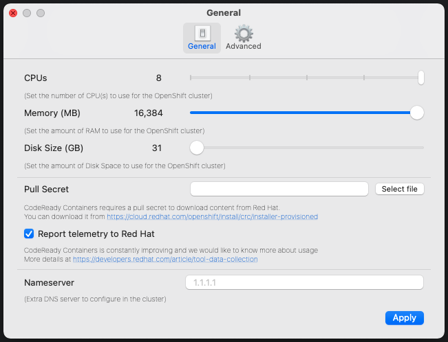

# Setup for Tutorials
Setup common components that are required in Iter8 tutorials.

## Local Kubernetes cluster
Use a managed K8s cluster or a local K8s cluster for running Iter8 tutorials. You can setup the latter using [Kind](https://kind.sigs.k8s.io/docs/user/quick-start/), [Minikube](https://minikube.sigs.k8s.io/docs/), or [CodeReady Containers](https://access.redhat.com/documentation/en-us/red_hat_codeready_containers/1.0/html/getting_started_guide/index) as follows.

=== "Kind"

    ```shell
    kind create cluster --wait 5m
    kubectl cluster-info --context kind-kind
    ```

=== "Minikube"

    ```shell
    minikube start
    ```

=== "CodeReady Containers"

    ```shell
    crc start
    ```

??? info "Setting CPU and memory resources for your local K8s cluster"
    Iter8 tutorials in certain K8s environments, especially those involving Istio, require additional CPU and memory resources. You can set this as follows.

    === "Kind"
        A Kind cluster inherits its CPU and memory resources of its host. If you are using Docker Desktop, you can set its resources as follows.

        

    === "Minikube"
        Set CPU and memory resources while starting Minikube as follows.

        ```shell
        minikube start --cpus 8 --memory 12288
        ```

    === "CodeReady Containers"
        Set CPU and memory resources while starting CodeReady Containers as follows.

        ```
        crc start --cpus 8 --memory 12288
        ```

        You can also change the CPU and memory resources in settings.

        

## Iter8 GitHub repo
Clone the Iter8 GitHub repo and set the `ITER8` environment variable as follows:

```shell
git clone https://github.com/iter8-tools/iter8.git
export ITER8=./iter8
```

## Iter8 Helm repo
Iter8 Helm repo contains charts that support Iter8's Helm-based tutorials. Get the repo as follows:

```shell
helm repo add iter8 https://iter8-tools.github.io/iter8/ --force-update
```