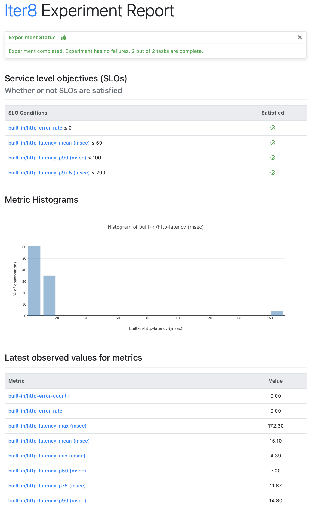

# Load Test with SLOs

!!! tip "Load test an HTTP Service and validate SLOs" 
    Use an [Iter8 experiment](concepts.md#what-is-an-iter8-experiment) to load test an HTTP service and validate latency and error-related [service level objectives (SLOs)](../user-guide/topics/slos.md).

***

## 1. Install Iter8
=== "Brew"
    ```shell
    brew tap iter8-tools/iter8
    brew install iter8
    ```

=== "Go 1.16+"
    ```shell
    go install github.com/iter8-tools/iter8@latest
    ```
    You can now run `iter8` (from your gopath bin/ directory)

=== "Binaries"
    Pre-compiled Iter8 binaries for many platforms are available [here](https://github.com/iter8-tools/iter8/releases). Uncompress the iter8-X-Y.tar.gz archive for your platform, and move the `iter8` binary to any folder in your PATH.

## 2. Download experiment chart
Download the `load-test` [experiment chart](concepts.md#experiment-chart) from [Iter8 hub](../user-guide/topics/iter8hub.md) as follows.

```shell
iter8 hub -e load-test
cd load-test
```

## 3. Run experiment
We will load test and validate the HTTP service whose URL is https://example.com. We will specify that the error rate must be 0, the mean latency must be under 50 msec, the 90th percentile latency must be under 100 msec, and the 97.5th percentile latency must be under 200 msec. 

Run the experiment as follows.

```shell
iter8 run --set url=https://example.com \
          --set SLOs.error-rate=0 \
          --set SLOs.mean-latency=50 \
          --set SLOs.p90=100 \
          --set SLOs.p'97\.5'=200
```

The `iter8 run` command combines an experiment chart with the supplied values to generate the `experiment.yaml` file, runs the experiment, and writes results into the `result.yaml` file.

??? note "Look inside experiment.yaml"
    This experiment contains the [`gen-load-and-collect-metrics` task](../user-guide/tasks/collect.md) for generating load and collecting metrics, and the [`assess-app-versions` task](../user-guide/tasks/assess.md) for validating SLOs.

    ```yaml
    # task 1: generate HTTP requests for application URL
    # collect Iter8's built-in latency and error-related metrics
    - task: gen-load-and-collect-metrics
      with:
        percentiles: 
        - 90
        - 97.5
        versionInfo:
        - url: https://example.com
    # task 2: validate service level objectives for app using
    # the metrics collected in the above task
    - task: assess-app-versions
      with:
        SLOs:
        - metric: "built-in/error-rate"
          upperLimit: 0
        - metric: "built-in/mean-latency"
          upperLimit: 50
        - metric: "built-in/p90"
          upperLimit: 100
        - metric: "built-in/p97.5"
          upperLimit: 200
    ```

??? note "Sample output from `iter8 run`"

    ```shell
    INFO[2021-12-14 10:23:26] starting experiment run                      
    INFO[2021-12-14 10:23:26] task 1: gen-load-and-collect-metrics : started 
    INFO[2021-12-14 10:23:39] task 1: gen-load-and-collect-metrics : completed 
    INFO[2021-12-14 10:23:39] task 2: assess-app-versions : started        
    INFO[2021-12-14 10:23:39] task 2: assess-app-versions : completed      
    INFO[2021-12-14 10:23:39] experiment completed successfully    
    ```

??? note "Iter8 and Helm"
    If you are familiar with [Helm](https://helm.sh), you probably noticed that the `load-test` folder resembles a Helm chart. This is because, Iter8 experiment charts *are* Helm charts under the covers. The [`iter8 run` command](../user-guide/commands/iter8_run.md) used above combines the experiment chart with values to generate the `experiments.yaml` file, much like how Helm charts can be combined with values to produce Kubernetes manifests.

## 4. Assert outcomes
Assert that the experiment completed without any failures and SLOs are satisfied.

```shell
iter8 assert -c completed -c nofailure -c slos
```

The `iter8 assert` subcommand asserts if experiment result satisfies the specified conditions. 
If assert conditions are satisfied, it exits with code `0`, and exits with code `1` otherwise. Assertions are especially useful within CI/CD/GitOps pipelines.

??? note "Sample output from `iter8 assert`"

    ```shell
    INFO[2021-11-10 09:33:12] experiment completed
    INFO[2021-11-10 09:33:12] experiment has no failure                    
    INFO[2021-11-10 09:33:12] SLOs are satisfied                           
    INFO[2021-11-10 09:33:12] all conditions were satisfied
    ```

## 5. View report
View a report of the experiment in HTML or text formats as follows.

=== "HTML"
    ```shell
    iter8 report -o html > report.html
    # open report.html with a browser. In MacOS, you can use the command:
    # open report.html
    ```

    ???+ note "The HTML report looks as follows"
        

=== "Text"
    ```shell
    iter8 report -o text
    ```

    ???+ note "The text report looks as follows."

        ```
        -----------------------------|-----
                   Experiment summary|
        -----------------------------|-----
                Experiment completed |true
        -----------------------------|-----
                   Experiment failed |false
        -----------------------------|-----
           Number of completed tasks |4
        -----------------------------|-----


        -----------------------------|-----
                                 SLOs|
        -----------------------------|-----
                  built-in/error-rate|true
        -----------------------------|-----
                built-in/p95.0 (msec)|true
        -----------------------------|-----


          -----------------------------|-----
                                Metrics|
          -----------------------------|-----
                   built-in/error-count|0
          -----------------------------|-----
                    built-in/error-rate|0
          -----------------------------|-----
                built-in/latency (msec)|3
          -----------------------------|-----
            built-in/max-latency (msec)|213.21
          -----------------------------|-----
           built-in/mean-latency (msec)|17.47
          -----------------------------|-----
            built-in/min-latency (msec)|4.30
          -----------------------------|-----
                  built-in/p50.0 (msec)|10.80
          -----------------------------|-----
                  built-in/p75.0 (msec)|12.40
          -----------------------------|-----
                  built-in/p90.0 (msec)|13.60
          -----------------------------|-----
                  built-in/p95.0 (msec)|14
          -----------------------------|-----
                  built-in/p99.0 (msec)|209.91
          -----------------------------|-----
                  built-in/p99.9 (msec)|212.88
          -----------------------------|-----
                 built-in/request-count|100
          -----------------------------|-----
         built-in/stddev-latency (msec)|39.90
          -----------------------------|-----
        ```

Congratulations! :tada: You completed your first Iter8 experiment.

***

???+ tip "Useful variations of this experiment"

    1. [Control the request generation process](../tutorials/load-test/requests.md) by setting the number of queries/duration of the load test, the number of queries sent per second during the test, and the number of parallel connections used to send requests.

    2. HTTP services with POST endpoints may accept payloads. [Send various types of content as payload](../tutorials/load-test/payload.md) during the load test.

    3. [Learn more about the built-in metrics that are collected and the SLOs that are validated during the load test](../tutorials/load-test/metricsandslos.md).
    
    4. The `values.yaml` file in the experiment chart folder documents all the values that can be supplied during the experiment.
