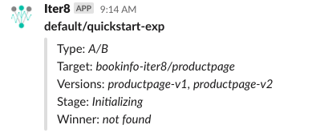

# Notification Tasks

## `notification/slack`

### Overview

The `notification/slack` task posts a slack message about current state of the experiment.

### Example

The following task notifies a slack channel with id `C0138103183` and using the token contained in the secret `slack-token` in the `ns` namespace.

```yaml
task: notification/slack
with:
  channel: C0138103183
  secret: ns/slack-token
```

### Inputs

| Field name | Field type | Description | Required |
| ----- | ---- | ----------- | -------- |
| channel | string | Name of the slack channel to which messages should be posted. | Yes |
| secret | string | Identifies a secret containing a `token` to be used for authentication.  Expressed as `namespace/name`. If `namespace` is not specified, the namespace of the experiment is used. | Yes |

### Result

A slack message describing the experiment will be posted to the specified channel. Below is a sample slack notification from this task.



### Requirements

#### Slack API token

An API token allowing posting messages to the desired slack channel is needed. To obtain a suitable token, see [Sending messages using Incoming Webhooks](https://api.slack.com/messaging/webhooks). Once you have the token, store it in a Kubernetes secret. For example, to create the secret _slack-secret_ in the default namespace:

```shell
kubectl create secret generic slack-secret --from-literal=token=<slack token>
```

#### Permission to read secret with Slack token

The Iter8 task runner needs permission to read the identified secret. For example the following RBAC changes will allow the task runner read the secret from the default namespace:

```shell
kubectl apply -f https://raw.githubusercontent.com/iter8-tools/iter8/master/samples/tasks/rbac/read-secrets.yaml
```

??? info "Inspect role and rolebinding"
    ```yaml linenums="1"
        # This role enables reading of secrets
        apiVersion: rbac.authorization.k8s.io/v1
        kind: ClusterRole
        metadata:
        name: iter8-secret-reader
        rules:
        - apiGroups:
        - ""
        resources:
        - secrets
        verbs: ["get", "list"]
        ---
        # This role binding enables Iter8 handler to read secrets in the default namespace.
        # To change the namespace apply to the target namespace
        apiVersion: rbac.authorization.k8s.io/v1
        kind: RoleBinding
        metadata:
        name: iter8-secret-reader-handler
        roleRef:
        apiGroup: rbac.authorization.k8s.io
        kind: ClusterRole
        name: iter8-secret-reader
        subjects:
        - kind: ServiceAccount
        name: iter8-handlers
        namespace: iter8-system
    ```

#### Slack channel ID

A slack channel is identified by an id. To find the id, open the slack channel in a web browser. The channel id is the portion of the URL of the form: `CXXXXXXXX`
