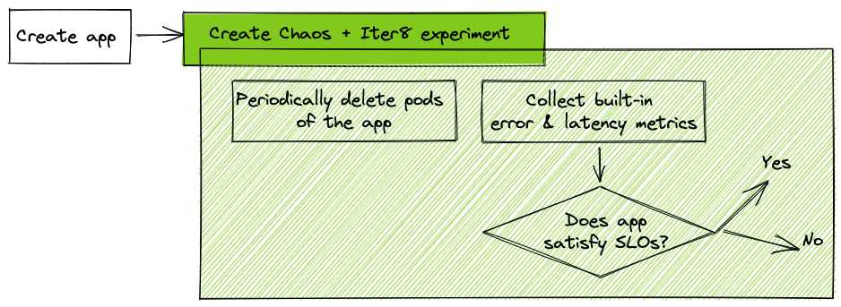

# Chaos Testing with SLO Validation

!!! tip "Scenario: Inject Chaos into Kubernetes cluster and verify if application can satisfy SLOs"
    **Problem:** You have a Kubernetes app. You want to stress test it by injecting chaos, and verify that it can satisfy service-level objectives (SLOs). This helps you guarantee that your application is resilient, and works well even under periods of stress (like intermittent pod failures).

    **Solution:** You will launch a Kubernetes application along with a composite experiment, consisting of [Litmus Chaos](https://litmuschaos.io/) experiment resource and an Iter8 experiment resource. The chaos experiment will delete pods of the application periodically, while the Iter8 experiment will send requests to the application and verify if it is able to satisfy SLOs.

    

??? warning "Setup Kubernetes cluster and local environment"
    0. If you completed the [Iter8 getting-started tutorial](../../getting-started/first-experiment.md) (highly recommended), you may skip to step number 6.
    1. Setup [Kubernetes cluster](../../getting-started/setup-for-tutorials.md#local-kubernetes-cluster)
    2. [Install Iter8 in Kubernetes cluster](../../getting-started/install.md)
    3. Get [Helm 3.4+](https://helm.sh/docs/intro/install/).
    4. Get [`iter8ctl`](../../getting-started/install.md#install-iter8ctl)
    5. Fork the [Iter8 GitHub repo](https://github.com/iter8-tools/iter8). Clone your fork, and set the ITER8 environment variable as follows.
    ```shell
    export USERNAME=<your GitHub username>
    ```
    ```shell
    git clone git@github.com:$USERNAME/iter8.git
    cd iter8
    export ITER8=$(pwd)
    ```
    6. Install [Litmus in Kubernetes cluster](https://litmuschaos.io/).
    ```shell
    kubectl apply -f https://litmuschaos.github.io/litmus/litmus-operator-v1.13.8.yaml
    ```
    Verify that the Litmus is install correctly as described [here](https://v1-docs.litmuschaos.io/docs/getstarted/#install-litmus).

## 1. Create app
The `hello` app consists of a Kubernetes deployment and service. Deploy the app as follows.

```shell
kubectl apply -n default -f $ITER8/samples/deployments/app/deploy.yaml
kubectl apply -n default -f $ITER8/samples/deployments/app/service.yaml
```

Use [these instructions](../../getting-started/first-experiment.md#verify-app) to verify that your app is running.

## 2. Create composite experiment
```shell
helm upgrade -n default my-exp $ITER8/samples/chaos \
  --set appns='default' \
  --set applabel='app.kubernetes.io/name=hello' \
  --set URL='http://hello.default.svc.cluster.local:8080' \
  --set limitMeanLatency=50.0 \
  --set limitErrorRate=0.0 \
  --set limit95thPercentileLatency=100.0 \
  --install
```

## 3. Observe Experiment
View the chaos resources (chaos engine resource, pod deletion experiment, and RBAC resources), and Iter8 experiment resource.
```shell
helm get manifest my-exp
```

Verify that the phase of the chaos experiment is `Completed`.
```shell
kubectl get chaosresults hello-pod-delete -n litmus -ojsonpath='{.status.experimentStatus.phase}'
```

Verify that the chaos experiment returned a `Pass` verdict. The `Pass` verdict states that the application is still running after the chaos.
```shell
kubectl get chaosresults hello-pod-delete -n litmus -ojsonpath='{.status.experimentStatus.verdict}'
```

Ensure that the Iter8 experiment completed.
```shell
iter8ctl assert -c completed
```

Due to chaos injection, and the fact that the number of replicas of the app in the deployment manifest is set to 1, the SLOs are not expected to be satisfied during this experiment. Verify this is the case.
```shell
# this assertion is expected to fail
iter8ctl assert -c winnerFound
```

Describe the Iter8 experiment. This will print the metrics collected during the experiment along with SLOs.
```shell
iter8ctl describe
```

## 4. Scale app and retry
Scale up the app so that replica count is increased to 2. The scaled app is now more resilient. Performing the same experiment as above will now result in SLOs being satisfied and a winner being found.

```shell
kubectl scale --replicas=2 -n default -f $ITER8/samples/deployments/app/deploy.yaml
```

Retry steps 2 and 3 above. You should now find that SLOs are satisfied and a winner is found at the end of the experiment.

## 5. Cleanup
```shell
# remove chaos + Iter8 experiments
helm uninstall -n default my-exp
# remove app
kubectl delete -n default -f $ITER8/samples/deployments/app/service.yaml
kubectl delete -n default -f $ITER8/samples/deployments/app/deploy.yaml
```

***

**Next Steps**

???+ tip "Use with your own app, and try other types of Chaos"
    1. You can easily replace the `hello` app used in this tutorial with your own application. a) Modify [Step 1](#1-create-app) to use your service and deployment. b) Modify [Step 2](#2-create-composite-experiment) by supplying the correct namespace and label for your app, and also the correct URL where the app receives requests.

    2. Litmus makes it possible to inject [over 51 types of Chaos](https://hub.litmuschaos.io/). Modify the composite Helm chart to use any of these other types of chaos experiment.

    3. Iter8 makes it possible to [promote the winning version](../../concepts/buildingblocks.md#version-promotion) in a number of different ways. For example, you may have a stable version running in production, a candidate version deployed in a staging environment, perform this experiment, ensure that the candidate is successful, and promote it as the latest stable version in a GitOps-y manner as described [here](../deployments/slo-validation-gitops.md).