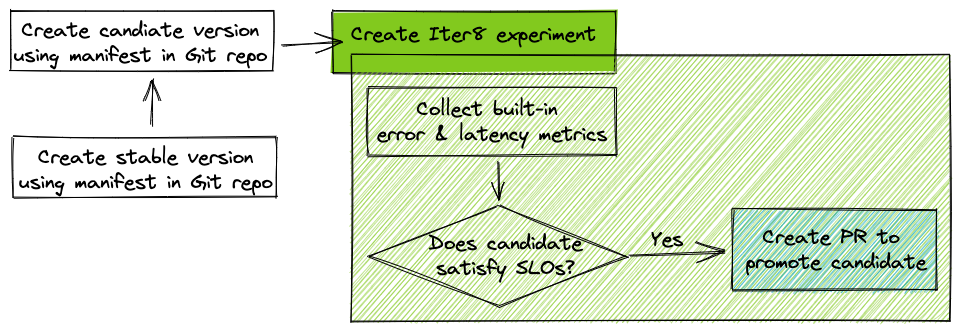

# Chaos Testing with SLO Validation

!!! tip "Scenario: Inject Chaos into Kubernetes cluster and verify if application can satisfy SLOs"
    **Problem:** You have a Kubernetes app. You want to stress test it by injecting chaos, and verify if it can continue to satisfy service-level objectives (SLOs).

    **Solution:** You will launch a Kubernetes application along with a composite experiment, consisting of [Litmus Chaos](https://litmuschaos.io/) experiment resource and an Iter8 experiment resource. The chaos experiment will delete pods of the application periodically, while the Iter8 experiment will send requests to the application and verify if it is able to satisfy SLOs.

    

Chaos Testing enables you to perform chaos tests(w/ [litmus](https://litmuschaos.io/)) with SLO validation using objectives. In this tutorial, you will:

  1. Perform Chaos Tests. This is performed by litmuschaos in this tutorial.
  1. Specify user-engagement as the reward metric. This metric will be mocked by Iter8 in this tutorial.

## Setup
### iter8 setup
### litmus setup

## Install application

## Create experiments

## Observe Experiment

## Promote winner

## Cleanup
