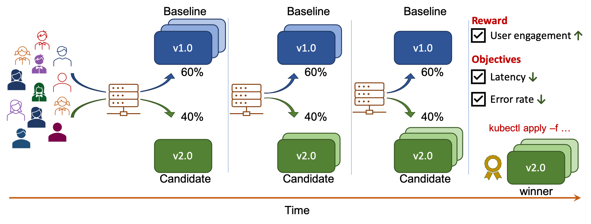
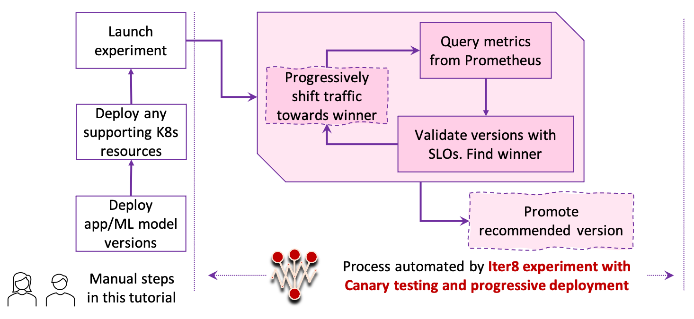

# Fixed Split Deployment

!!! tip "Scenario: FixedSplit deployment"

    [FixedSplit deployment](../../../concepts/buildingblocks/#deployment-patterns) enables you to fix the traffic split between versions ahead of the experiment. When you use FixedSplit deployment pattern in an experiment, Iter8 will work with the traffic split you specified and will **not** progressively shift traffic towards the winner during the iterations of an experiment. In this tutorial, you will:

    * Modify the [quick start tutorial](../../../getting-started/quick-start) to use FixedSplit instead of Progressive deployment.

    The modified A/B testing experiment with FixedSplit deployment pattern is depicted below.

    


???+ warning "Before you begin, you will need... "
    > **Note:** Please choose the same K8s stack (for example, Istio, KFServing, or Knative) consistently throughout this tutorial. If you wish to switch K8s stacks between tutorials, start from a clean K8s cluster, so that your cluster is correctly setup.

## Steps 1 to 6
    
Please follow steps 1 through 6 of the [quick start tutorial](../../../getting-started/quick-start/#1-create-kubernetes-cluster).


## 7. Launch experiment
Launch the Iter8 experiment that orchestrates canary testing for the app in this tutorial.

=== "Istio"

    ```shell
    kubectl apply -f $ITER8/samples/istio/canary/experiment.yaml
    ```

    ??? info "Look inside experiment.yaml"
        ```yaml linenums="1"
        apiVersion: iter8.tools/v2alpha2
        kind: Experiment
        metadata:
          name: canary-exp
        spec:
          # target identifies the service under experimentation using its fully qualified name
          target: bookinfo-iter8/productpage
          strategy:
            # this experiment will perform a Canary test
            testingPattern: Canary
            # this experiment will progressively shift traffic to the winning version
            deploymentPattern: Progressive
            actions:
              # when the experiment completes, promote the winning version using kubectl apply
              finish:
              - task: common/exec
                with:
                  cmd: /bin/bash
                  args: [ "-c", "kubectl -n bookinfo-iter8 apply -f {{ .promote }}" ]
          criteria:
            objectives: # metrics used to validate versions
            - metric: iter8-istio/mean-latency
              upperLimit: 100
            - metric: iter8-istio/error-rate
              upperLimit: "0.01"
            requestCount: iter8-istio/request-count
          duration: # product of fields determines length of the experiment
            intervalSeconds: 10
            iterationsPerLoop: 10
          versionInfo:
            # information about the app versions used in this experiment
            baseline:
              name: productpage-v1
              variables:
              - name: namespace # used in metric queries
                value: bookinfo-iter8
              - name: promote # used by final action if this version is the winner
                value: https://raw.githubusercontent.com/iter8-tools/iter8/master/samples/istio/quickstart/vs-for-v1.yaml
              weightObjRef:
                apiVersion: networking.istio.io/v1beta1
                kind: VirtualService
                namespace: bookinfo-iter8
                name: bookinfo
                fieldPath: .spec.http[0].route[0].weight
            candidates:
            - name: productpage-v2
              variables:
              - name: namespace # used in metric queries
                value: bookinfo-iter8
              - name: promote # used by final action if this version is the winner
                value: https://raw.githubusercontent.com/iter8-tools/iter8/master/samples/istio/quickstart/vs-for-v2.yaml
              weightObjRef:
                apiVersion: networking.istio.io/v1beta1
                kind: VirtualService
                namespace: bookinfo-iter8
                name: bookinfo
                fieldPath: .spec.http[0].route[1].weight
        ```
=== "Knative"

    ```shell
    kubectl apply -f $ITER8/samples/knative/canary/experiment.yaml
    ```

    ??? info "Look inside experiment.yaml"
        ```yaml linenums="1"
        apiVersion: iter8.tools/v2alpha2
        kind: Experiment
        metadata:
          name: canary-exp
        spec:
          target: default/sample-app
          strategy:
            testingPattern: Canary
            deploymentPattern: Progressive
            actions:
              finish: # run the following sequence of tasks at the end of the experiment
              - task: common/exec # promote the winning version      
                with:
                  cmd: /bin/sh
                  args:
                  - "-c"
                  - |
                    kubectl apply -f https://raw.githubusercontent.com/iter8-tools/iter8/master/samples/knative/quickstart/{{ .promote }}.yaml
          criteria:
            requestCount: iter8-knative/request-count
            objectives: 
            - metric: iter8-knative/mean-latency
              upperLimit: 50
            - metric: iter8-knative/95th-percentile-tail-latency
              upperLimit: 100
            - metric: iter8-knative/error-rate
              upperLimit: "0.01"
          duration:
            intervalSeconds: 10
            iterationsPerLoop: 10
          versionInfo:
            # information about app versions used in this experiment
            baseline:
              name: sample-app-v1
              weightObjRef:
                apiVersion: serving.knative.dev/v1
                kind: Service
                name: sample-app
                namespace: default
                fieldPath: .spec.traffic[0].percent
              variables:
              - name: promote
                value: baseline
            candidates:
            - name: sample-app-v2
              weightObjRef:
                apiVersion: serving.knative.dev/v1
                kind: Service
                name: sample-app
                namespace: default
                fieldPath: .spec.traffic[1].percent
              variables:
              - name: promote
                value: candidate
        ```

The process automated by Iter8 during this experiment is depicted below.



## 8. Observe experiment
Follow [step 8 of quick start tutorial](../../../getting-started/quick-start/#8-observe-experiment) to observe the experiment in realtime. Note that the experiment in this tutorial uses a different name from the quick start one. Replace the experiment name `quickstart-exp` with `canary-exp` in your commands.

???+ info "Understanding what happened"
    1. You created two versions of your app/ML model.
    2. You generated requests for your app/ML model versions. At the start of the experiment, 100% of the requests are sent to the baseline and 0% to the candidate.
    3. You created an Iter8 experiment with canary testing pattern and progressive deployment pattern. In each iteration, Iter8 observed the latency and error-rate metrics collected by Prometheus; Iter8 verified that the candidate satisfied all the SLOs, identified candidate as the winner, progressively shifted traffic from the baseline to the candidate, and promoted the candidate.

## 9. Cleanup
=== "Istio"
    ```shell
    kubectl delete -f $ITER8/samples/istio/quickstart/fortio.yaml
    kubectl delete -f $ITER8/samples/istio/canary/experiment.yaml
    kubectl delete namespace bookinfo-iter8
    ```
=== "Knative"
    ```shell
    kubectl delete -f $ITER8/samples/knative/quickstart/fortio.yaml
    kubectl delete -f $ITER8/samples/knative/canary/experiment.yaml
    kubectl delete -f $ITER8/samples/knative/quickstart/experimentalservice.yaml
    ```
