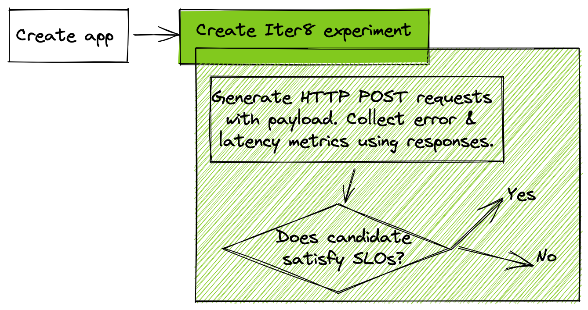

# SLO Validation with Payload
!!! tip "Validate SLOs for an app that receives a payload through an HTTP POST API"
    **Problem**: You have a Kubernetes app that receives a payload through an HTTP POST API. You want to verify that it satisfies latency and error rate SLOs.

    **Solution**: In this tutorial, you will launch a Kubernetes app that implements a POST API that receives a payload, along with an Iter8 experiment. Iter8 will [validate that the app satisfies latency and error-based objectives (SLOs)](../../concepts/buildingblocks.md#slo-validation) using [built-in metrics](../../metrics/builtin.md). During this validation, Iter8 will generate HTTP POST requests with a payload for the app.

    

???+ warning "Setup Kubernetes cluster and local environment"
    1. If you completed the [Iter8 getting-started tutorial](../../getting-started/first-experiment.md) (highly recommended), you may skip the remaining steps of setup.
    2. Setup [Kubernetes cluster](../../getting-started/setup-for-tutorials.md#local-kubernetes-cluster)
    3. [Install Iter8 in Kubernetes cluster](../../getting-started/install.md)
    4. Get [Helm 3.4+](https://helm.sh/docs/intro/install/).
    5. Get [`iter8ctl`](../../getting-started/install.md#get-iter8ctl)
    6. Fork the [Iter8 GitHub repo](https://github.com/iter8-tools/iter8). Clone your fork, and set the `ITER8` environment variable as follows.
    ```shell
    export USERNAME=<your GitHub username>
    ```
    ```shell
    git clone git@github.com:$USERNAME/iter8.git
    cd iter8
    export ITER8=$(pwd)
    ```

## 1. Create app
The `httpbin` app consists of a Kubernetes deployment and service. Deploy the app as follows.

```shell
# deploy app
kubectl apply -n default -f $ITER8/samples/deployments/httpbin/deploy.yaml
kubectl apply -n default -f $ITER8/samples/deployments/httpbin/service.yaml
```

### 1.a) Verify app is running

??? note "Verify that the app is running using these instructions"
    ```shell
    # do this in a separate terminal
    # port-forward the app
    kubectl port-forward -n default svc/httpbin 8080:80
    ```

    ```shell
    curl http://localhost:8080/post -X POST -d @$ITER8/samples/deployments/httpbin/payload.json -H "Content-Type: application/json"
    ```

    `Curl` output will be similar to the following.
    ```json
    {
      "args": {}, 
      "data": "{  \"hello\": \"world\",  \"goodbye\": \"world\"}", 
      "files": {}, 
      "form": {}, 
      "headers": {
        "Accept": "*/*", 
        "Content-Length": "41", 
        "Content-Type": "application/json", 
        "Host": "localhost:8080", 
        "User-Agent": "curl/7.64.1"
      }, 
      "json": {
        "goodbye": "world", 
        "hello": "world"
      }, 
      "origin": "127.0.0.1", 
      "url": "http://localhost:8080/post"
    }
    ```

## 2. Launch Iter8 experiment
Deploy an Iter8 experiment for SLO validation of the app as follows.
```shell
helm upgrade -n default my-exp $ITER8/samples/slo-validation \
  --set URL='http://httpbin.default.svc.cluster.local/post' \
  --set payloadURL='https://raw.githubusercontent.com/sriumcp/iter8/post/samples/deployments/httpbin/payload.json' \
  --set contentType='application/json' \
  --set limitMeanLatency=100.0 \
  --set limitErrorRate=0.0 \
  --set limit95thPercentileLatency=200.0 \
  --install  
```

The above command creates [an Iter8 experiment](../../concepts/whatisiter8.md#what-is-an-iter8-experiment) that generates HTTP requests, collects latency and error rate metrics for the app, and verifies that the app satisfies mean latency (100 msec), error rate (0.0), 95th percentile tail latency (200 msec) SLOs. These HTTP requests are POST requests and use the JSON data from the `payloadURL` specified in the command as request payload.

View the manifest created by the Helm command, the default values used by the Helm chart, and the actual values used by the Helm release using [the instructions in this step](../../getting-started/first-experiment.md#2-launch-iter8-experiment).

## 3. Observe experiment
Observe the experiment by following [these steps](../../getting-started/first-experiment.md#3-observe-experiment).

## 4. Cleanup
```shell
helm uninstall -n default my-exp
kubectl delete -n default -f $ITER8/samples/deployments/httpbin/service.yaml
kubectl delete -n default -f $ITER8/samples/deployments/httpbin/deploy.yaml
```
***

!!! tip "Next Steps"
    1. Run the above experiment with *your* app by replacing the `httpbin` app with *your* app, and modifying the Helm values appropriately.

    2. Customize the number of queries, and queries per second generated by Iter8, by setting the `numQueries` and `QPS` values.

    3. Try other variations of SLO validation that involve:
        - [GitOps with automated pull request](slo-validation-pr.md)
        - [GitOps with automated GH Actions workflow trigger](slo-validation-ghaction.md)
        - [Chaos injection](slo-validation-chaos.md)
