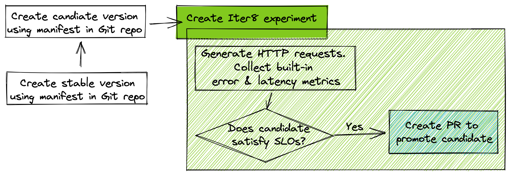

# SLO Validation with Automated Pull Request
!!! tip "Validate SLOs and automatically create a pull request"
    **Problem:** You have a new version of a K8s app. You want to verify that it satisfies latency and error rate SLOs, and automatically promote it to production as the stable version in a GitOps-y manner by creating a pull request.

    **Solution:** In this tutorial, you will [dark launch](../../concepts/buildingblocks.md#dark-launch) the new version of your K8s app along with an Iter8 experiment. Iter8 will [validate that the new satisfies latency and error-based objectives (SLOs)](../../concepts/buildingblocks.md#slo-validation) using [built-in metrics](../../metrics/builtin.md) and [promote the new version by raising a pull-request in a GitHub repo](../../concepts/buildingblocks.md#version-promotion).

    

???+ warning "Setup Kubernetes cluster and local environment"
    1. If you completed the [Iter8 getting-started tutorial](../../getting-started/first-experiment.md) (highly recommended), you may skip the remaining steps of setup.
    2. Setup [K8s cluster](../../getting-started/setup-for-tutorials.md#local-kubernetes-cluster)
    3. [Install Iter8 in K8s cluster](../../getting-started/install.md)
    4. Get [Helm 3.4+](https://helm.sh/docs/intro/install/).
    5. Get [`iter8ctl`](../../getting-started/install.md#install-iter8ctl)
    6. Fork the [Iter8 GitHub repo](https://github.com/iter8-tools/iter8). Clone your fork, and set the `ITER8` environment variable as follows.
    ```shell
    export USERNAME=<your GitHub username>
    ```
    ```shell
    git clone git@github.com:$USERNAME/iter8.git
    cd iter8
    export ITER8=$(pwd)
    ```

## 1. Create stable version
Create version `1.0` of the `hello world` app as follows.

```shell
# USERNAME is exported as part of setup steps.
kubectl apply -f https://raw.githubusercontent.com/$USERNAME/iter8/master/samples/deployments/app/deploy.yaml
kubectl apply -f https://raw.githubusercontent.com/$USERNAME/iter8/master/samples/deployments/app/service.yaml
```

## 2. Create candidate version
Create version `2.0` of the `hello world` app in the staging environment. For the purposes of this tutorial, the production environment is the `master` branch of the GitHub repo which is synced to the `default` namespace in the Kubernetes cluster, and the staging environment is the `staging` branch in the GitHub repo which is synced to the `staging` namespace in the Kubernetes cluster.

Create candidate version in `staging` branch as follows.
```shell
# create the staging branch
git checkout -b staging

# edit the image in the deployment
tmpfile=$(mktemp)
kubectl set image --local -f $ITER8/samples/deployments/app/deploy.yaml hello='gcr.io/google-samples/hello-app:2.0' -o yaml > ${tmpfile}
cat ${tmpfile} > $ITER8/samples/deployments/app/deploy.yaml
rm -f ${tmpfile}

# commit and push
git commit -a -m "set image to 2.0"
git push origin staging
```

Sync the `staging` branch to the  `staging` namespace as follows.
```shell
kubectl create ns staging
kubectl apply -f https://raw.githubusercontent.com/$USERNAME/iter8/staging/samples/deployments/app/deploy.yaml -n staging
kubectl apply -f https://raw.githubusercontent.com/$USERNAME/iter8/staging/samples/deployments/app/service.yaml -n staging
```

Adapt [these instructions](../../getting-started/first-experiment.md#1a-verify-app-is-running) to verify that stable and candidate versions of your app are running.

## 3. Enable GitOps
3.1) [Create a personal access token on GitHub](https://docs.github.com/en/github/authenticating-to-github/keeping-your-account-and-data-secure/creating-a-personal-access-token). In Step 8 of this process, grant `repo` and `read:org` permissions to this token. This will ensure that the token can be used by Iter8 to update your app manifest in GitHub.

3.2) Create K8s secret
```shell
# replace $GHTOKEN with GitHub token created above
kubectl create secret generic -n staging ghtoken --from-literal=token=$GHTOKEN
```

## 4. Launch Iter8 experiment
Deploy an Iter8 experiment for SLO validation and GitOps-y promotion of the app as follows.
```shell
helm upgrade -n staging my-exp $ITER8/samples/slo-pr \
  --set URL='http://hello.staging.svc.cluster.local:8080' \
  --set limitMeanLatency=50.0 \
  --set limitErrorRate=0.0 \
  --set limit95thPercentileLatency=100.0 \
  --set owner=$USERNAME \
  --set repo=iter8 \
  --install
```

The above command creates [an Iter8 experiment](../../concepts/whatisiter8.md#what-is-an-iter8-experiment) that generates requests, collects latency and error rate metrics for the candidate version of the app, and verifies that the candidate satisfies mean latency (50 msec), error rate (0.0), 95th percentile tail latency (100 msec) SLOs. 

Assuming the candidate version satisfies SLOs, it creates a pull request with `staging` as the head branch and `master` as the base branch. It uses the `ghtoken` secret to do so.

View the manifest created by the Helm command, the default values used by the Helm chart, and the actual values used by the Helm release by adapting [the instructions in this step](../../getting-started/first-experiment.md#2-launch-iter8-experiment).

## 5. Observe experiment
Observe the experiment by adapting [these steps](../../getting-started/first-experiment.md#3-observe-experiment).

## 6. Review pull request
Once the experiment completes, you can visit your fork at https://github.com/$USERNAME/iter8/pulls to review the pull-request created by Iter8.

## 7. Cleanup

```shell
kubectl delete ns staging
kubectl delete deploy/hello
kubectl delete svc/hello
```

***

!!! tip "Next Steps"
    1. Run the above experiment with *your* app by replacing the stable and candidate versions of `hello` app with the stable and candidate versions of *your* app respectively, modifying the Helm values, and supplying the appropriate token. You can also customize the number of queries and queries per second generated by Iter8 as part of this experiment by setting the `numQueries` and `QPS` values.

    2. Try other variations of version promotion that involve:
        - [GitOps with automated GH Actions workflow trigger](slo-validation-ghaction.md)
