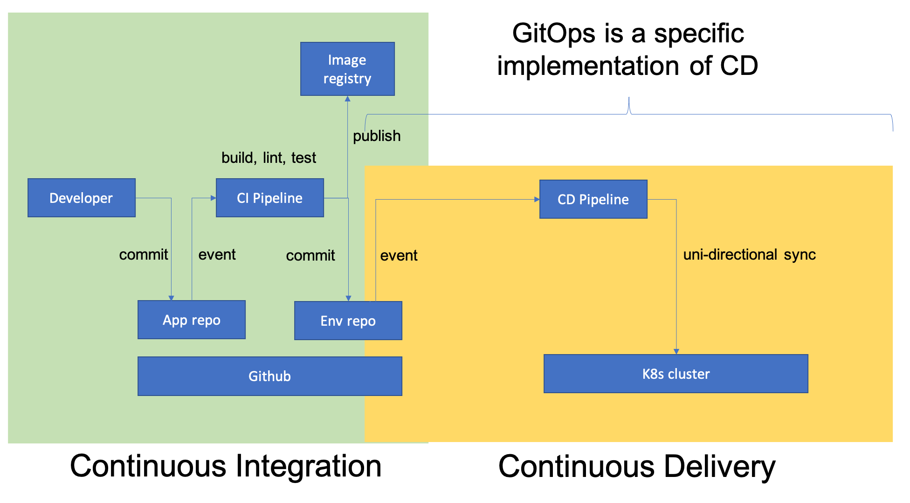
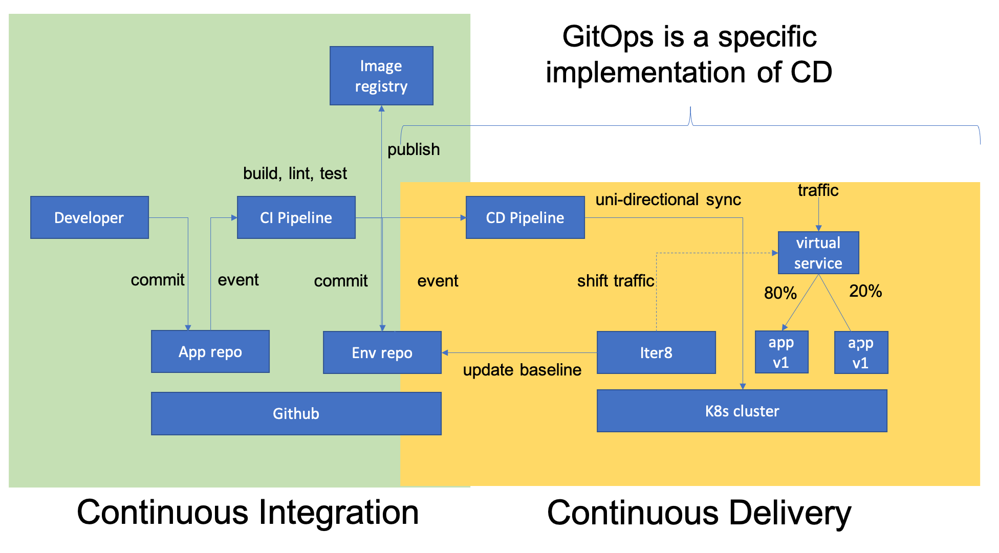

# GitOps with Argo CD

!!! tip "Scenario: GitOps"
    GitOps methodology is being widely used in CI/CD pipelines in Kubernetes-based environments to ease cluster management tasks. When using this methodology, the desired states of one or more clusters are kept in a Git repo, and a CD pipeline tool will continuously monitor for changes in the repo and sync them to the clusters. Additionally, it is preferred that Git repos are structured in a certain way so that the code repo is separated from the environment (Env) repo. Commits to the code repo trigger the CI pipeline tool to build, test, lint, and eventually push newly built images to an image repository. The Env repo contains configuration files that describe how various resources should be deployed in the cluster. Subsequently, configurations in the Env repo are updated to point to the newly built images. And finally, the CD pipeline tool will sync the new desired states to the clusters. This process is shown below:

    

!!! tip "Scenario: Iter8+Gitops"
    Iter8 can be used in the context of GitOps (shown below) so that new versions of an application can be progressively rolled out, or even rolled back when problems are detected. In this tutorial, we will use Argo CD as the CD pipeline tool and Istio as the underlying service mesh,

    

    We assume the reader has at least a basic understanding of how Iter8 works from the [quick start tutorial](../../../getting-started/quick-start.md#1-create-kubernetes-cluster). Since the Env repo is at the heart of GitOps, we will focus mainly on how to setup and manage the Env repo during application update. In this tutorial, we will cover the following topics.

    1. How to setup an Env repo to work with Iter8+GitOps
    2. How to update the Env repo to start an Iter8 experiment
    3. How to cleanup the Env repo after an Iter8 experiment is finished

???+ warning "Iter8 GitOps Guarantees"
    Unlike other progressive delivery tools, Iter8 adheres to GitOps guarantees by ensuring the desired state is always in sync with the actual state. App version that failed promotion criteria will never get promoted, even if the cluster had to be recreated from scratch. This important GitOps property is often not guaranteed by other tools!

## Step 1. Create K8s cluster
If you don't already have a K8s cluster, [create a Minikube or Kind K8s cluster locally](../../../getting-started/quick-start/istio/platform-setup.md).

## Step 2. Fork repo

As you will need to make changes to the Env repo to test new app versions, you will need your own copy of the repo.

* Fork this repo: [https://github.com/iter8-tools/iter8](https://github.com/iter8-tools/iter8)
* Now you should have your own Env repo at: https://github.com/[YOUR_ORG]/iter8

## Step 3. Install platform components

In your K8s cluster, you will need to install Istio, Prometheus, Iter8, and Argo CD. Run the following script to install these:

```shell
git clone https://github.com/[YOUR_ORG]/iter8.git
cd iter8
export ITER8=$(pwd)
$ITER8/samples/istio/gitops/platformsetup.sh
```

replacing `[YOUR_ORG]` with your Github organization or username. Now, do the same replacement operation to update some references in the repo so they will point at your forked repo.

=== "MacOS"
    ```shell
    find $ITER8/samples/istio/gitops -name "*" -type f | xargs sed -i '' "s/MY_ORG/YOUR_ORG/"
    ```
=== "Linux"
    ```shell
    find $ITER8/samples/istio/gitops -name "*" -type f | xargs sed -i "s/MY_ORG/YOUR_ORG/"
    ```

## Step 4. Argo CD Setup

The output from the previous step will provide instructions on how to access Argo CD UI to setup your Argo CD app. You might see something similar to:

```shell
Your Argo CD installation is complete
Run the following commands:
    1. kubectl port-forward svc/argocd-server -n argocd 8080:443
    2. Open a browser with URL: http://localhost:8080 with the following credential
       Username: 'admin', Password: 'xxxxxxxxxx'
```

Start the port-forward in a new terminal, and access the Argo CD UI from your browser. After logging in, you should see Argo CD showing no application is currently installed. To install the bookinfo application we will use for this tutorial, run the following:

```shell
kubectl apply -f $ITER8/samples/istio/gitops/argocd-app.yaml
```

Now Argo CD UI should show a new app called `gitops` is created. Make sure it is showing both Healthy and Synced - this might take a few minutes.

## Step 5. Setup Github token

At the end of an experiment, Iter8 will need to update Env repo so the winner of the experiment becomes the new baseline (it will also need to perform various clean up tasks in the Env repo -- we will discuss these later). To accomplish this, Iter8 will need to have access to your Env repo, so it can make the necessary changes by creating PRs. First, login to www.github.com, and from the upper right corner of the page, go to Settings > Developer settings > Personal access token > Generate new token. Make sure the token is granted access for `repo.public_repo`. Now create a K8s secret from the token so that Iter8 can use it at runtime.

Run the following (replace the token string with your own token):

```shell
kubectl create secret generic iter8-token --from-literal=token=xxxxxxxxxxxxxxxxxxxxxxxxxxxxxxxxxxxx
```

## Step 6. Start experiment

When new images become available and/or new configurations need to be tested, the CI pipeline tool (or some other entity) will make changes to the Env repo, so the new desired states can be deployed into the cluster. To use Iter8 to perform progressive rollout, the CI pipeline tool will need to make a few additional changes in the Env repo. Specifically, it will need to create at least the following resources:

1. A candidate deployment
2. An Iter8 experiment
3. (Optionally) A workload generator

These are the same resources you would need to create even in an non-GitOps setting.  To simplify this step in the tutorial, we included a `runCI.sh` script that creates these 3 resources.

Run the following:

```shell
(cd $ITER8/samples/istio/gitops; ./runCI.sh)
```

To start an Iter8 experiment, you need to commit these changes to the Env repo for Argo CD to sync them to the cluster. Run the following:

```shell
git add -A .; git commit -m "iter8 experiment"; git push origin head
```

By default Argo CD is configured to run every 3 minutes, so if you don't want to wait, you can use Argo CD UI to force a manual refresh so the changes to the Env repo can be immediately synced to the cluster.

??? info "More about runCI.sh"
    `runCI.sh` (shown as below) creates resource files from templates using `sed`.
    ```shell linenums="1"
    # give fortio deployment a random name so it restarts on a new experiment
    RANDOM=`od -An -N4 -i /dev/random`
    sed "s|  name: fortio-|  name: fortio-$RANDOM|" templates/fortio.yaml > ./fortio.yaml

    # give experiment a random name so CI triggers new experiment each time a new app version is available
    sed "s|name: gitops-exp|name: gitops-exp-$RANDOM|" templates/experiment.yaml > ./experiment.yaml

    # use a random color for a new experiment candidate
    declare -a colors=("red" "orange" "blue" "green" "yellow" "violet" "brown")
    color=`expr $RANDOM % ${#colors[@]}`
    version=`git rev-parse --short HEAD`
    sed "s|value: COLOR|value: \"${colors[$color]}\"|" templates/productpage-candidate.yaml |\
    sed "s|version: v.*|version: v$version|" > ./productpage-candidate.yaml
    ```

    Both `fortio.yaml` and `experiment.yaml` are almost identical to their templates in the `templates/` subdirectory. The only change we made was to give it a random name because we want each new experiment to preempt any running experiment and workload generator when Argo CD syncs. We could have used a simpler `cp` command if Argo CD supported `generateName` field better. However, in its current version, it cannot correctly associate resources with `generateName` field in the Env repo with those created in the cluster, so we had to resort to using `sed`. The candidate deployment is also templated from the `templates/` subdirectory, and we simply use the current commit ID as its version and assign it a random color to use.

## 7. Finish experiment

The experiment should run for a few minutes once it starts, and one can run the following command to track its progress:

```
watch kubectl get experiments.iter8.tools
```

Once the experiment finishes, check https://github.com/[YOUR_ORG]/iter8/pulls. Iter8 should have created a new PR titled `Iter8 GitOps`. File diffs from the PR should show clearly what Iter8 is proposing to change in the Env repo. Regardless which version is the winner, Iter8 will always clean up the Env repo after an experiment is finished. Specifically, the files created by the CI pipeline at the start of the experiment will be deleted, i.e., experiment.yaml, fortio.yaml, and productpage-candidate.yaml, to essentially put the Env repo back to its initial state. Additionally, if the candidate met all the success criteria of the experiment, productpage.yaml will be updated to reflect the new baseline version.

You can now merge the PR that Iter8 just created. Argo CD should detect the change and sync the cluster to the new desired states. If the experiment had succeeded, the candidate version will become the new baseline version for future experiments.

??? info "More about Iter8 GitOps task"
    Iter8 operating in the GitOps mode is very similar to how it works normally. One key difference is that at the end of the experiment, it will need to perform an additional step to modify the desired state of the Env repo to reflect the outcome of the experiment. This can be done by specifying a `finish` task that runs at the end of an experiment. The specific task we are using in this tutorial is written in a shell script as shown below:
    ```yaml linenums="1"
    actions:
      # when the experiment completes, promote the winning version in the Env repo
      finish:
      - task: common/exec
        with:
          cmd: /bin/bash
          args: [
                 "-c",
                 "apt-get install -y git jq curl;\
                  REPO=github.com/huang195/iter8;\
                  BRANCH=gitops;\
                  USER=huang195;\
                  TOKEN=`kubectl -n {{ .namespace }} get secret iter8-token -o json | jq -r .data.token | base64 -d`;\
                  git config --global user.email 'iter8@iter8.tools';\
                  git config --global user.name 'Iter8';\
                  git clone https://${USER}:${TOKEN}@${REPO} --branch=${BRANCH};\
                  cd iter8/samples/istio/gitops;\
                  TMP=`mktemp`;\
                  sed 's/candidate/stable/g' {{ .filepath }} > $TMP;\
                  mv $TMP productpage.yaml;\
                  rm -f productpage-candidate.yaml;\
                  rm -f fortio.yaml;\
                  rm -f experiment.yaml;\
                  if [ `git status -s | wc -l` != 0 ];\
                  then \
                    git checkout -b iter8_exp;\
                    git commit -a -m 'update baseline';\
                    git push -f origin iter8_exp;\
                    curl -u${USER}:${TOKEN} -XPOST https://api.github.com/repos/iter8-tools/iter8/pulls -s -d '{\"head\":\"iter8_exp\", \"base\":\"gitops\", \"body\":\"update baseline\", \"title\":\"Iter8 GitOps\"}';\
                  fi;\
                  kubectl -n {{ .namespace }} apply -f istio-vs.yaml;\
                 "
                ]

    ```

    For prototyping, one can write these tasks as shell scripts and inline them within an Experiment CR. This makes writing these tasks efficient and easy to debug. However, the down side is it makes the Experiment CR a lot more complicated and scary to read. We are currently working to simplify this interface, so stay tuned.

## 8. Cleanup
```shell
kubectl delete -f $ITER8/samples/istio/gitops/
kubectl delete ns istio-system
kubectl delete ns iter8-system
kubectl delete ns argocd
```

## 9. Additional details

### Env repo setup

In GitOps, it's generally a good idea to use multiple repos separating code from environment configurations. In cases where the same repo is being used for both, one needs to be careful when configuring CI/CD pipeline tools so code changes can be differentiated from configuration changes, so that one doesn't inadvertently create infinite loops.

The Env repo can be organized in many different ways. With tools such as Helm and Kustomize becoming widely used, it becomes even simpler for CI pipeline tools to update an Env repo to roll out new app versions. In this tutorial, we consciously decided to use the simplest directory structure (i.e., all YAML files within a single directory without subdirectories) without the use of any higher level templating tools. Adapting the basic directory structure to Helm/Kustomize should be fairly straight forward.

When organizing the directory structure, one needs to keep in mind that the CI pipeline tool will be creating new resources in the Env repo to start an Iter8 experiment. And when the experiment finishes, Iter8 (specifically, Iter8 tasks) will delete the added resources and update the baseline version in the Env repo. In other words, the invariant here is the directory structure, which should stay the same before and after an experiment.

### GitOps support for multiple environments

Some users might use GitOps to manage multiple environments, e.g., dev, staging, prod, so changes can always propagate from environment to environment, minimizing the chance of defects from reaching the prod environment. In this setup, the Iter8 GitOps task would need to be modified so that Env repo changes are done at the correct places. For example, if different environments are managed by different Env repos, the task would need to make multiple git commits, one for each of the repos. This could be done all within a single task, or across multiple tasks.

### Caveats

1. Both CI pipeline tools and Iter8 need to write to the Env repo in GitOps, and if not coordinated, race conditions could occur. In this tutorial, we assume repo changes are done via PRs, which is a common practice, so the chance of having a race condition is minimized, if not eliminated. However, other means to coordinate writes to the Env repo by different entities can be done so Iter8 can operate in fully automated pipelines.

2. When a new app version becomes available while an experiment is still running, Iter8 will preempt the existing experiment with the new one. We currently don't support `test-every-commit` behavior by queuing new experiments, but this could be supported in the future if it turrned out to be more common than we are currently expecting.

3. Iter8 task could fail, just like everything else. Iter8 tasks are currently `fail-stop` without retries. Please take this into account when writing Iter8 tasks and error handling code.
