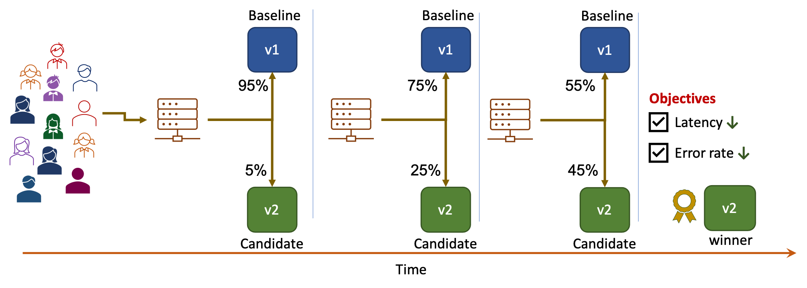

# SLO Validation

!!! tip "Scenario: SLO validation with progressive traffic shift"
    This tutorial illustrates an [SLO validation experiment with two versions](../../../concepts/buildingblocks.md#slo-validation); the candidate version will be promoted after Iter8 validates that it satisfies service-level objectives (SLOs). You will:

    1. Specify *latency* and *error-rate* based service-level objectives (SLOs). If the candidate version satisfies SLOs, Iter8 will declare it as the winner.
    2. Use Iter8's built-in capabilities for collecting latency and error-rate metrics.
    3. Combine SLO validation with [progressive traffic shifting](../../../concepts/buildingblocks.md#progressive-traffic-shift).
    
    

???+ warning "Platform setup"
    Follow [these steps](../setup-for-tutorials.md) to install Iter8 and Knative in your K8s cluster.

## 1. Create app versions
Deploy two versions of a Knative app.

```shell
kubectl apply -f $ITER8/samples/knative/quickstart/baseline.yaml
kubectl apply -f $ITER8/samples/knative/quickstart/experimentalservice.yaml
kubectl wait --for=condition=Ready ksvc/sample-app
```

??? info "Look inside baseline.yaml"
    ```yaml linenums="1"
    apiVersion: serving.knative.dev/v1
    kind: Service
    metadata:
      name: sample-app
      namespace: default
    spec:
      template:
        metadata:
          name: sample-app-v1
        spec:
          containers:
          - image: gcr.io/knative-samples/knative-route-demo:blue 
            env:
            - name: T_VERSION
              value: "blue"
    ```

??? info "Look inside experimentalservice.yaml"
    ```yaml linenums="1"
    apiVersion: serving.knative.dev/v1
    kind: Service
    metadata:
      name: sample-app
      namespace: default
    spec:
      template:
        metadata:
          name: sample-app-v2
        spec:
          containers:
          - image: gcr.io/knative-samples/knative-route-demo:green 
            env:
            - name: T_VERSION
              value: "green"
      traffic:
      - tag: current
        revisionName: sample-app-v1
        percent: 100
      - tag: candidate
        latestRevision: true
        percent: 0
    ```

## 2. Launch experiment
Launch the SLO validation experiment. This experiment will generate requests for your application versions, collect latency and error-rate metrics, and progressively shift traffic and promote the candidate version after verifying that it satisfies SLOs.

```shell
kubectl apply -f $ITER8/samples/knative/quickstart/experiment.yaml
```

??? info "Look inside experiment.yaml"
    ```yaml linenums="1"
    apiVersion: iter8.tools/v2alpha2
    kind: Experiment
    metadata:
      name: quickstart-exp
    spec:
      target: default/sample-app
      strategy:
        testingPattern: Canary
        deploymentPattern: Progressive
        actions:
          loop:
          - task: metrics/collect
            with:
              versions: 
              - name: sample-app-v1
                url: http://sample-app-v1.default.svc.cluster.local
              - name: sample-app-v2
                url: http://sample-app-v2.default.svc.cluster.local
          finish: # run the following sequence of tasks at the end of the experiment
          - task: common/bash # promote candidate, if candidate is the winner
            if: CandidateWon()
            with:
              script: kubectl apply -f https://raw.githubusercontent.com/iter8-tools/iter8/master/samples/knative/quickstart/candidate.yaml
          - task: common/bash # promote baseline, if candidate is not the winner
            if: not CandidateWon()
            with:
              script: kubectl apply -f https://raw.githubusercontent.com/iter8-tools/iter8/master/samples/knative/quickstart/baseline.yaml
      criteria:
        requestCount: iter8-system/request-count
        objectives: 
        - metric: iter8-system/mean-latency
          upperLimit: 50
        - metric: iter8-system/latency-95th-percentile
          upperLimit: 100
        - metric: iter8-system/error-rate
          upperLimit: "0.01"
      duration:
        maxLoops: 3
        intervalSeconds: 1
        iterationsPerLoop: 1
      versionInfo:
        # information about app versions used in this experiment
        baseline:
          name: sample-app-v1
          weightObjRef:
            apiVersion: serving.knative.dev/v1
            kind: Service
            name: sample-app
            namespace: default
            fieldPath: .spec.traffic[0].percent
        candidates:
        - name: sample-app-v2
          weightObjRef:
            apiVersion: serving.knative.dev/v1
            kind: Service
            name: sample-app
            namespace: default
            fieldPath: .spec.traffic[1].percent
    ```

## 3. Observe experiment
Follow [these steps](../../../getting-started/first-experiment.md#3-observe-experiment) to observe your experiment.

## 4. Cleanup
```shell
kubectl delete -f $ITER8/samples/knative/quickstart/experiment.yaml
kubectl delete -f $ITER8/samples/knative/quickstart/experimentalservice.yaml
```
