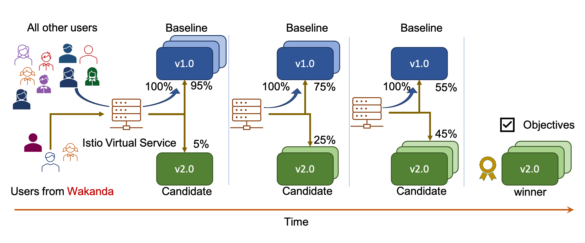

# Progressive Canary Release with Traffic Segmentation

!!! tip ""
    An experiment with [`Canary`](../../../concepts/buildingblocks/#testing-pattern) testing, [`Progressive`](../../../concepts/buildingblocks/#deployment-pattern) deployment and [traffic segmentation](../../../concepts/buildingblocks/#traffic-engineering).
    
    

You will create the following resources in this tutorial.

1. **Knative services** implementing an app with `baseline` and `candidate` versions.
2. An  **Istio virtual service** which routes requests based on an HTTP header called `country`. All requests are routed to the `baseline`, except those with their `country` header field set to `wakanda`; these may be routed to the `baseline` or `candidate`.
3. Two **curl-based traffic generators** which simulate user requests; one of them sets the `country` HTTP header field in its requests to `wakanda`, and the other sets it to `gondor`.
4. An **Iter8 experiment** which verifies that the `candidate` satisfies mean latency, 95th percentile tail latency, and error rate `objectives`, and progressively increases the proportion of traffic with `country: wakanda` header that is routed to the `candidate`.

???+ warning "Before you begin, you will need... "
    **Kubernetes cluster with Iter8, Knative and Istio:** Ensure that you have a Kubernetes cluster with Iter8, Knative with the Istio networking layer, Prometheus add-on, and Iter8's sample metrics for Knative installed. You can do so by following Steps 1, 2, 3 and 6 of the [quick start tutorial for Knative](../../../getting-started/quick-start/with-knative/), and selecting Istio during Step 3.

    **Cleanup:** If you ran an Iter8 tutorial earlier, run the associated cleanup step.

    **ITER8 environment variable:** Ensure that `ITER8` environment variable is set to the root directory of your cloned Iter8 repo. See [Step 2 of the quick start tutorial for Knative](../../../getting-started/quick-start/with-knative/#2-clone-iter8-repo) for example.

    **[`iter8ctl`](../../../getting-started/quick-start/with-knative/#8-observe-experiment):** This tutorial uses `iter8ctl`.

## 1. Create versions
```shell
kubectl apply -f $ITER8/samples/knative/traffic-segmentation/services.yaml
```

??? info "Look inside services.yaml"
    ```yaml linenums="1"
    apiVersion: serving.knative.dev/v1
    kind: Service
    metadata:
      name: sample-app-v1
      namespace: default
    spec:
      template:
        metadata:
          name: sample-app-v1-blue
          annotations:
            autoscaling.knative.dev/scaleToZeroPodRetentionPeriod: "10m"
        spec:
          containers:
          - image: gcr.io/knative-samples/knative-route-demo:blue 
            env:
            - name: T_VERSION
              value: "blue"
    ---
    apiVersion: serving.knative.dev/v1
    kind: Service
    metadata:
      name: sample-app-v2
      namespace: default
    spec:
      template:
        metadata:
          name: sample-app-v2-green
          annotations:
            autoscaling.knative.dev/scaleToZeroPodRetentionPeriod: "10m"
        spec:
          containers:
          - image: gcr.io/knative-samples/knative-route-demo:green 
            env:
            - name: T_VERSION
              value: "green"
    ```


## 2. Create Istio virtual service
```shell
kubectl apply -f $ITER8/samples/knative/traffic-segmentation/routing-rule.yaml
```

??? info "Look inside routing-rule.yaml"
    ```yaml linenums="1"
    apiVersion: networking.istio.io/v1alpha3
    kind: VirtualService
    metadata:
      name: routing-for-wakanda
    spec:
      gateways:
      - mesh
      - knative-serving/knative-ingress-gateway
      - knative-serving/knative-local-gateway
      hosts:
      - example.com
      http:
      - match:
        - headers:
            country:
              exact: wakanda
        route:
        - destination:
            host: sample-app-v1.default.svc.cluster.local
          headers:
            request:
              set:
                Knative-Serving-Namespace: default
                Knative-Serving-Revision: sample-app-v1-blue
                Host: sample-app-v1.default
          weight: 100
        - destination:
            host: sample-app-v2.default.svc.cluster.local
          headers:
            request:
              set:
                Knative-Serving-Namespace: default
                Knative-Serving-Revision: sample-app-v2-green
                Host: sample-app-v2.default
          weight: 0
      - route:
        - destination:
            host: sample-app-v1.default.svc.cluster.local
          headers:
            request:
              set:
                Knative-Serving-Namespace: default
                Knative-Serving-Revision: sample-app-v1-blue
                Host: sample-app-v1.default
    ```

## 3. Generate traffic
```shell
TEMP_DIR=$(mktemp -d)
cd $TEMP_DIR
curl -L https://istio.io/downloadIstio | ISTIO_VERSION=1.8.2 sh -
istio-1.8.2/bin/istioctl kube-inject -f $ITER8/samples/knative/traffic-segmentation/curl.yaml | kubectl create -f -
cd $ITER8
```

??? info "Look inside curl.yaml"
    ```yaml linenums="1"
    apiVersion: batch/v1
    kind: Job
    metadata:
      name: curl
    spec:
      template:
        spec:
          activeDeadlineSeconds: 6000
          containers:
          - name: curl-from-gondor
            image: tutum/curl
            command: 
            - /bin/sh
            - -c
            - |
              while true; do
              curl -sS example.com -H "country: gondor"
              sleep 1.0
              done
          - name: curl-from-wakanda
            image: tutum/curl
            command: 
            - /bin/sh
            - -c
            - |
              while true; do
              curl -sS example.com -H "country: wakanda"
              sleep 0.25
              done
          restartPolicy: Never
    ```

## 4. Create Iter8 experiment
```shell
kubectl wait --for=condition=Ready ksvc/sample-app-v1
kubectl wait --for=condition=Ready ksvc/sample-app-v2
kubectl apply -f $ITER8/samples/knative/traffic-segmentation/experiment.yaml
```

??? info "Look inside experiment.yaml"
    ```yaml linenums="1"
    apiVersion: iter8.tools/v2alpha2
    kind: Experiment
    metadata:
      name: request-routing
    spec:
      # this experiment uses the fully-qualified name of the Istio virtual service as the target
      target: default/routing-for-wakanda
      strategy:
        # this experiment will perform a canary test
        testingPattern: Canary
        deploymentPattern: Progressive
      criteria:
        # mean latency of version should be under 50 milliseconds
        # 95th percentile latency should be under 100 milliseconds
        # error rate should be under 1%
        objectives: 
        - metric: iter8-knative/mean-latency
          upperLimit: 50
        - metric: iter8-knative/95th-percentile-tail-latency
          upperLimit: 100
        - metric: iter8-knative/error-rate
          upperLimit: "0.01"
      duration:
        intervalSeconds: 10
        iterationsPerLoop: 10
      versionInfo:
        # information about versions used in this experiment
        baseline:
          name: current
          variables:
          - name: revision
            value: sample-app-v1-blue
          weightObjRef:
            apiVersion: networking.istio.io/v1alpha3
            kind: VirtualService
            name: routing-for-wakanda
            namespace: default
            fieldPath: .spec.http[0].route[0].weight
        candidates:
        - name: candidate
          variables:
          - name: revision
            value: sample-app-v2-green
          weightObjRef:
            apiVersion: networking.istio.io/v1alpha3
            kind: VirtualService
            name: routing-for-wakanda
            namespace: default
            fieldPath: .spec.http[0].route[1].weight
    ```

## 5. Observe experiment
Observe the experiment in realtime. Paste commands from the tabs below in separate terminals.

=== "Metrics-based analysis"
    ```shell
    while clear; do
    kubectl get experiment request-routing -o yaml | iter8ctl describe -f -
    sleep 4
    done
    ```

    The output will look similar to the [iter8ctl output](../../../getting-started/quick-start/with-knative/#8-observe-experiment) in the quick start instructions.

    As the experiment progresses, you should eventually see that all of the objectives reported as being satisfied by both versions. The candidate is identified as the winner and is recommended for promotion. When the experiment completes (in ~ 2 mins), you will see the experiment stage change from `Running` to `Completed`.

=== "Experiment progress"
    ```shell
    kubectl get experiment request-routing --watch
    ```

    The output will look similar to the [kubectl get experiment output](../../../getting-started/quick-start/with-knative/#8-observe-experiment) in the quick start instructions.

    When the experiment completes (in ~ 2 mins), you will see the experiment stage change from `Running` to `Completed`.

=== "Traffic split"
    ```shell
    kubectl get vs routing-for-wakanda -o json --watch | jq .spec.http[0].route
    ```

    The output shows the traffic split for the wakanda as defined in the `VirtualService` resource.

    As the experiment progresses, you should see traffic progressively shift from host `sample-app-v1.default.svc.cluster.local` to host `sample-app-v2.default.svc.cluster.local`. When the experiment completes, the traffic remains split; this experiment has no _finish_ action to promote the winning version.

???+ info "Understanding what happened"
    1. You configured two Knative services corresponding to two versions of your app in `services.yaml`.

    2. You used `example.com` as the HTTP host in this tutorial.
        - **Note:** In your production cluster, use domain(s) that you own in the setup of the virtual service.

    3. You set up an Istio virtual service which mapped the Knative services to this custom domain. The virtual service specified the following routing rules: all HTTP requests to `example.com` with their Host header or :authority pseudo-header **not** set to `wakanda` would be routed to the `baseline`; those with `wakanda` Host header or :authority pseudo-header may be routed to `baseline` and `candidate`.
    
    4. The percentage of `wakandan` requests sent to `candidate` is 0% at the beginning of the experiment.

    5. You generated traffic for `example.com` using a `curl`-job with two `curl`-containers to simulate user requests. You injected Istio sidecar injected into it to simulate traffic generation from within the cluster. The sidecar was needed in order to correctly route traffic. One of the `curl`-containers sets the `country` header field to `wakanda`, and the other to `gondor`.
        - **Note:** You used Istio version 1.8.2 to inject the sidecar. This version of Istio corresponds to the one installed in [Step 3 of the quick start tutorial](http://localhost:8000/getting-started/quick-start/with-knative/#3-install-knative-and-iter8). If you have a different version of Istio installed in your cluster, change the Istio version during sidecar injection appropriately.
    
    6. You created an Iter8 `Canary` experiment with `Progressive` deployment pattern to evaluate the `candidate`. In each iteration, Iter8 observed the mean latency, 95th percentile tail-latency, and error-rate metrics collected by Prometheus, and verified that the `candidate` version satisfied all the `objectives` specified in the experiment. It progressively increased the proportion of traffic with `country: wakanda` header that is routed to the `candidate`.

## 6. Cleanup
```shell
kubectl delete -f $ITER8/samples/knative/traffic-segmentation/experiment.yaml
kubectl delete -f $ITER8/samples/knative/traffic-segmentation/curl.yaml
kubectl delete -f $ITER8/samples/knative/traffic-segmentation/routing-rule.yaml
kubectl delete -f $ITER8/samples/knative/traffic-segmentation/services.yaml
```