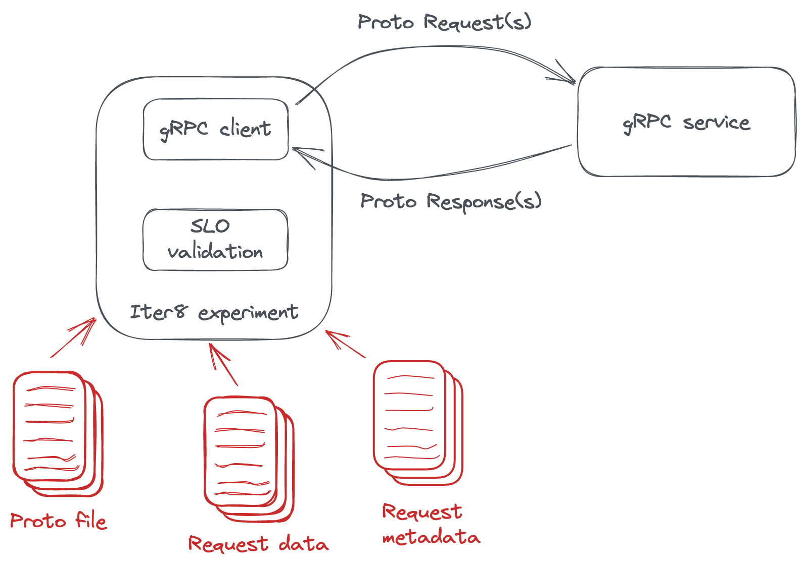

# Load test a Knative gRPC service

!!! tip "Load test a Knative gRPC Service and validate SLOs"
    Use an [Iter8 experiment](../../../../getting-started/concepts.md#what-is-an-iter8-experiment) to load test a [Knative](https://knative.dev/) gRPC service and validate latency and error-related service level objectives (SLOs).

    **Use-case:** Continuous delivery (CD) of gRPC services is a motivating use-case for this experiment. If the gRPC service satisfies the SLOs specified in the experiment, it may be safely rolled out (for example, from a test environment to a production environment).

    This experiment is illustrated in the figure below.

    


???+ note "Before you begin"
    1. [Install Iter8](../../../../getting-started/install.md).
    2. [Install Knative and deploy your first Knative Service](https://knative.dev/docs/getting-started/first-service/). As noted at the end of the Knative tutorial, when you curl the Knative service,
    ```shell
    curl http://hello.default.127.0.0.1.sslip.io
    ```
    you should see the expected output as follows.
    ```
    Hello World!
    ```
    3. Update the Knative service deployed above to a gRPC service as follows.
    ```shell
    kn service update hello \
    --image docker.io/grpc/java-example-hostname:latest \
    --port 50051 \
    --revision-name=grpc
    ```

## 1. Download experiment chart
Download the `load-test-grpc` [experiment chart](../../../../getting-started/concepts.md#experiment-chart) from [Iter8 hub](../../../../getting-started/concepts.md#iter8-hub) as follows.

```shell
iter8 hub -e load-test-grpc
cd load-test-grpc
```

## 2. Run experiment
We will load test and validate the Knative gRPC service with host:port `hello.default.127.0.0.1.sslip.io:50051`, under the package `helloworld`, with name `Greeter` and method `SayHello`. 

In this example, we specify the URL where the protobuf file defining this service is located (`protoURL`). However, this service supports reflection, and hence, the `iter8 run` command would work even without specifying `protoURL`. 

We will also specify that the error rate must be 0 (no errors), mean latency must be under 400 msec, 90th percentile tail latency must be under 500 msec, and 97.5th tail latency must be under 600 msec.

```shell
iter8 run --set-string host="hello.default.127.0.0.1.sslip.io:50051" \
          --set-string call="helloworld.Greeter.SayHello" \
          --set-string protoURL="https://raw.githubusercontent.com/grpc/grpc-java/master/examples/example-hostname/src/main/proto/helloworld/helloworld.proto"
          --set data.name="frodo" \
          --set SLOs.error-rate=0 \
          --set SLOs.latency/mean=400 \
          --set SLOs.latency/p90=500 \
          --set SLOs.latency/p'97\.5'=600
```

## 3. Assert outcomes
Assert that the experiment completed without any failures and SLOs are satisfied.

```shell
iter8 assert -c completed -c nofailure -c slos
```

## 4. View report
View a report of the experiment in HTML or text formats as follows.

=== "HTML"
    ```shell
    iter8 report -o html > report.html
    # open report.html with a browser. In MacOS, you can use the command:
    # open report.html
    ```

=== "Text"
    ```shell
    iter8 report -o text
    ```

***

???+ tip "Useful variations of this experiment"

    1. The `values.yaml` file in the experiment chart folder documents all the values that can be supplied during the experiment.

