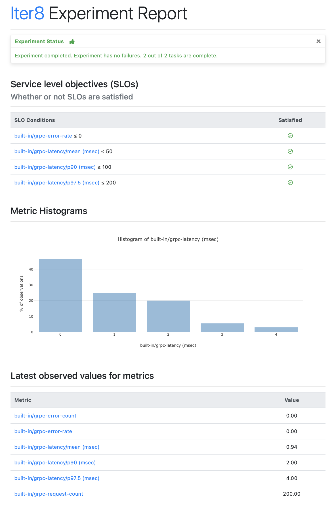

# Unary gRPC Service

!!! tip "Load Test a unary gRPC Service with SLOs"
    Load testing a unary gRPC service and validate its latency and error-related service level objectives (SLOs). 
    
***

???+ note "Before you begin"
    1. [Install Iter8](../../getting-started/install.md).
    2. Complete the [quick start tutorial](../../getting-started/your-first-experiment.md).

## 1. Run sample app
Choose a language, and follow the linked instructions to run the gRPC sample app. 

!!! warning "Update step is not needed" 
    The linked instructions show how to update the app, and re-run the updated app. For the purpose of this tutorial, there is **no need** to update and re-run. Running the basic service is sufficient.

=== "C#"
    [Run the C# gRPC app](https://grpc.io/docs/languages/csharp/quickstart/#run-a-grpc-application).

=== "C++"
    [Run the C++ gRPC app](https://grpc.io/docs/languages/cpp/quickstart/#try-it).

=== "Dart"
    [Run the Dart gRPC app](https://grpc.io/docs/languages/dart/quickstart/#run-the-example).

=== "Go"
    [Run the Go gRPC app](https://grpc.io/docs/languages/go/quickstart/#run-the-example).

=== "Java"
    [Run the Java gRPC app](https://grpc.io/docs/languages/java/quickstart/#run-the-example).

=== "Kotlin"
    [Run the Kotlin gRPC app](https://grpc.io/docs/languages/kotlin/quickstart/#run-the-example).

=== "Node"
    [Run the Node gRPC app](https://grpc.io/docs/languages/node/quickstart/#run-a-grpc-application).

=== "Objective-C"
    [Run the Objective-C gRPC app](https://grpc.io/docs/languages/objective-c/quickstart/#run-the-server).

=== "PHP"
    [Run the PHP gRPC app](https://grpc.io/docs/languages/php/quickstart/#run-the-example).

=== "Python"
    [Run the Python gRPC app](https://grpc.io/docs/languages/python/quickstart/#run-a-grpc-application).

=== "Ruby"
    [Run the Ruby gRPC app](https://grpc.io/docs/languages/ruby/quickstart/#run-a-grpc-application).


## 2. Download experiment chart
```shell
iter8 hub -e load-test-grpc
cd load-test-grpc
```

## 3. Run experiment
We will load test and validate the gRPC sample service with host `127.0.0.1:50051`, fully-qualified method name `helloworld.Greeter.SayHello`, and defined by the Protocol Buffer file located at the `protoURL`. We will specify that the gRPC requests made by the Iter8 experiment will include `{'name': 'frodo'}` as the data, serialized in the protobuf format. We will also specify that the error rate must be 0, the mean latency must be under 50 msec, the 90th percentile latency must be under 100 msec, and the 97.5th percentile latency must be under 200 msec.

Run the experiment as follows.

```shell
iter8 run --set-string host="127.0.0.1:50051" \
          --set-string call="helloworld.Greeter.SayHello" \
          --set-string protoURL="https://raw.githubusercontent.com/grpc/grpc-go/master/examples/helloworld/helloworld/helloworld.proto" \
          --set data.name="frodo" \
          --set SLOs.error-rate=0 \
          --set SLOs.latency/mean=50 \
          --set SLOs.latency/p90=100 \
          --set SLOs.latency/p'97\.5'=200
```

***

Assert experiment outcomes and view reports as described in the [quick start tutorial](../../getting-started/your-first-experiment.md).

??? note "The HTML report looks like this"
    

??? note "The text report looks like this"
    ```shell
    Experiment summary:
    *******************

      Experiment completed: true
      No failed tasks: true
      Total number of tasks: 2
      Number of completed tasks: 2

    Whether or not service level objectives (SLOs) are satisfied:
    *************************************************************

      SLO Conditions                            |Satisfied
      --------------                            |---------
      built-in/grpc-error-rate <= 0             |true
      built-in/grpc-latency/mean (msec) <= 50   |true
      built-in/grpc-latency/p90 (msec) <= 100   |true
      built-in/grpc-latency/p97.5 (msec) <= 200 |true
      

    Latest observed values for metrics:
    ***********************************

      Metric                             |value
      -------                            |-----
      built-in/grpc-error-count          |0.00
      built-in/grpc-error-rate           |0.00
      built-in/grpc-latency/mean (msec)  |1.51
      built-in/grpc-latency/p90 (msec)   |3.00
      built-in/grpc-latency/p97.5 (msec) |4.00
      built-in/grpc-request-count        |200.00    
    ```