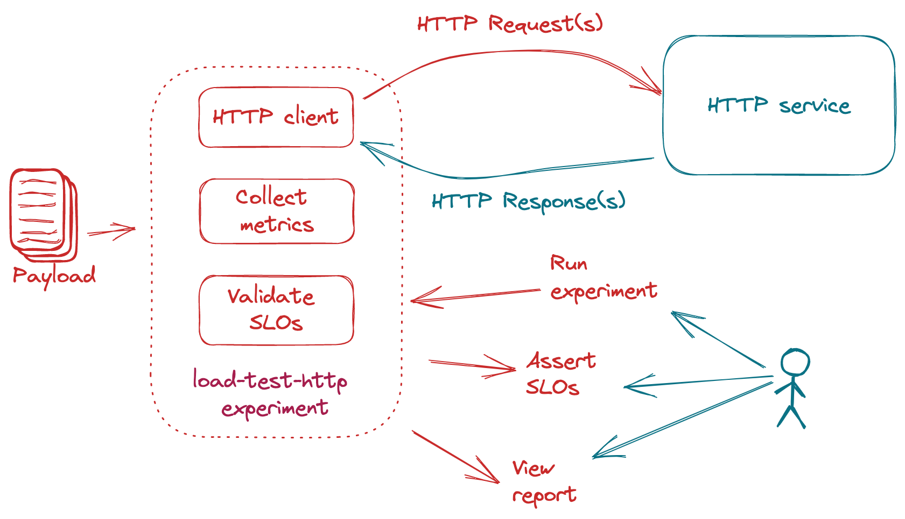

# Overview

!!! tip "Load Testing and SLO Validation for HTTP Services"
    Iter8's HTTP load testing and SLO validation experiments can generate requests for HTTP services, collect built-in latency and error-related metrics, and validate service-level objectives (SLOs).

    **Use-case:** Continuous delivery (CD) of HTTP services is a motivating use-case for this experiment. If the HTTP service satisfies the SLOs specified in the experiment, it may be safely rolled out (for example, from a test environment to a production environment).
    
    This experiment is illustrated in the figure below.

    

***

## Examples

[Load test an HTTP service and validate SLOs (your first experiment)](../../getting-started/your-first-experiment.md).

: Use an Iter8 experiment to load test an HTTP service and validate latency and error-related service level objectives (SLOs).

[Control the load characteristics](loadcharacteristics.md).
: Control the load characteristics during the HTTP load test experiment by setting the number of queries/duration, the number of queries sent per second, and the number of parallel connections used to send requests.

[Send payload during the HTTP load test](payload.md).
: While load testing an HTTP service with a POST endpoint, you may send any type of content as payload as part of the requests.

[Learn more about built-in metrics and SLOs](metricsandslos.md).
: Learn more about the built-in metrics that are collected and the SLOs that are validated during the load test.

***

## Community examples

These samples are contributed and maintained by members of the Iter8 community.

!!! tip "Dear Iter8 community" 

    Community examples may become outdated. If you find that something is not working, lend a helping hand and fix it in a PR. More examples are always welcome.

***

### Knative

[Load test a Knative HTTP service](community/knative/loadtest.md)
: Use an Iter8 experiment to load test a Knative HTTP service and validate latency and error-related service level objectives (SLOs).