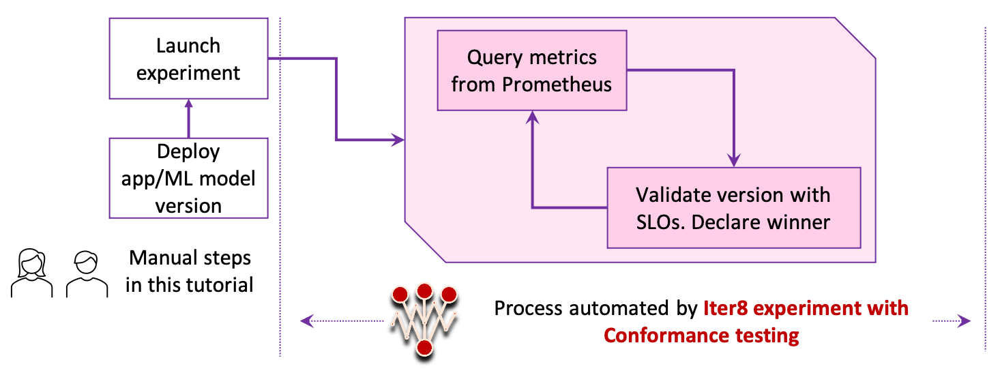

# Conformance Testing

!!! tip "Scenario: Conformance testing"
    [Conformance testing](../../../concepts/buildingblocks/#testing-pattern) enables you to validate a  version of your app/ML model using service-level objectives (SLOs). In this tutorial, you will:

    1. Perform conformance testing.
    2. Specify *latency* and *error-rate* based service-level objectives (SLOs). If your version satisfies SLOs, Iter8 will declare it as the winner.
    3. Use Prometheus as the provider for latency and error-rate metrics.
    
    

???+ warning "Before you begin... "

    This tutorial is available for the following K8s stacks.

    [Istio](#before-you-begin){ .md-button }
    [Knative](#before-you-begin){ .md-button }

    Please choose the same K8s stack consistently throughout this tutorial. If you wish to switch K8s stacks between tutorials, start from a clean K8s cluster, so that your cluster is correctly setup.

## Steps 1, 2, and 3
    
Please follow steps 1, 2, and 3 of the [quick start tutorial](../../../getting-started/quick-start/#1-create-kubernetes-cluster).

## 4. Create app/ML model version
=== "Istio"
    Deploy [bookinfo](https://istio.io/latest/docs/examples/bookinfo/) app:

    ```shell
    kubectl apply -n bookinfo-iter8 -f $ITER8/samples/istio/conformance/bookinfo-app.yaml
    ```

    ??? info "Look inside productpage-v1 defined in bookinfo-app.yaml"
        ```yaml linenums="1"
        apiVersion: apps/v1
        kind: Deployment
        metadata:
          name: productpage-v1
          labels:
            app: productpage
            version: v1
        spec:
          replicas: 1
          selector:
            matchLabels:
              app: productpage
              version: v1
          template:
            metadata:
              annotations:
                sidecar.istio.io/inject: "true"
                prometheus.io/scrape: "true"
                prometheus.io/path: /metrics
                prometheus.io/port: "9080"
              labels:
                app: productpage
                version: v1
            spec:
              serviceAccountName: bookinfo-productpage
              containers:
              - name: productpage
                image: iter8/productpage:demo
                imagePullPolicy: IfNotPresent
                ports:
                - containerPort: 9080
                env:
                  - name: deployment
                    value: "productpage-v1"
                  - name: namespace
                    valueFrom:
                      fieldRef:
                        fieldPath: metadata.namespace
                  - name: color
                    value: "red"
                  - name: reward_min
                    value: "0"
                  - name: reward_max
                    value: "5"
                  - name: port
                    value: "9080"
        ```

=== "Knative"
    Deploy a Knative app.

    ```shell
    kubectl apply -f $ITER8/samples/knative/conformance/baseline.yaml
    ```

    ??? info "Look inside baseline.yaml"
        ```yaml linenums="1"
        apiVersion: serving.knative.dev/v1
        kind: Service
        metadata:
        name: sample-app 
        namespace: default 
        spec:
        template:
            metadata:
            name: sample-app-v1
            spec:
            containers:
            - image: gcr.io/knative-samples/knative-route-demo:blue 
                env:
                - name: T_VERSION
                value: "blue"
        ```

## 5. Generate requests
=== "Istio"
    Generate requests using Fortio as follows.

    ```shell
    kubectl wait -n bookinfo-iter8 --for=condition=Ready pods --all
    # URL_VALUE is the URL of the `bookinfo` application
    URL_VALUE="http://$(kubectl -n istio-system get svc istio-ingressgateway -o jsonpath='{.spec.clusterIP}'):80/productpage"
    sed "s+URL_VALUE+${URL_VALUE}+g" $ITER8/samples/istio/quickstart/fortio.yaml | kubectl apply -f -
    ```

    ??? info "Look inside fortio.yaml"
        ```yaml
        apiVersion: batch/v1
        kind: Job
        metadata:
          name: fortio
        spec:
          template:
            spec:
              volumes:
              - name: shared
                emptyDir: {}
              containers:
              - name: fortio
                image: fortio/fortio
                command: [ 'fortio', 'load', '-t', '6000s', '-qps', "16", '-json', '/shared/fortiooutput.json', '-H', 'Host: bookinfo.example.com', "$(URL)" ]
                env:
                - name: URL
                  value: URL_VALUE
                volumeMounts:
                - name: shared
                  mountPath: /shared
              - name: busybox
                image: busybox:1.28
                command: ['sh', '-c', 'echo busybox is running! && sleep 6000']
                volumeMounts:
                - name: shared
                  mountPath: /shared
              restartPolicy: Never
        ```

=== "Knative"
    Generate requests using Fortio as follows.

    ```shell
    kubectl wait --for=condition=Ready ksvc/sample-app
    URL_VALUE=$(kubectl get ksvc sample-app -o json | jq .status.address.url)
    sed "s+URL_VALUE+${URL_VALUE}+g" $ITER8/samples/knative/conformance/fortio.yaml | kubectl apply -f -
    ```

    ??? info "Look inside fortio.yaml"
        ```yaml
        apiVersion: batch/v1
        kind: Job
        metadata:
          name: fortio
        spec:
          template:
            spec:
              volumes:
              - name: shared
                emptyDir: {}    
              containers:
              - name: fortio
                image: fortio/fortio
                command: ["fortio", "load", "-t", "6000s", "-json", "/shared/fortiooutput.json", $(URL)]
                env:
                - name: URL
                  value: URL_VALUE
                volumeMounts:
                - name: shared
                  mountPath: /shared         
              - name: busybox
                image: busybox:1.28
                command: ['sh', '-c', 'echo busybox is running! && sleep 600']          
                volumeMounts:
                - name: shared
                  mountPath: /shared       
              restartPolicy: Never
        ```

## 6. Define metrics
Please follow step 6 of the [quick start tutorial](../../../getting-started/quick-start/#6-define-metrics).

## 7. Launch experiment
Launch the Iter8 experiment that orchestrates conformance testing for the app/ML model in this tutorial.

=== "Istio"
    ```shell
    kubectl apply -f $ITER8/samples/istio/conformance/experiment.yaml
    ```

    ??? info "Look inside experiment.yaml"
        ```yaml
        apiVersion: iter8.tools/v2alpha2
        kind: Experiment
        metadata:
          name: conformance-exp
        spec:
          # target identifies the service under experimentation using its fully qualified name
          target: bookinfo-iter8/productpage
          strategy:
            # this experiment will perform a Conformance test
            testingPattern: Conformance
          criteria:
            objectives: # used for validating versions
            - metric: iter8-istio/mean-latency
              upperLimit: 100
            - metric: iter8-istio/error-rate
              upperLimit: "0.01"
            requestCount: iter8-istio/request-count
          duration: # product of fields determines length of the experiment
            intervalSeconds: 10
            iterationsPerLoop: 10
          versionInfo:
            # information about the app versions used in this experiment
            baseline:
              name: productpage-v1
              variables:
              - name: namespace # used by final action if this version is the winner
                value: bookinfo-iter8
        ```

=== "Knative"
    ```shell
    kubectl apply -f $ITER8/samples/knative/conformance/experiment.yaml
    ```

    ??? info "Look inside experiment.yaml"
        ```yaml
        apiVersion: iter8.tools/v2alpha2
        kind: Experiment
        metadata:
          name: conformance-exp
        spec:
          # target identifies the knative service under experimentation using its fully qualified name
          target: default/sample-app
          strategy:
            # this experiment will perform a conformance test
            testingPattern: Conformance
          criteria:
            # mean latency of version should be under 50 milliseconds
            # 95th percentile latency should be under 100 milliseconds
            # error rate should be under 1%
            objectives: 
            - metric: iter8-knative/mean-latency
              upperLimit: 50
            - metric: iter8-knative/95th-percentile-tail-latency
              upperLimit: 100
            - metric: iter8-knative/error-rate
              upperLimit: "0.01"
          duration:
            intervalSeconds: 10
            iterationsPerLoop: 10
          versionInfo:
            # information about app versions used in this experiment
            baseline:
              name: sample-app-v1
        ```

The process automated by Iter8 during this experiment is depicted below.



## 8. Observe experiment

Follow [step 8 of quick start tutorial](../../../getting-started/quick-start/#8-observe-experiment) to observe the experiment in realtime. Note that the experiment in this tutorial uses a different name from the quick start one. Replace the experiment name `quickstart-exp` with `conformance-exp` in your commands.


???+ info "Understanding what happened"
    1. You created a single version of an app/ML model.
    2. You generated requests for your app/ML model versions.
    3. You created an Iter8 experiment with conformance testing pattern. In each iteration, Iter8 observed the latency and error-rate metrics collected by Prometheus; Iter8 verified that the version (referred to as baseline in a conformance experiment) satisfied all the SLOs, and identified baseline as the winner.

## 9. Cleanup

=== "Istio"
    ```shell
    kubectl delete -f $ITER8/samples/istio/conformance/fortio.yaml
    kubectl delete -f $ITER8/samples/istio/conformance/experiment.yaml
    kubectl delete ns bookinfo-iter8
    ```

=== "Knative"
    ```shell
    kubectl delete -f $ITER8/samples/knative/conformance/fortio.yaml
    kubectl delete -f $ITER8/samples/knative/conformance/experiment.yaml
    kubectl delete -f $ITER8/samples/knative/conformance/baseline.yaml
    ```
