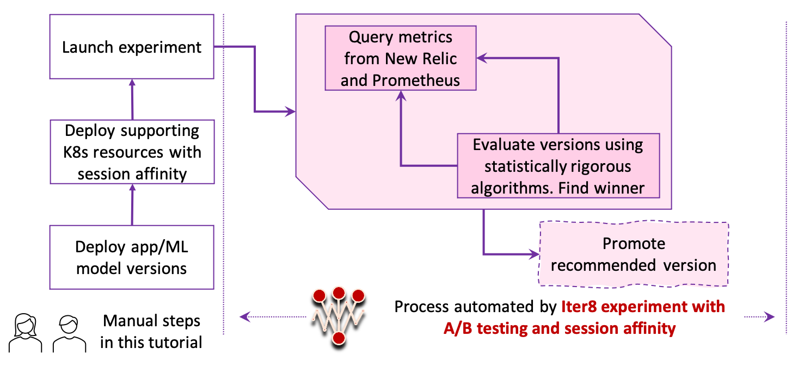

# Session Affinity

!!! tip "Scenario: A/B testing with session affinity (sticky sessions)"

    [Session affinity](../../../concepts/buildingblocks/#traffic-engineering) ensures that the version to which a particular user's request is routed remains consistent throughout the duration of the experiment. In this tutorial, you will use a [FixedSplit deployment](../../../concepts/buildingblocks/#deployment-patterns) in conjunction with session affinity.

    The experiment will involve two user groups, 1 and 2. Reqeusts from user group 1 will have a `userhash` header value prefixed with `111` and will be routed to the baseline version. Requests from user group 2 will have a `userhash` header value prefixed with `101` and will be routed to the candidate version.
    
    The session affinity experiment is depicted below.

    

    


???+ warning "Before you begin... "

    This tutorial is available for the following K8s stacks.

    [KFServing](#before-you-begin){ .md-button }

    Please choose the same K8s stack consistently throughout this tutorial. If you wish to switch K8s stacks between tutorials, start from a clean K8s cluster, so that your cluster is correctly setup.

## Steps 1 to 3
    
Please follow steps 1 through 3 of the [quick start tutorial](../../../getting-started/quick-start/#1-create-kubernetes-cluster).

## 4. Create versions and initialize routing rule
=== "KFServing"

    ```shell
    kubectl apply -f $ITER8/samples/kfserving/quickstart/baseline.yaml
    kubectl apply -f $ITER8/samples/kfserving/quickstart/candidate.yaml
    kubectl apply -f $ITER8/samples/kfserving/session-affinity/routing-rule.yaml
    kubectl wait --for=condition=Ready isvc/flowers -n ns-baseline
    kubectl wait --for=condition=Ready isvc/flowers -n ns-candidate
    ```

    ??? info "Virtual service with routing rule"
        ```yaml linenums="1"
        apiVersion: networking.istio.io/v1alpha3
        kind: VirtualService
        metadata:
          name: routing-rule
          namespace: default
        spec:
          gateways:
          - knative-serving/knative-ingress-gateway
          hosts:
          - example.com
          http:
          - match:
            - headers:
                userhash: # user hash is a 10-digit random binary string
                  prefix: "101" # in expectation, 1/8th of user hashes will match this prefix
            route: # matching users will always go to v2
            - destination:
                host: flowers-predictor-default.ns-candidate.svc.cluster.local
              headers:
                request:
                  set:
                    Host: flowers-predictor-default.ns-candidate
                response:
                  set:
                    version: flowers-v2
          - route: # non-matching users will always go to v1
            - destination:
                host: flowers-predictor-default.ns-baseline.svc.cluster.local
              headers:
                request:
                  set:
                    Host: flowers-predictor-default.ns-baseline
                response:
                  set:
                    version: flowers-v1
        ```

## 5. Generate requests
=== "KFServing"
    Generate requests to your model as follows.
 
    === "Port forward (terminal one)"
        ```shell
        INGRESS_GATEWAY_SERVICE=$(kubectl get svc -n istio-system --selector="app=istio-ingressgateway" --output jsonpath='{.items[0].metadata.name}')
        kubectl port-forward -n istio-system svc/${INGRESS_GATEWAY_SERVICE} 8080:80
        ```

    === "Baseline requests (terminal two)"
        ```shell
        curl -o /tmp/input.json https://raw.githubusercontent.com/kubeflow/kfserving/master/docs/samples/v1beta1/rollout/input.json
        while true; do
        curl -v -H "Host: example.com" -H "userhash: 1111100000" localhost:8080/v1/models/flowers:predict -d @/tmp/input.json
        sleep 0.29
        done
        ```

    === "Candidate requests (terminal three)"
        ```shell
        curl -o /tmp/input.json https://raw.githubusercontent.com/kubeflow/kfserving/master/docs/samples/v1beta1/rollout/input.json
        while true; do
        curl -v -H "Host: example.com" -H "userhash: 1010101010" localhost:8080/v1/models/flowers:predict -d @/tmp/input.json
        sleep 2.0
        done
        ```

## 6. Define metrics
Please follow [Step 6 of the quick start tutorial](../../../getting-started/quick-start/#6-define-metrics).

## 7. Launch experiment
=== "KFServing"

    ```shell
    kubectl apply -f $ITER8/samples/kfserving/session-affinity/experiment.yaml
    ```

    ??? info "Look inside experiment.yaml"
        ```yaml linenums="1"
        apiVersion: iter8.tools/v2alpha2
        kind: Experiment
        metadata:
          name: session-affinity-exp
        spec:
          target: flowers
          strategy:
            testingPattern: A/B
            deploymentPattern: FixedSplit
            actions:
              # when the experiment completes, promote the winning version using kubectl apply
              finish:
              - task: common/exec
                with:
                  cmd: /bin/bash
                  args: [ "-c", "kubectl apply -f {{ .promote }}" ]
          criteria:
            requestCount: iter8-kfserving/request-count
            rewards: # Business rewards
            - metric: iter8-kfserving/user-engagement
              preferredDirection: High # maximize user engagement
            objectives:
            - metric: iter8-kfserving/mean-latency
              upperLimit: 2000
            - metric: iter8-kfserving/95th-percentile-tail-latency
              upperLimit: 5000
            - metric: iter8-kfserving/error-rate
              upperLimit: "0.01"
          duration:
            intervalSeconds: 10
            iterationsPerLoop: 10
          versionInfo:
            # information about model versions used in this experiment
            baseline:
              name: flowers-v1
              variables:
              - name: ns
                value: ns-baseline
              - name: promote
                value: https://raw.githubusercontent.com/iter8-tools/iter8/master/samples/kfserving/quickstart/promote-v1.yaml
            candidates:
            - name: flowers-v2
              variables:
              - name: ns
                value: ns-candidate
              - name: promote
                value: https://raw.githubusercontent.com/iter8-tools/iter8/master/samples/kfserving/quickstart/promote-v2.yaml
        ```

The process automated by Iter8 during this experiment is depicted below.



## 8. Observe experiment
Please follow [Step 8 of the quick start tutorial](../../../getting-started/quick-start/#8-observe-experiment) to observe the experiment in realtime. Note that the experiment in this tutorial uses a different name from the quick start one. Replace the experiment name `quickstart-exp` with `session-affinity-exp` in your commands. You can also observe traffic by suitably modifying the commands for observing traffic.


???+ info "Understanding what happened"
    1. You created two versions of your app/ML model.
    2. You generated requests for your app/ML model versions. Throughout the experiment, users from Group 1 (i.e., users whose requests had a `userhash` header value prefixed with `111` ) were routed to the baseline version; and users from Group 2 (i.e., users whose requests had a `userhash` header value prefixed with `101` ) were routed to the candidate version.
    3. You created an Iter8 experiment with A/B testing pattern and FixedSplit deployment pattern. In each iteration, Iter8 observed the latency and error-rate metrics collected by Prometheus, and the user-engagement metric from New Relic; Iter8 verified that the candidate satisfied all objectives, verified that the candidate improved over the baseline in terms of user-engagement, identified candidate as the winner, and finally promoted the candidate.

## 9. Cleanup
=== "KFServing"
    ```shell
    kubectl delete -f $ITER8/samples/kfserving/session-affinity/experiment.yaml
    kubectl delete -f $ITER8/samples/kfserving/session-affinity/routing-rule.yaml
    kubectl delete -f $ITER8/samples/kfserving/quickstart/candidate.yaml
    kubectl delete -f $ITER8/samples/kfserving/quickstart/baseline.yaml
    ```
